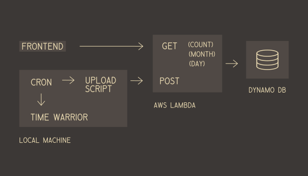
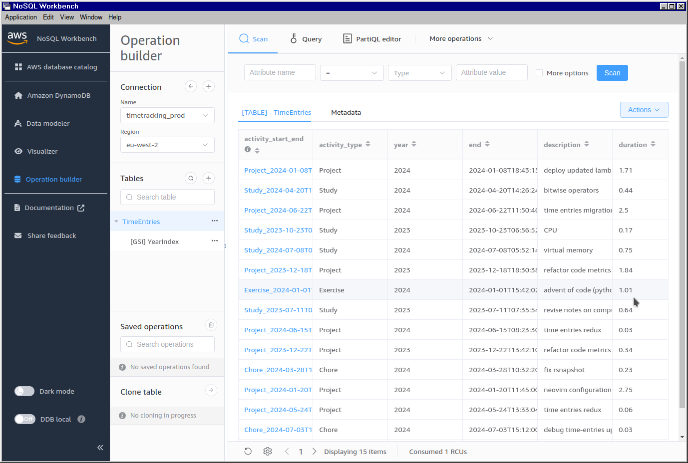

I have just added a new feature to the site:
[Activity Log](https://systemsobscure.blog/activity-log/), which presents my
personal time tracking entries. This is how I configured the backend.



On my local machine I use [TimeWarrior](https://timewarrior.net/docs/what/) to
record the time I spend on different activities. It runs from the terminal and
can be exported to JSON.

To access the data remotely, I needed to store it in a database and be able to
regularly export the time entries from my machine to the remote DB.

I created a simple AWS Lambda with a few endpoints:

- A POST that receives data and adds it to the database.
- A GET at `/count` that returns a count of the entries for each day for the
  last twelve months
- A GET at `/month` that returns the entries for the last month
- A GET at `/day` that returns the entries for the specified single date

The idea is that the frontend will first present all the entries for the current
month in a table. Along with this there will be histogram similar to GitHub's
commit graph that will present a colour coded representation of the amount of
activity for each day in the last year. When the user clicks on a day, a request
is made for the entries for that day. That way I don't have to load all the
entries into memory at once.

In development, I used MySQL but it turns out that production SQL databases are
prohibitively expensive on AWS. This figures as MySQL requires a permanently
running server, contravening the serverless architecture that makes AWS
otherwise affordable on the Free Tier.

After some research I decided to use DynamoDB. This didn't immediately occur to
me because, in my ignorance, I assumed a key-value database only permits one key
to one value and my table contains multiple fields for each row. In fact, after
specifying a unique _primary key_, you can associate it with any number of
values (known as "attributes"), thus creating a "table-like" data structure.

The nomenclature for DynamoDB is quite confusing but I was able to create a
simple table-like structure with the following schema:

```json
{
  "TableName": "TimeEntries",
  "AttributeDefinitions": [
    { "AttributeName": "activity_start_end", "AttributeType": "S" },
    { "AttributeName": "year", "AttributeType": "S" }
  ],
  "KeySchema": [{ "AttributeName": "activity_start_end", "KeyType": "HASH" }],
  "GlobalSecondaryIndexes": [
    {
      "IndexName": "YearIndex",
      "KeySchema": [
        { "AttributeName": "year", "KeyType": "HASH" },
        { "AttributeName": "start", "KeyType": "RANGE" }
      ]
    }
  ],
  "ProvisionedThroughput": {
    "ReadCapacityUnits": 1,
    "WriteCapacityUnits": 1
  }
}
```

The attribute `activity_start_end` is my primary key which is basically
equivalent to the primary key in SQL: the value I use to uniquely individuate
each entry in the table. It is a simple concatenation of the fields
`activity_type`, `start`, `end`. The latter two are ISO timestamps, ensuring
uniqueness.

A _global secondary index_ (GSI) is an attribute in addition to the primary key
that you may use to group entries. By suppling a GSI with your query you can
reduce the compute required for lookups. By using `year` as a GSI I ensure that
the query will only run against values matching the specified year.

When working locally, I used Docker to create a DynamoDB image. As the AWS SAM
software (used for running the Lambda and API Gateway locally) also uses a
Docker container (that you can't inspect or modify) it was necessary to specify
a bridging network in the `docker-compose.yml` so that each container could
communicate:

```yml
services:
  dev:
    image: amazon/dynamodb-local
    container_name: timetracking_dynamodb_dev
    ports:
      - "8000:8000"
    volumes:
      - "/home/thomas/repos/lambdas/node-js/time-tracking/data/dev:/home/dynamodblocal/data/dev"
    command:
      "-jar DynamoDBLocal.jar -dbPath /home/dynamodblocal/data/dev --sharedDb"
    networks:
      - sam-local

networks:
  sam-local:
    driver: bridge
```

With the server running I could then view the database using Amazon's _NoSQL
Workbench_ client:



Creating the Lambda with TypeScript was simple enough using the AWS SDK. Here is
the function that I use to return the entries for the month and specific dates:

```ts
import { DynamoDBClient } from "@aws-sdk/client-dynamodb"
import { DynamoDBDocumentClient, QueryCommand } from "@aws-sdk/lib-dynamodb"
import { generateDates, TPeriod } from "./generateDates"

interface ITimeEntry {
  activity_start_end: string
  year: string
  start: string
  end: string
  activity_type: string
  duration: number
  description: string
}

const getTimeEntries = async (
  client: DynamoDBClient,
  timePeriod: TPeriod
): Promise<ITimeEntry[]> => {
  const documentClient = DynamoDBDocumentClient.from(client)
  const dateParams = generateDates()[timePeriod]

  const params = {
    TableName: "TimeEntries",
    IndexName: "YearIndex",
    KeyConditionExpression:
      "#yr = :year AND #start BETWEEN :start_date AND :end_date",
    ExpressionAttributeNames: {
      "#yr": "year",
      "#start": "start",
    },
    ExpressionAttributeValues: {
      ":year": dateParams.year,
      ":start_date": dateParams.start,
      ":end_date": dateParams.end,
    },
  }

  const command = new QueryCommand(params)
  const response = await documentClient.send(command)
  return (response?.Items as ITimeEntry[]) || []
}

export { getTimeEntries, ITimeEntry }
```

(The `DynamoDBDocumentClient` proved essential. It ensures that each row comes
back as an array of objects matching the shape of `ITimeEntry`. Without this,
the data returns in a nested format specific to DynamoDB that is cumbersome to
work with.)

Outside of the Lambda and setting up the database, it was necessary to write
some scripts to glue the different parts together:

- a Python
  [script](https://github.com/thomasabishop/lambdas/blob/main/node-js/time-tracking/scripts/export_timewarrior_entries.py)
  that exports the entries from TimeWarrior, parsing them into the format the
  database expects
- a Python
  [script](https://github.com/thomasabishop/lambdas/blob/main/node-js/time-tracking/scripts/upload_daily_entries.py)
  (running on a cron timer) that runs the preceding export script every hour and
  uploads to the remote DB using the Lambda's POST endpoint, sending a
  notification to my
  [Slack channel](https://systemsobscure.blog/slack-notification-center/)
- a Bash
  [ script](https://github.com/thomasabishop/lambdas/blob/main/node-js/time-tracking/scripts/migrate.sh)
  to migrate the contents of the production database to my local Docker instance
  (useful when working on the frontend locally)
- a Bash
  [script](https://github.com/thomasabishop/lambdas/blob/main/node-js/time-tracking/scripts/seed.sh)
  to seed the production and local databases from a CSV

That's basically it. The biggest pain point was getting my DynamoDB Docker
instance to communicate with the default SAM instance. That, and converting my
SQL version into DynamoDB. I wouldn't say I find DynamoDB particularly
straightforward or fun to use but I'll put up with it because it costs like
£00.02 per month compared to the £54.00 they were asking for MySQL.
