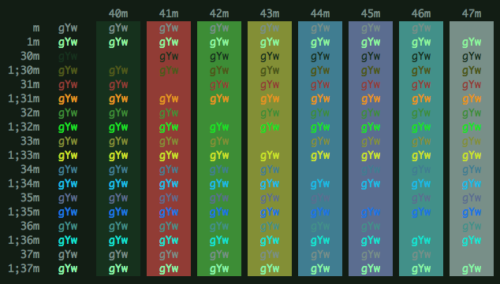
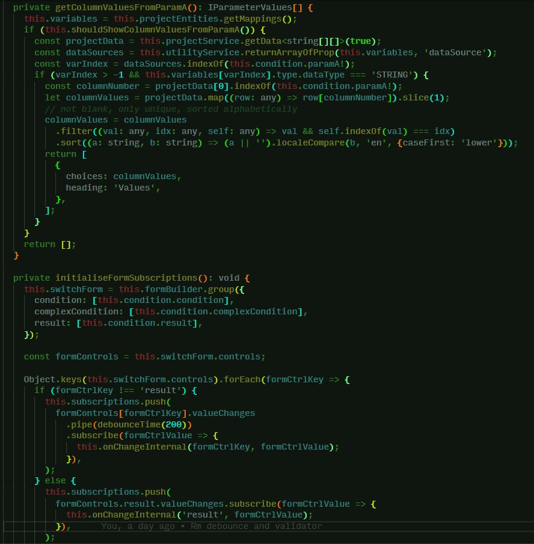

I'm endlessly toggling through colour themes in VS Code, combining them with
different fonts and icons to approximate a Platonic ideal of the optimal working
environment. I am never satisfied. There is always some aspect that displeases
me.

Over the last month or so I decided to resolve the issue once and for all by
creating my own custom theme.

I have always really enjoyed the Alien Blood colours that are one of the default
themes of the iTerm2 terminal emulator for Mac. I decided I would use this as my
base and try to construct a full syntax and UI scheme from the terminal
pallette. This wasn't easy because the colour palettes of terminal themes are
more austere than those designed for syntax-highlighting. It took lots of
tweaking to try and make the resulting theme visually harmonious but not so
homogenous that you cannot distinguish the syntax at glance.

I was able to achieve this without introducing any additional colours to the
default Alien Blood palette. The theme can be demoed in the browser
[here](https://vscode.dev/theme/ThomasBishop.alien-blood/Alien%20Blood%20) and
downloaded from the
[extension marketplace](https://marketplace.visualstudio.com/items?itemName=ThomasBishop.alien-blood).
You can also view the theme on
[GitHub](https://github.com/thomasabishop/alien-blood-vscode).

I'm particularly happy with the rendering of TypeScript and Angular components
which is what I am editing the majority of the time at work, similarly with HTML
and CSS. However I think there is room for improvement when it comes to plain
JavaScript and other filetypes such as shell scripts. In these cases the
highlighting is too homogenous and dark but now I have the basic palette
completed I can add additional rules for specific programming languages in
future releases.
