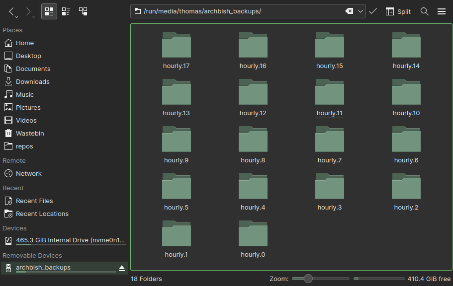

I use the `rsnapshots` package to run sequenced backups of my ThinkPad T15 running Arch Linux.

`rsnapshots` is based on the `rsync` utility and makes it easy to maintain backups over several timeframes. I run hourly, daily, weekly, and monthly backups, sequenced using `systemd` timers.

## Preparing the external disk

I store my backups on an external 500GB SSD.

First I partition the disk:

```
fdisk /dev/sda
d # delete the existing partitions
n # start a new partition
+500GB # specify size
w # write the partition to the disk
```

I now have a 500GB partition at `/dev/sda/sda1`

Next I create the file system:

```
mkfs -t ext4 /dev/sda1
```

And I label my disk so that I it has a readable name rather than the default GUID that Linux will apply.

```
e2label /dev/sda1 archbish_backups
```

At this point you would create or specify a mount directory and mount the partition with `mount`, also adding it to your `fstab` file to ensure that the disk mounts to the same location in future.

I haven't chosen to do this because I use the KDE Plasma desktop environment and it automatically mounts any connected drives to `/run/media`. However in order to check the partition label and ensure the above processes have been successful I will disconnect and reconnect the device.

Now when I run `lsblk` to list the block devices on the machine, I see my new disk and partition:

```
lsblk
NAME        MAJ:MIN RM   SIZE RO TYPE MOUNTPOINTS
sda           8:0    0 465.8G  0 disk
└─sda1        8:1    0 465.8G  0 part /run/media/thomas/archbish_backups
nvme0n1     259:0    0 476.9G  0 disk
├─nvme0n1p1 259:1    0   512M  0 part
├─nvme0n1p2 259:2    0  11.2G  0 part [SWAP]
└─nvme0n1p3 259:3    0 465.3G  0 part /
```

Typically you won't have access to the partition or mount directory yet. You can run the following against your username to ensure access:

```
sudo chown -R <username>:users /run/media/<username>/
```

## Configure snapshot backups with rsnapshot

I install `rsnapshot` and `rsync` as a dependency:

```
pacman -Sy rsync rsnapshot
```

`rsnapshot` is setup entirely through its config file: `/etc/rsnapshot.conf`. When you install the package the default config file contains lots of instructions and it's mostly a case of removing the comments for the functionality you require. The [Arch wiki](https://wiki.archlinux.org/title/rsnapshot) provides an exhaustive account but the key parts are as follows:

```
# Set the snapshot root directory (the external HDD you plan to use)

snapshot_root   /run/media/thomas/archbish_backups

# Set the backup intervals

retain  hourly 24
retain  daily   7
retain  weekly  4
retain  monthly 12

# Name the dir you want to snapshot and what it should be called on the external disk

backup  /home/  localhost
```

So, obviously I am taking hourly, daily, weekly and monthly snapshots. In total, this gives me a years worth of retention whilst minimising the space taken by the older backups. (If I wanted to keep a record spanning several years, I could just make a copy the latest monthly backup in a year's time.)

The numbers next to the names indicate the retention period. After 24 hours, the oldest hourly backup becomes the daily backup; after seven days the oldest daily backup becomes the weekly backup; after four weeks the oldest weekly backup becomes the monthly backup and so on.

Now we need to automate the execution of `rsnapshot` at the times designated in the configuration file. We'll do this with a `systemd` service file and several timers. Each file created will be located at `/etc/systemd/system/`

First we create the service file. This will be a oneshot service that is run by the timers:

```
[Unit]
Description=rsnapshot (%I) backup

[Service]
Type=oneshot
Nice=19
IOSchedulingClass=idle
ExecStart=/usr/bin/rsnapshot %I
```

Then we have to create a timer file for each of the intervals: hourly, daily, weekly, and monthly. Here's the hourly and monthly files to give an idea:

```
# /etc/systemd/system/rsnapshot-hourly.timer
[Unit]
Description=rsnapshot hourly backup

[Timer]
# Run every hour at 15mins past the hour
OnCalendar=*:15
Persistent=true
Unit=rsnapshot@hourly.service

[Install]
WantedBy=timers.target
```

```
# /etc/systemd/system/rsnapshot-monthly.timer
[Unit]Description=rsnapshot monthly backup

[Timer]
# Run once per month at 3:30 local time
OnCalendar=*-*-1 03:30:00
Persistent=true
Unit=rsnapshot@monthly.service

[Install]
WantedBy=timers.target
```

Let's check one of our timers:

```
systemd-analyze calendar "*:15"

Original form: *:15
Normalized form: *-*-* *:15:00
    Next elapse: Sun 2023-01-08 15:15:00 GMT
       (in UTC): Sun 2023-01-08 15:15:00 UTC
       From now: 27min left
```

Nice. Now we need to enable and start the timers. For each timer run:

```
systemctl enable rsnapshot-[interval].timer
systemctl start rsnapshot-[interval].timer
```

Oh it's 15:21, let's check the first hourly snapshot was taken:

```
journalctl -u rsnapshot@hourly
Jan 08 15:15:04 archbish systemd[1]: Starting rsnapshot (hourly) backup...
```

Great. After a few hours we can see the different snapshots mounting up in the backup directory:


