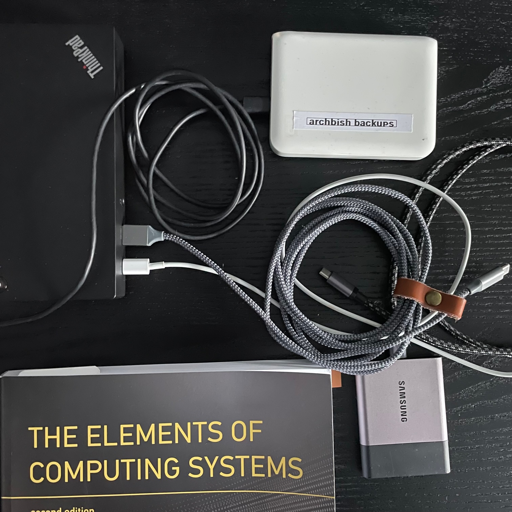

My primary machine is called `archbish` because my surname is Bishop and my OS is Arch Linux. I thought it was funny at the time. I run two sorts of backups:

1. A daily backup of the entire disk
2. Hourly, daily, weekly and monthly snapshot backups of the home directory

Both are backed-up to an external harddrive.



The purpose of the whole disk backup is for recovery in the event of a catastrophic disk failure where I am locked out of the machine and unable to go in and effect a recovery via `tty`. In this scenario I would be able to recreate my setup by wiping the corrupted machine drive, reinstalling the OS and migrating the backup.

The snapshot backups exist for more minor mishaps. For example, accidentally removing something important with a cavalier `rm -rf` or clearing the cache only to find that I have lost an important configuration setting. In this scenario, I would just restore the individual file from the hourly backups or revert to an earlier state from the same day. In contrast to the whole-disk backup the snapshots only record the `/home/` directory.

I use `rsync` for the whole-disk backup and `rsnapshot` for the snapshot backups. `rsnapshots` is itself based on `rsync`. The execution of the `rsync` process is managed through a `cron` job but I follow the Arch Linux wiki advice to run `rsync` as a `systemd` service.

I also maintain a virtual machine version of Arch so that I can periodically check my failsafes and ensure I can successfully restore from the backup.

## Preparing the external disk

I use an old spinning HDD with a max capacity of 500GB. I use `fdisk` to make two `ext4` (Linux filesystem) partitions:

- `sda1`: 250GB - for snapshot backups
- `sda2`: 200GB - for whole disk bootable backups

(I use the remaining space as an extra partition for virtual machines.)

Using the first partition as an example:

```bash
$ fdisk /dev/sda # create the partition
$ d # delete the existing partitions
$ n # start a new partition
$ +250GB # specify size
$ p # print to check
$ w # write the partition to the disk

$ mkfs -t ext4 /dev/sda1 # Set the filesystem
$ e2label /dev/sda2 archbish_snaps # name the disk
$ mkdir mnt1 # create a mount location
$ mount -t ext4 /dev/sda1 mnt1 # mount the disk
```

## Configure whole-disk backup with `rsync`

I use the following command to run `rsync`:

```bash
rsync -aAXv --delete --exclude={"/dev/*","/proc/*","/sys/*","/tmp/*","/usr/tmp/*","/run/*","/mnt/*","/media/*","/var/cache/*","/","/lost+found","node_modules"} /* /run/media/thomas/archbish_disk
```

The `--delete` flag makes sure that only files which have changed since the last backup are updated in the archive. I run a series of exclude rules (mostly temporary files or files that I can easily restore at initialisation) and I write to the `archbish_disk` volume I created earlier.

I set a `cron` job for this script to run at midnight everyday:

```
00 00 * * * ~/repos/bash_scripts/rsync_whole_disk_backup.sh
```

## Configure snapshot backups with `rsnapshot`

`rsnapshot` is setup entirely through its config file: `/etc/rsnapshot.conf`. When you install the package the default config file contains lots of instructions and it's mostly a case of removing the comments for the functionality you require. The [Arch wiki](https://wiki.archlinux.org/title/rsnapshot) provides an exhaustive account but the key parts are as follows:

```
# Set the snapshot root directory (the external HDD you plan to use)

snapshot_root   /run/media/thomas/archbish_snaps

# Set the backup intervals

retain  hourly 24
retain  daily   7
retain  weekly  4
retain  monthly 12

# Name the dir you want to snapshot and what it should be called on the external disk

backup  /home/  home/
```

Now we need to automate the execution at the set times using `systemd`. First we create the service file:

```bash
# Source link location: /etc/systemd/system/rsnapshot@.service
[Unit]
Description=rsnapshot (%I) backup

[Service]
Type=oneshot
Nice=19
IOSchedulingClass=idle
ExecStart=/usr/bin/rsnapshot %I
```

Then we have to create a timer file for each of the intervals: hourly, daily, weekly, and monthly. Here's the hourly and monthly files to give an idea:

```bash
# Source link location: /etc/systemd/system/rsnapshot-hourly.timer
[Unit]
Description=rsnapshot hourly backup

[Timer]
# Run every hour at 15mins past the hour
OnCalendar=*:15
Persistent=true
Unit=rsnapshot@hourly.service

[Install]
WantedBy=timers.target
```

```bash
# Source link location: /etc/systemd/system/rsnapshot-monthly.timer
[Unit]
Description=rsnapshot monthly backup

[Timer]
# Run once per month at 3:30 local time
OnCalendar=*-*-1 03:30:00
Persistent=true
Unit=rsnapshot@monthly.service

[Install]
WantedBy=timers.target
```

Let's check one of our timers:

```bash
$ systemd-analyze calendar "*:15"

Original form: *:15
Normalized form: *-*-* *:15:00
    Next elapse: Sun 2023-01-08 15:15:00 GMT
       (in UTC): Sun 2023-01-08 15:15:00 UTC
       From now: 27min left
```

Nice. Now we need to enable and start the timers. For each timer run:

```bash
$ systemctl enable rsnapshot-[interval].timer
$ systemctl start rsnapshot-[interval].timer
```

Oh it's 15:21, let's check the first hourly snapshot was taken:

```bash
$ journalctl -u rsnapshot@hourly
Jan 08 15:15:04 archbish systemd[1]: Starting rsnapshot (hourly) backup...
```

Yas.
