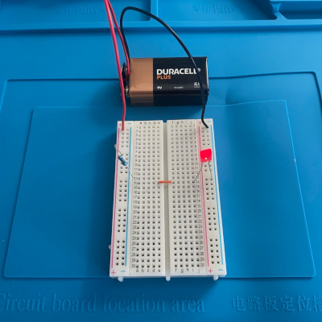
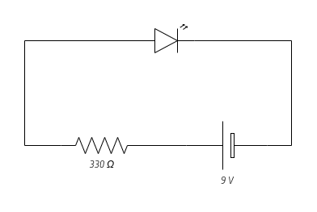

My first project is the _hello world_ of hobbyist electronics: a simple LED
circuit.

I have connected a 9V battery to a breadboard containing a 330Ω resistor and
LED. Assuming a forward voltage drop of 2V from the LED, this circuit produces a
current of I = 7V / 10,000Ω = 21.21 mA.

