As part of our holiday this year my girlfriend and I went to visit
[Bletchley Park](https://bletchleypark.org.uk/) and
[The National Museum of Computing](https://www.tnmoc.org/).

With our customary taste for luxury, we stayed in one of the three Premier Inns
in Milton Keynes. Milton Keynes is strange: a car park in search of a town.
However, we had the good fortune to overlook one of its supermalls. This is
notable only because it _looks exactly like a sandworm in Dune_:

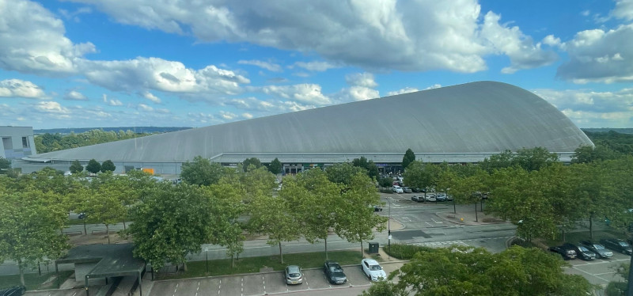

Bletchley was superb. A model of how to run a heritage project and museum. We
spent about five hours on site stopping for lunch and an excellent cup of tea.

As you work your way through the huts you pass through each region of what was a
global signals intelligence factory: collection, decryption, evaluation, and
finally dissemination.

The huts concerned with decryption were naturally the most compelling. There was
life size replica of the Bombe computer used to derive the daily settings of the
Enigma machine. It had spinning and clicking rotars however this was a
simulation rather than a working reconstruction.

<i>Model of the Bombe machine</i>

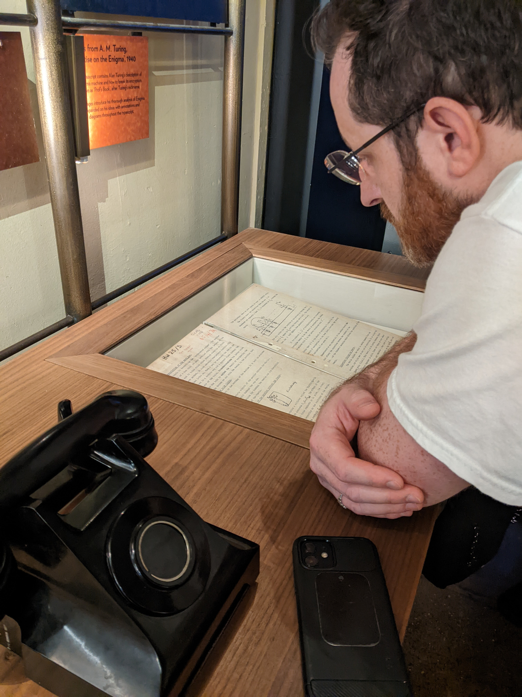

<i>Reading Turing's notes on the operation of the Bombe</i>

Probably the biggest highlight for me was standing at "the birthplace of the
modern computer": the hut where the Colossus computer was used to decipher the
Lorenz messages of the German high command.

<i>Outside the hut where the Colossus operated</i>

Although not a modern computer in the sense of being general-purpose (it could
only be used for breaking this type of cipher and and was not programmable), it
was the first to use vacuum-tubes for logic operations, rather than
electro-mechanical switches and relays. This made it fully electronic and
therefore much quicker and with greater combinatorial range.

<i>The working reconstruction of the Colossus at the National Museum of
        Computing</i>

This was the insight of
[Tommy Flowers](https://en.wikipedia.org/wiki/Tommy_Flowers) (a working class
hero if ever there was), who designed and built it. He proposed using
vacuum-tubes from his experience with telephony at the Post Office Research
Station. This was met with scepticism and at one point he resorted to using his
own money (never properly remunerated) to build it. He was vindicated. Not only
did the machine prove critical in the final stages of the War (confirming the
Nazis had bought the D-Day deception), it proved the speed and viability of
purely-electronic components that would ultimately lead to the transistor and
integrated circuit in later decades.

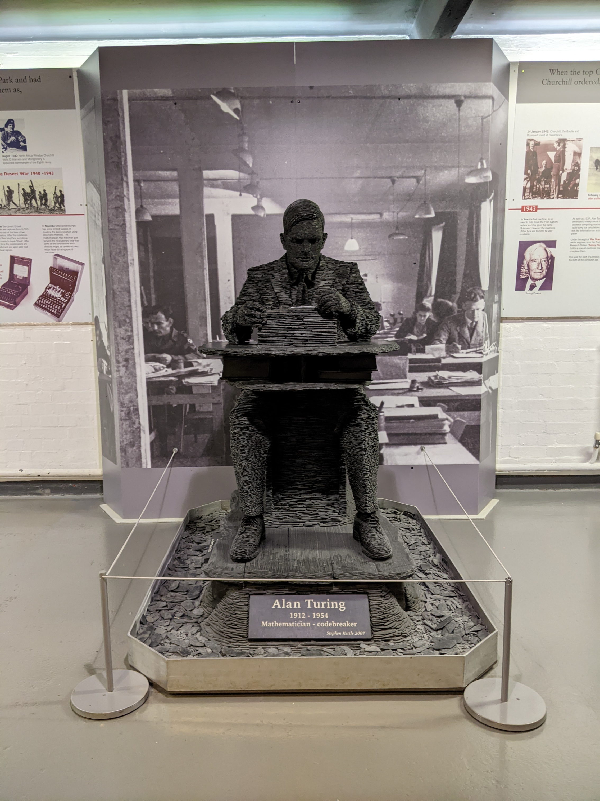

<i>Sculpture of Alan Turing at Bletchley Park</i>

The next day we went to the National Museum of Computing which is unaffiliated
with Bletchley but located on the same site.

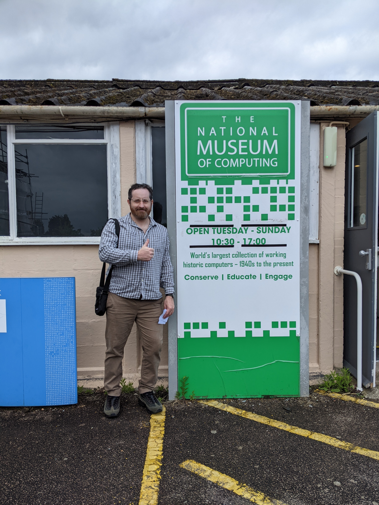

<i>Excited would be an understatement</i>

This was a different experience. Certainly less polished and perhaps a bit
forbidding for those not already well versed in computer lore.

This said, it had it's own scruffy charm and is clearly a labour of love. During
our visit there were OG volunteer computer engineers actively working on the
reconstructions.

It was a complete cornicopia of retro computers and we had a high time
marvelling at the sheer amount of beige and retro-futurist design.

Here are some of my highlights...

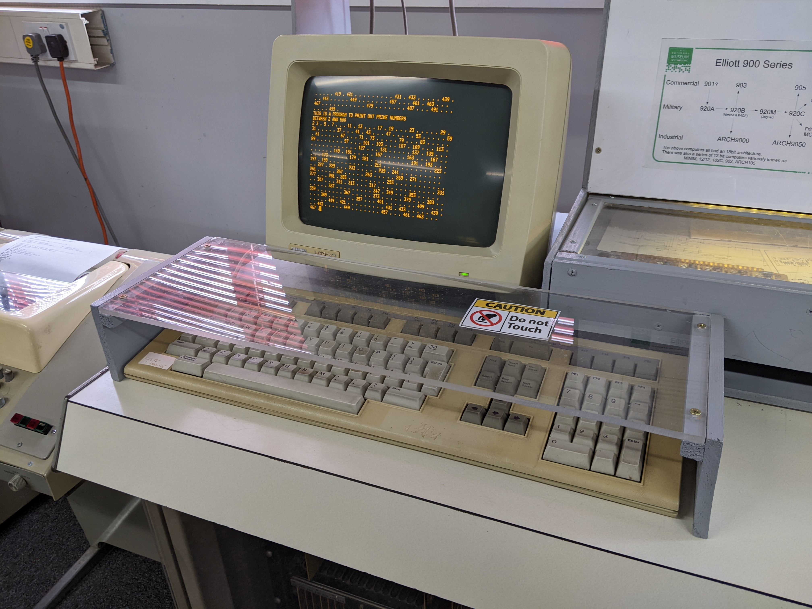

<i>The Elliott 900</i>

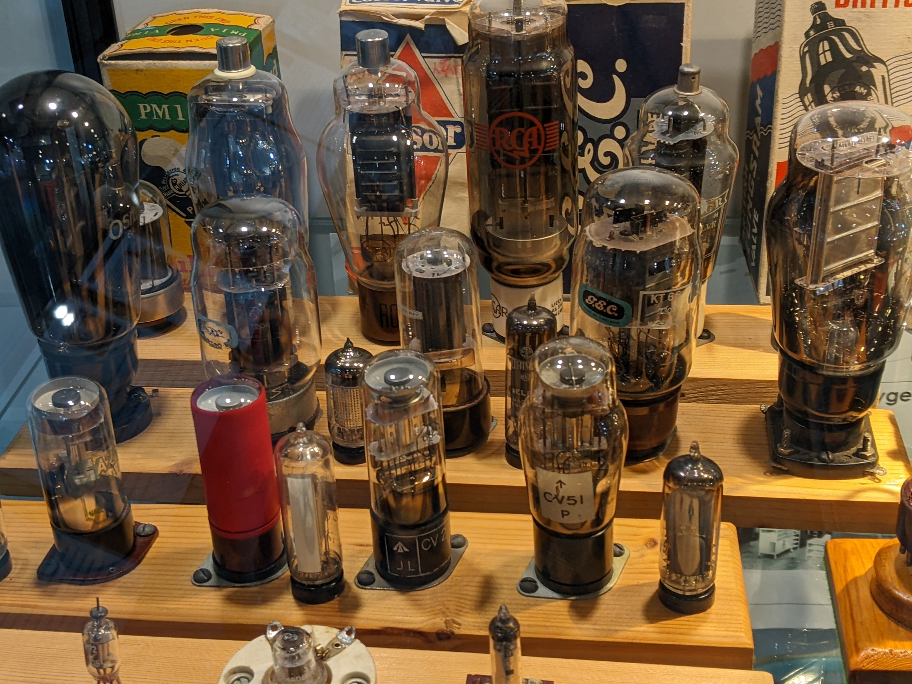

<i>A lovely array of thermionic valves (vacuum-tubes)</i>

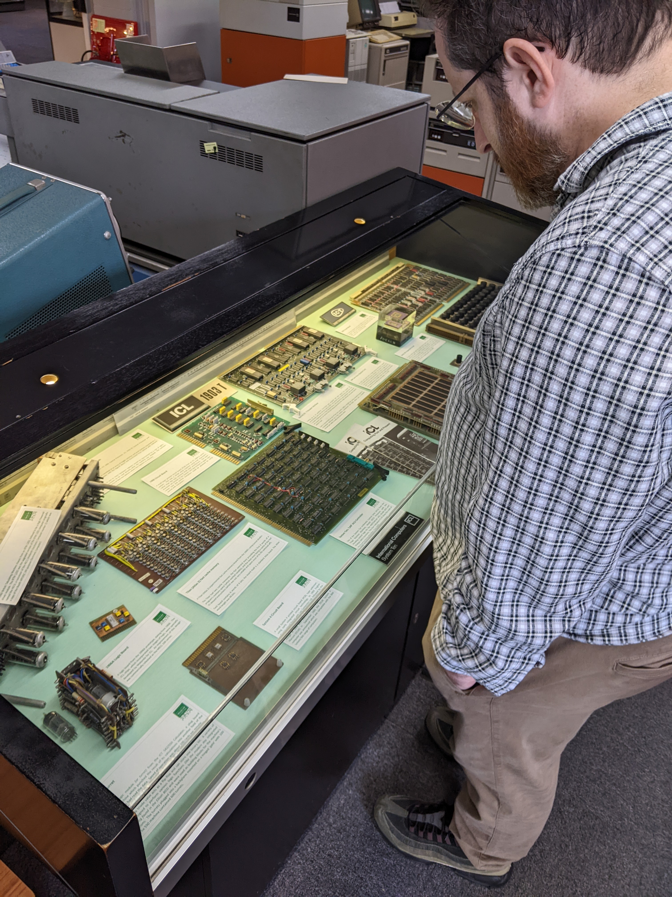

<i>Looking at circuit boards</i>

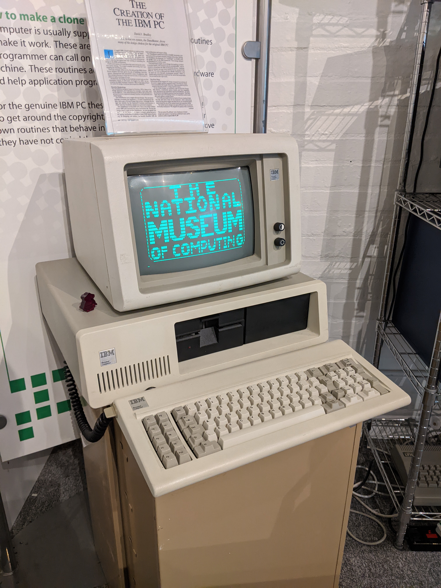

<i>The first IBM Personal Computer</i>

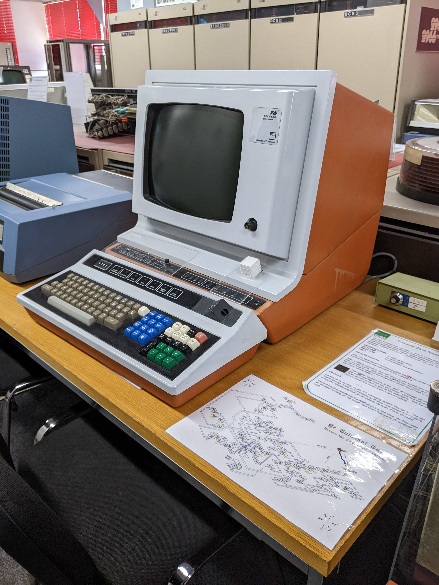

<i>Where did we go wrong with interface design?</i>

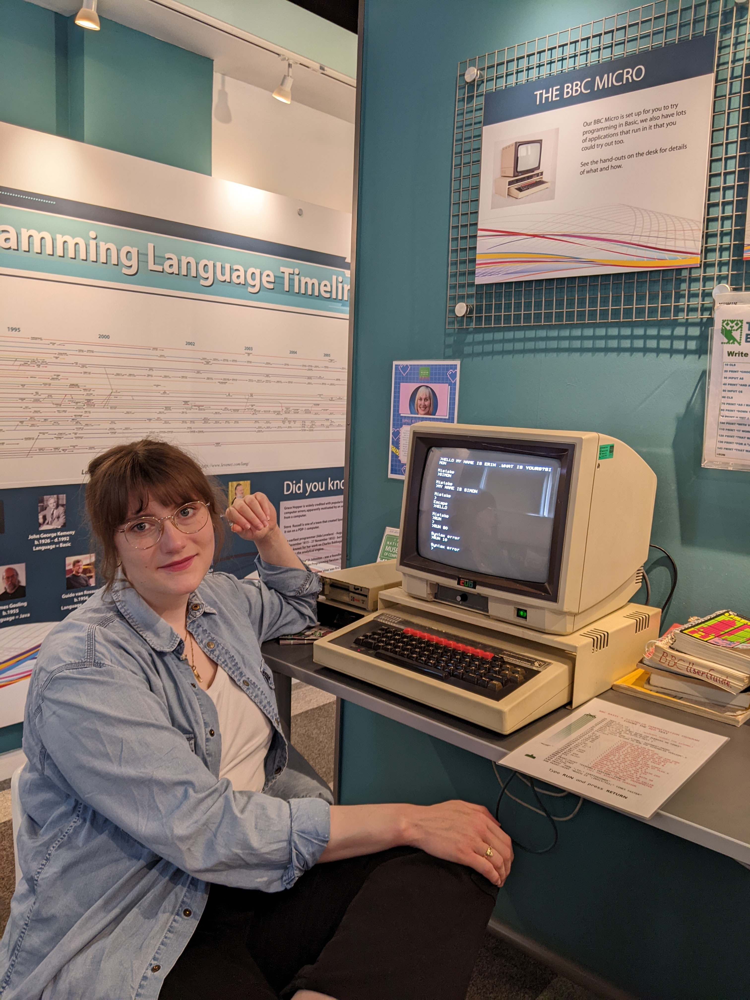

<i>Cute nerd with the BBC Micro</i>

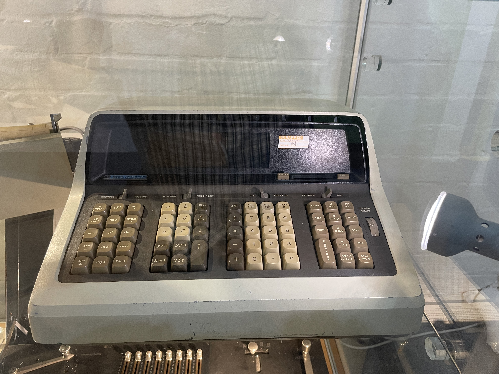

<i>The keycaps on this calculator are pure <a href="https://github.com/morhetz/gruvbox">Gruvbox</a></i>

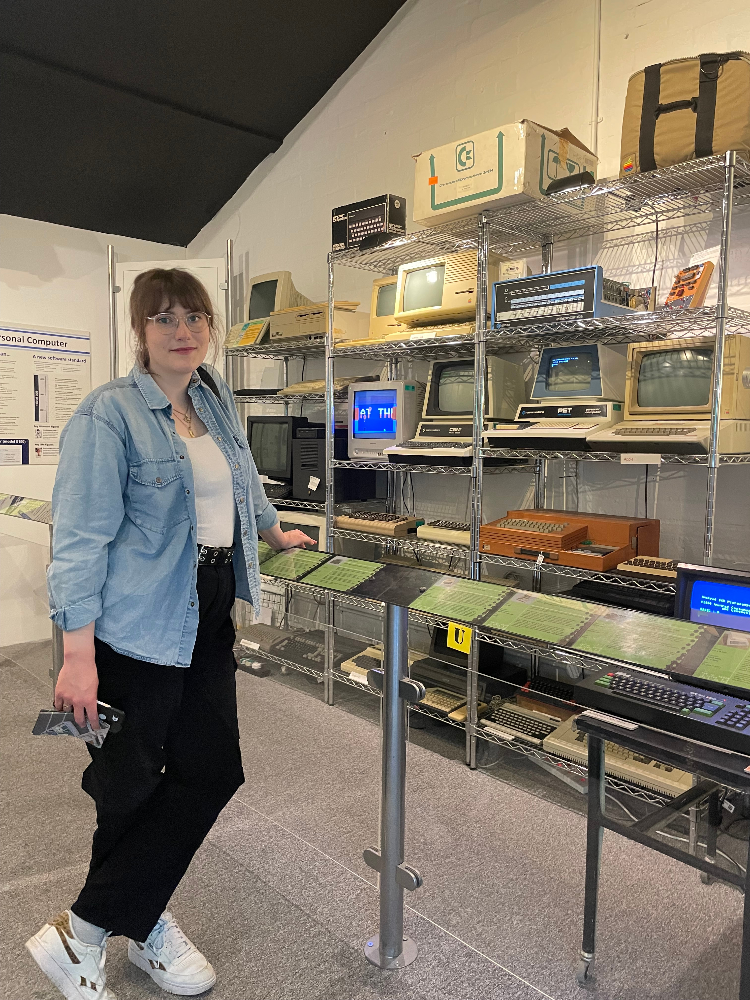

<i>Ms. Systems Obscure with an array of early PCs</i>

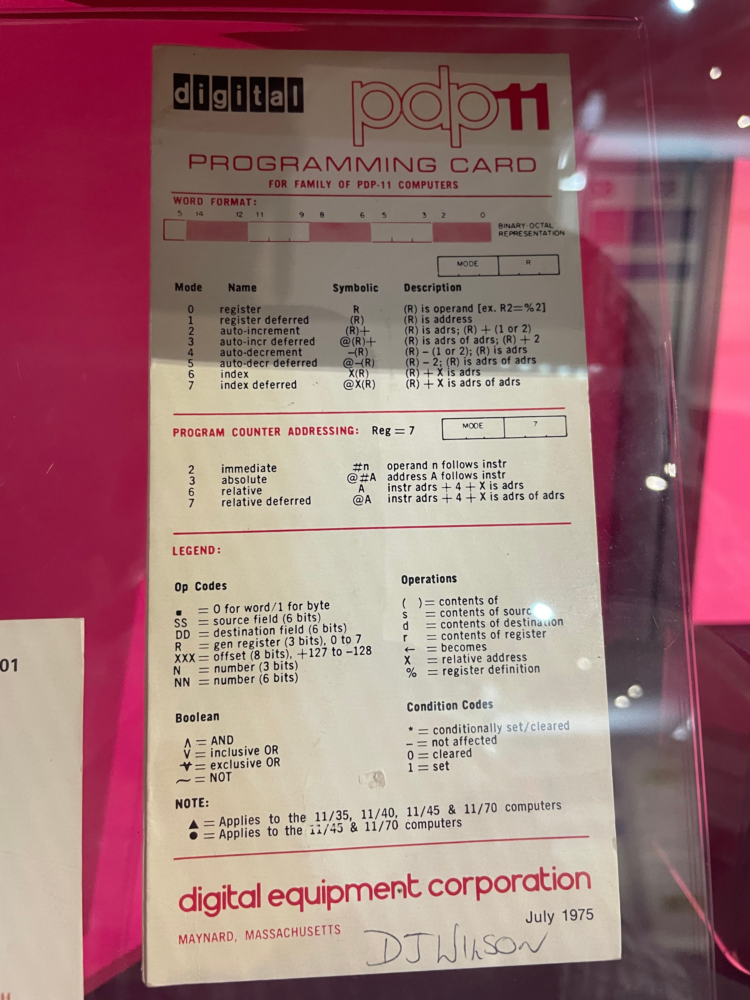

<i>Instructions for programming the PDP-11 from DEC</i>

