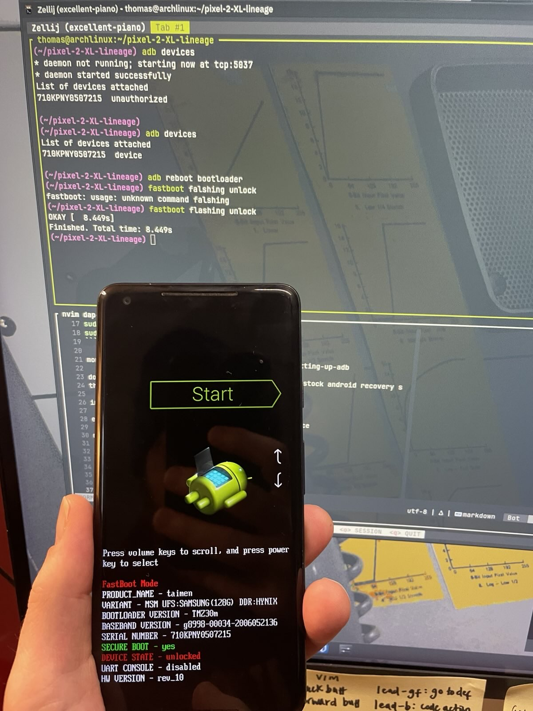
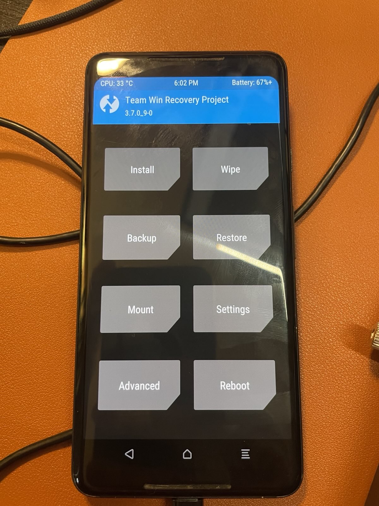
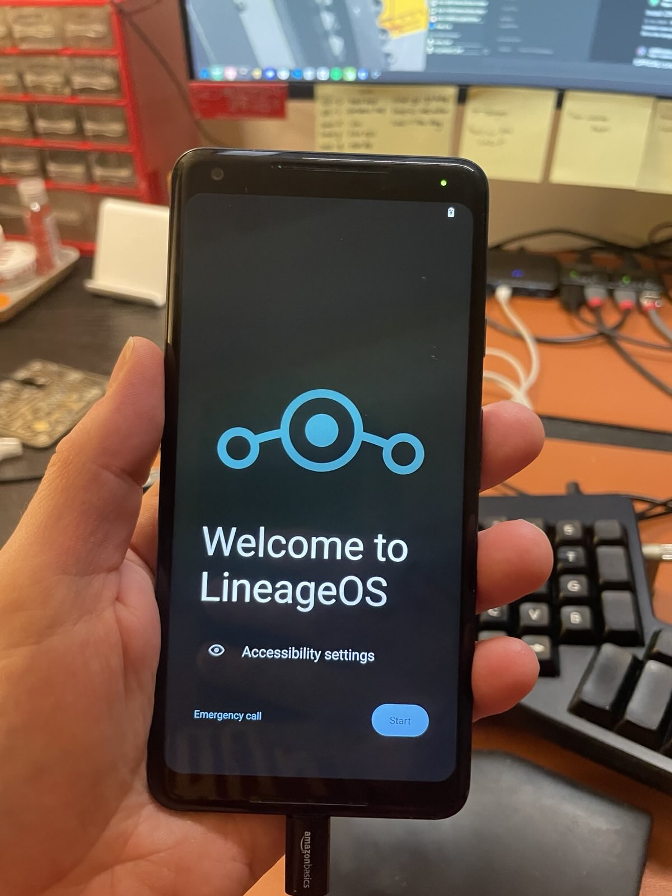
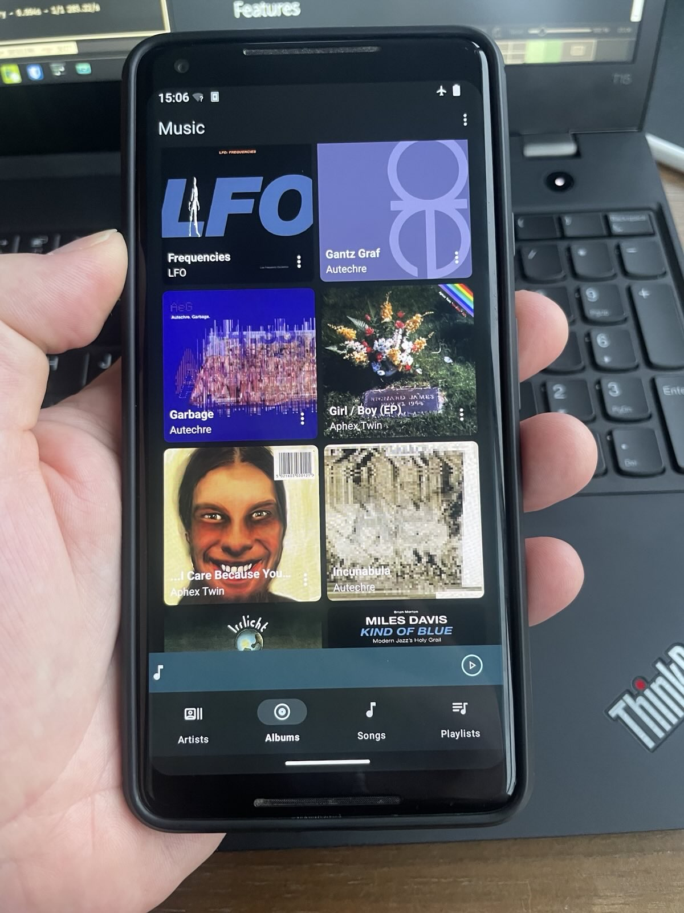
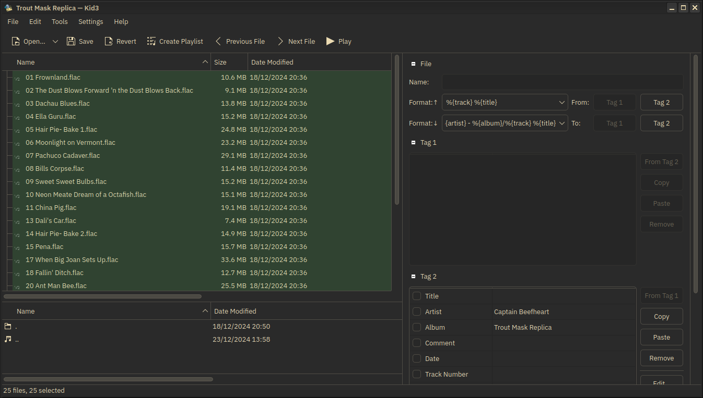

I recently read
[_The Age of Surveillance Capitalism_](https://en.wikipedia.org/wiki/The_Age_of_Surveillance_Capitalism)
. This book and initiatives like the
[Opt Out Project](https://www.optoutproject.net) have motivated me to try and
improve my digital privacy.

Some will see this as a fool's errand and I agree to some extent. However it
isn't something I expect to complete overnight. I view the journey as just as
important as the destination as it provides opportunities to acquire new skills,
discover new technologies, and work on projects that have utility in my daily
life.

My first objective was to do away with my Spotify subscription and consume music
from a dedicted offline device that plays albums I actually own.

I researched modern-day MP3 players but this is a pretty dead market these days
and all the devices were ugly or surplus to my requirements. There is a
community of hard-core audiophiles who have rechristened MP3 players _digital
audio players_ (DAPs) but most of the recommended devices are very expensive and
my goal is to try and keep the overall anti-surveillance project affordable,
recycling and building my own solutions where I can.

It occurred to me that I could just repurpose an old phone into a single-purpose
computer for playing music. Appropriately enough, I have an old Google Pixel 2
XL from 2017 - the surveillance capitalist device _par excellence_.

It is able to play FLAC files natively and its 128GB harddrive should be more
than sufficient for my library.

My first task was to "de-Google" the phone by finding a version of Android that
respects privacy and doesn't bundle surveillance-ware. This was trickier that I
expected. Not because there isn't such software but because phones have a more
specific hardware set with greater variation than laptops of desktop computers.
You have to find an OS that is compatible with your hardware and which is still
regularly maintained even though the hardware is, in my case, eight years old
and long since superseded by more recent devices.

Luckily [LineageOS](https://lineageos.org) offers a build that works with the
Pixel 2 XL and which is fairly lightweight, allowing me to preserve greater disk
space for the audio files.

Having enabled "Developer Mode" on the Pixel, I needed to install a few CLI
tools on my Arch Linux machine that would enable me to interface with the
device.

I installed `android-tools` and `android-udev`. `android-tools` includes `adb`
which allows me to communicate with an Android device over USB, transfer files,
and access the shell from another Linux device. It also includes `fastboot`
which unlocks the Pixel bootloader, necessary to install third-party recovery
software through which I can flash a new OS ROM to the device. I used
`android-udev` to grant myself access to the Pixel from my Linux PC.

<i>Bootloader unlocked</i>

Having gained access to the device remotely I used `adb` to unlock the
bootloader and then transferred over the [TWRP](https://twrp.me/about/) recovery
software and the latest build of LineageOS, tagged to Android v.12.

Then, on the device, I booted into TWRP. From here I wiped the data and
installed LineageOS. This took a few attempts to work. It kept booting into the
recovery menu for some reason but eventually it just worked.

<i>Running the recovery software</i>

Once the new OS was installed there wasn't much else to do. I deleted the few
apps included with LineageOS that I didn't need and installed F-Droid. F-Droid
is a de-Googled version of Google's Play Store that serves as a package manager
for FOSS Android apps.

<i>LineageOS installed</i>

Using F-Droid, I installed a few music apps to experiment with but ended up
finding the default LineageOS player satisfactory. I also installed Duck Duck Go
as my browser and KDE Connect. Although I intend to mostly keep the device
offline, it's handy to have a browser to source images for the music player.

KDE Connect allows me to connect to the Pixel from my PC over WiFi. This is
necessary for transferring the audio files. It also allows me to control media
on the PC from the phone although I doubt I will have much use for this.

I am still in the process of recreating my Spotify library with albums I own. I
have a lot of albums in MP3 on an old external HD from the pre-streaming era. I
have also been able to use the Internet Archive as well as buying albums direct
from artists on Bandcamp. For very obscure stuff that was originally released on
tape and circulated online I am usually able to find torrents, although some
stuff is very hard to track down. I'm planning on getting a CD drive so that I
can rip CDs I find in second-hand shops and fairs. If I go full
"digital-hoarder", I may even get a vinyl-to-digital converter turnable
eventually, then I can exploit my friends' LP collections.

<i>Album list within the DAP</i>

One annoying thing is that the metadata for the music files will often be
missing or incomplete. For instance the tracks on an album might be out of order
or lacking the album cover. I use [kid3](https://kid3.kde.org) to view and edit
the metadata so that the tracks are recognised properly by the player with
release year and album art.

<i>kid3 for managing album metadata</i>

My next challenge will be tackling audiobooks and podcasts. Ideally I would like
to download them as files to the DAP and avoid streaming services. More on this
to follow.
