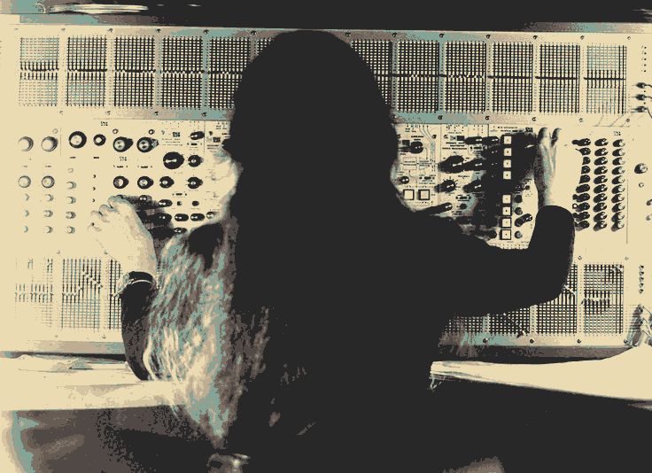
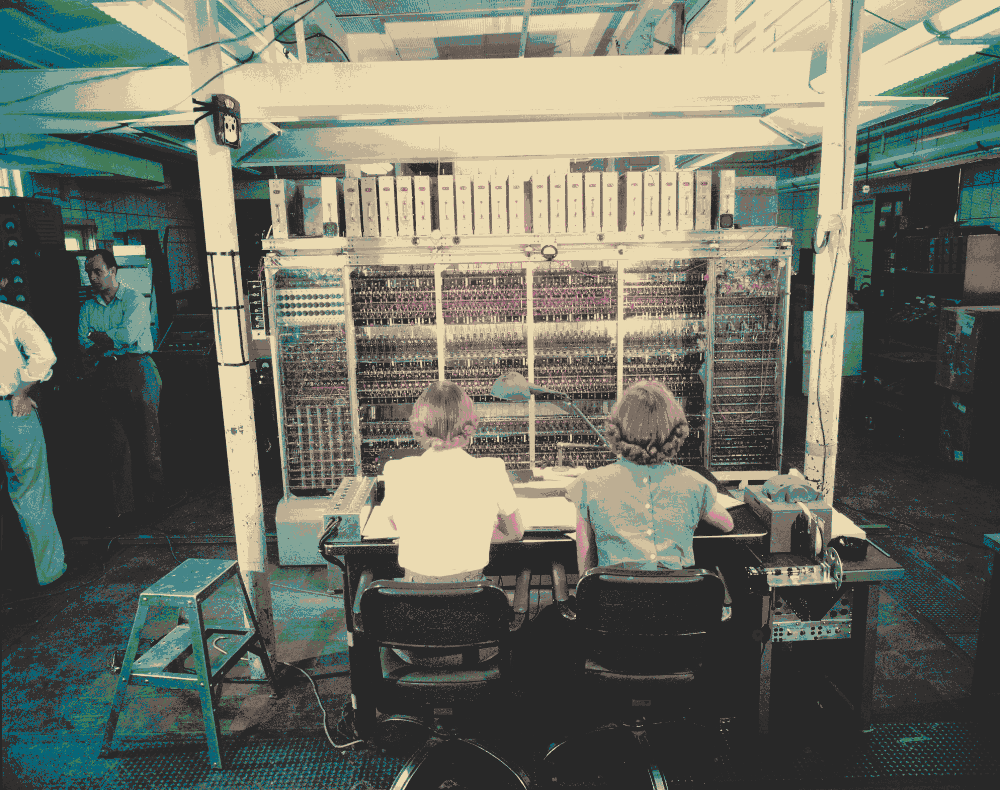
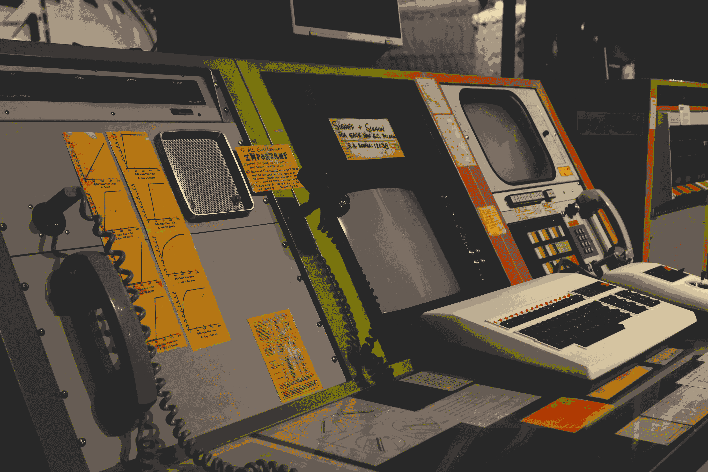
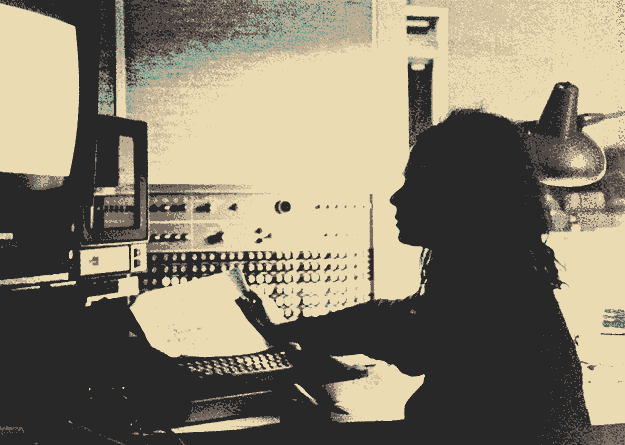
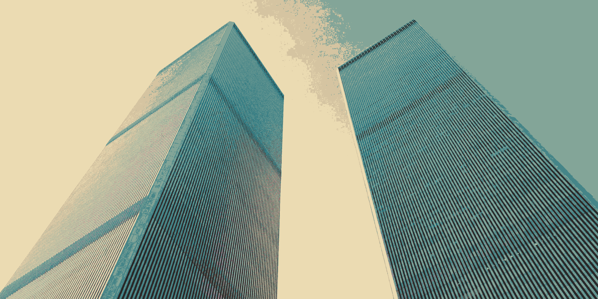

I've been experimenting with an
<a href="https://en.wikipedia.org/wiki/ImageMagick">ImageMagick</a> script to
create filters for images that I use as my screensaver. I applied a
Gruvbox-themed colour swap and manipulated the dithering to create a retro
effect with highlights. I was quite surprised how easy and effective this proved
to be. Below are some of the ones I like best.

<i>The composer Éliane Radigue manipulating an ARP synthesiser. Original <a href="https://res.cloudinary.com/reverb-cms/image/upload/v1680037720/backfilled/curation/31_kymhtf.jpg" target="_blank">image</a> by Yves Arman.</i>

<i>Operators in front of the MANIAC computer. Original <a href="https://encrypted-tbn0.gstatic.com/images?q=tbn:ANd9GcSLZnRG4IM-Djg001ZVkdXK1_bSmrvqP8TS9RNqYb2K_813jGz0" target="_blank">image</a>.</i>

<i>Power station control panel image I found on Unsplash. Original <a href="https://substackcdn.com/image/fetch/f_auto,q_auto:good,fl_progressive:steep/https%3A%2F%2Fsubstack-post-media.s3.amazonaws.com%2Fpublic%2Fimages%2F670a5538-253f-4855-b211-457cf368ba73_5472x3648.jpeg" target="_blank">image</a>.</i>

<i>Composer Laurie Speigel working with a computer at Bell Labs. Original <a href="https://unseenworlds.com/blogs/linernotes/laurie-spiegel-the-expanding-universe-notes-by-laurie-spiegel" target="_blank">image</a>.</i>

<i>The Twin Towers</i>

