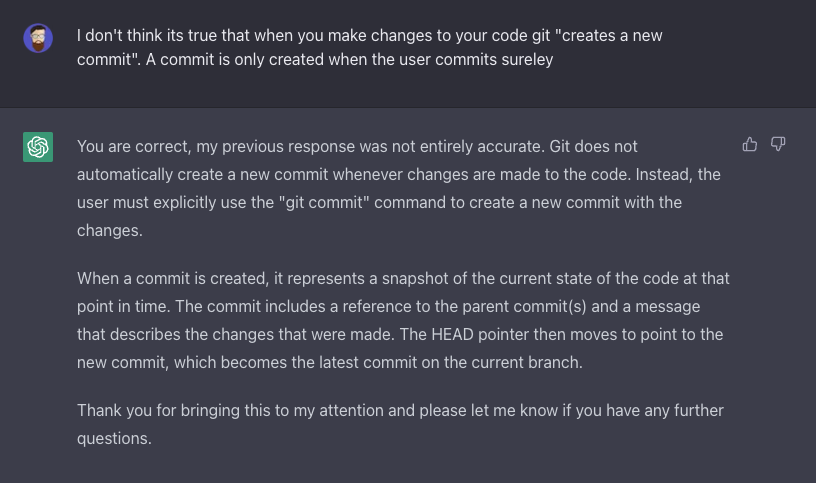

Like a lot of people who make software for a living I'm currently coming to terms with ChatGPT. I have mixed feelings and conflicting thoughts.

My misgivings relate mostly to its social, political and cultural implications rather than its practical utility. I will address these in a future post. Here, I want to discuss the benefits from my point of view as a software engineer and explain why, for now at least, I view it as an asset rather than a threat to human programmers.

The interaction below marked the point at which I realised that there was something of substance to the technology beyond the hype.

The Bash code I had written looked fine to me and I couldn't see what I was doing wrong. Provided with the code and the expected output, ChatGPT identified the problem immediately, saving me from potentially wasting a lot of time scouring Stack Overflow for a solution. A good linter or debugger can do the same, however. The difference with ChatGPT is that I am also able to interrogate the AI about its response and seek clarification as it relates to my broader objectives, knowing that it will retain a reference to the pertinent data and be able to justify and elaborate on its responses.

It's the experience, or rather the illusion, of _rational interchange_ that makes me think that ChatGPT and its successors will constitute a definitive step-change in the way that people retrieve and process information, particularly in practical fields that work with specialised, more or less objective knowledge.

I know from my own case and from my time as a teacher that facts become knowledge only when they are embedded within a web of related beliefs. Beliefs that are constantly being revised and rejected based on their rational relations to other beliefs and their correspondance to truth. If you want a child to understand a mathematical concept and they don't simply get it in a flash of _a priori_ discernment, the best thing you can do is present examples of the concept under different aspects and in relation to things they _do_ know, whilst all the time questioning them and encouraging them to verbalise their reasoning and question you.

ChatGPT excels in this role of midwife to your ideas.[^nietzshe] It is like having a very patient and knowledgeable teacher at your side that turns frustrating bugs and errors into opportunities for intellectual enrichment and growth. I can query ChatGPT on a shallow level about bugs and syntax but I can also ask for broader advice on architectural questions and matters of style. _Which data structure should I use for maximum efficiency?_, _How can I reduce repetition and achieve greater abstraction?_, _How do I do this thing in Java that I can already do in Python_? etc.

At least in its current form, I do not see this as a threat to my role as a human programmer because real rational interchange is only possible if both parties are conversant in the subject matter and are bound by the contraints of truth and logical inference. Currently, ChatGPT falls short on both counts.

In order to be able to exploit the benefits of ChatGPT in the programming context, I require a degree of knowledge sufficient to generate a good question and follow-up with secondary queries that refine the initial response and check it for truth. My (actual) knowledge is critical to the usefulness of the exchange.

This is obviously true in light of the fact that the technology, when compared to what we would consider to be genuine general artificial intelligence, is a glorified Markovian regurgitator of sampled data generated by humans. (Only those unaware of the challenges of artificial intelligence and the broader project of cognitive science, would mistake this for intelligence or linguistic capacity, as Chomsky has [predictably argued](https://web.archive.org/web/20230320095450/https://www.nytimes.com/2023/03/08/opinion/noam-chomsky-chatgpt-ai.html).) ChatGPT doesn't _know_ anything more than the man in the [Chinese Room](https://plato.stanford.edu/entries/chinese-room/). Nor does it have a concept of truth, as its well-documented "hallucinations" demonstrate. For now, the human is the vital guarantor of the truth and relevance of the output.

Here I catch ChatGPT out. It owns up to its error and provides a detailed and accurate correction.

But these limitations are what make ChatGPT a _good tool_ rather than a competitor. It empowers and elevates the programmer rather than diminishing him.

This is why I was rather underwhelmed by GitHub Copilot and uninstalled it after an hour or so. It provided no mechanism to query or second-guess the code that it was generating, beyond simply rejecting it. It made me feel diminished and effaced - a _user of software_ rather than a _builder of software_. It was easy to imagine it becoming an engine of entropy and mediocrity. Where poor or lazy programmers unthinkingly cobble together bloated and inelegant solutions that work, but without knowing why.

ChatGPT remedies this to a considerable extent. It is aware of its fallibility and will earnestly accept when it is told that it is wrong, recalibrating its response and vowing to do better. As long as it is utilised in an uncredulous spirit and the user has sufficient knowledge to hold it to account, ChatGPT serves as an invaluable tool for programming and technical personal development, without yet becoming a replacement or surrogate for skilled human technicians.

[^nietzshe]: "One person seeks a midwife for his thoughts; the other, someone he can assist. Here is the origin of a good conversation." Friedrich Nietzshe. _Beyond Good and Evil_. 1886.
