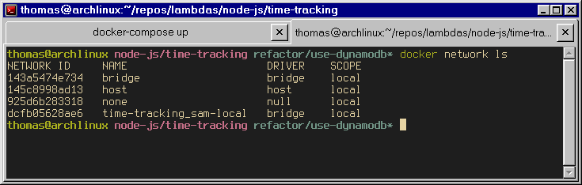
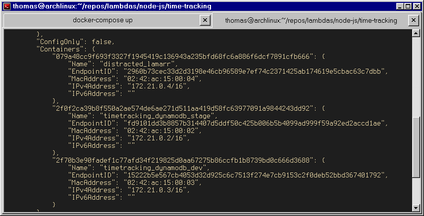
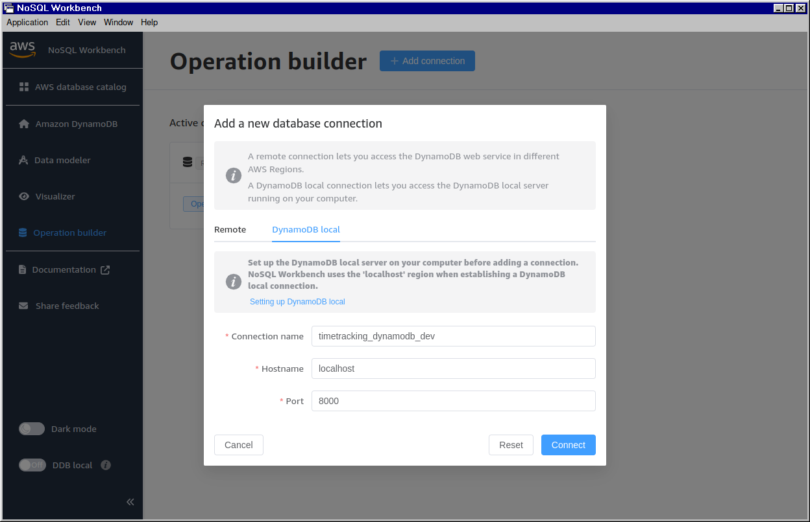
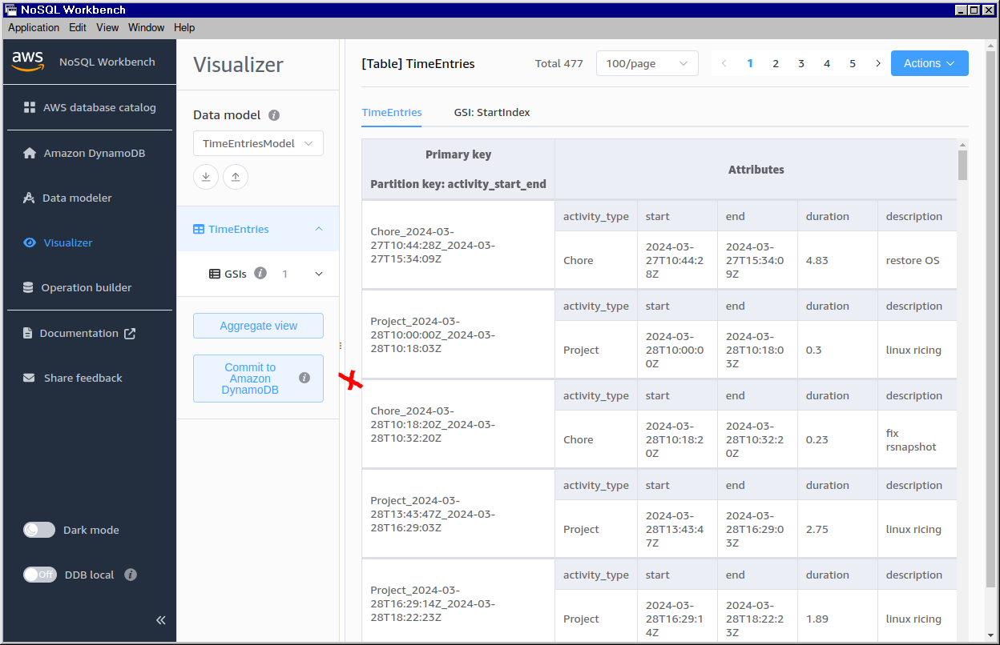
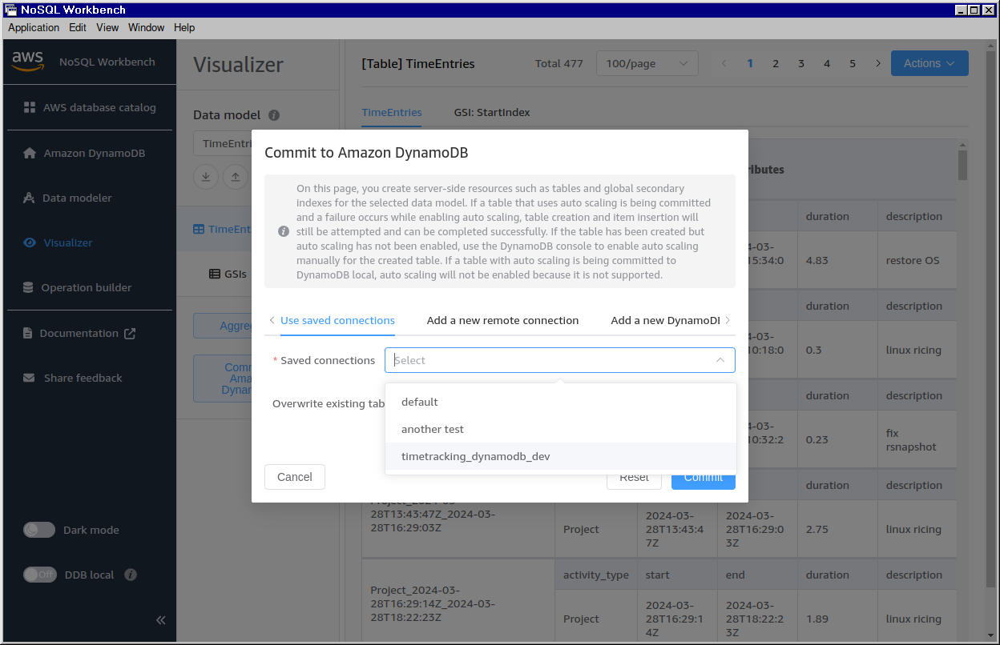
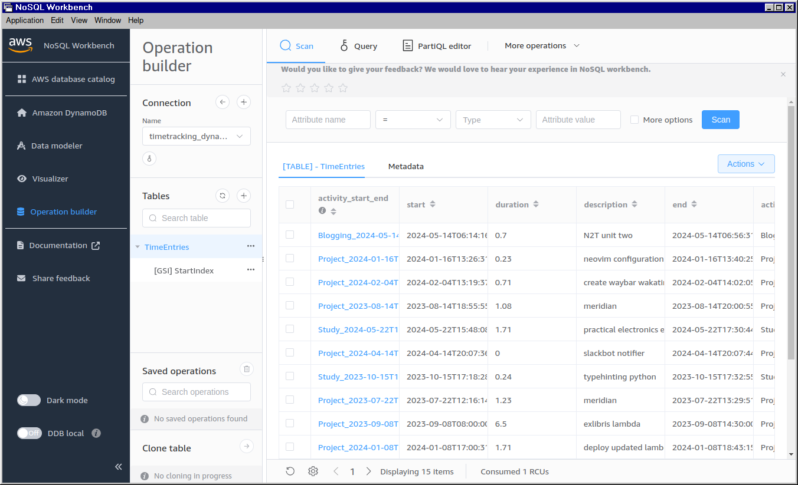
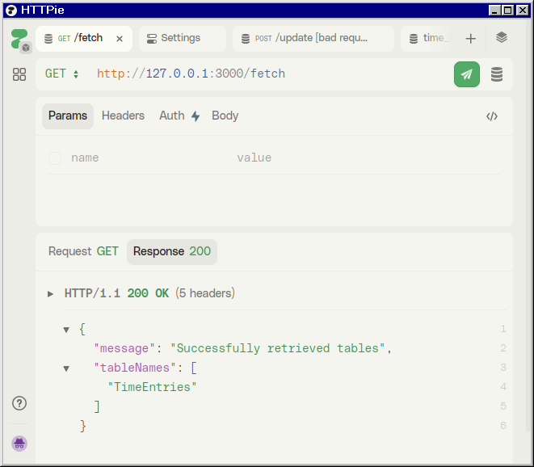

I wasted most of an afternoon trying to get the following set-up:

- Two local instances of DynamoDB running in Docker
- A local AWS Lambda working via AWS SAM
- The ability to add table data to either instance via NoSQL Workbench and query
  it via the lambda

If you are coming from SQLPro or DBeaver, Amazon's NoSQL workbench is a bit
unintuitive. Creating the lambdas and the Docker containers was easy, it was
getting them recognised by this client that was tricky. Anyway this is the
process.

I want to set up two Docker instances of the `amazon/dynamodb-local` image,
along with a bridging network so that the Docker container that SAM runs in can
communicate with the containers that DynamoDB runs in. Hence `docker-compose` is
the way to go:

```yml
# docker-compose.yaml

version: "3.8"
services:
  dev:
    image: amazon/dynamodb-local
    container_name: timetracking_dynamodb_dev
    ports:
      - "8000:8000"
    volumes:
      - "./data:/home/dynamodblocal/data"
    networks:
      - sam-local
  stage:
    image: amazon/dynamodb-local
    container_name: timetracking_dynamodb_stage
    ports:
      - "8001:8001"
    volumes:
      - "./data:/home/dynamodblocal/data"
    networks:
      - sam-local

networks:
  sam-local:
    driver: bridge
```

My two DDB instances are `dev` and `stage` running on ports 8000 and 8001
respectively. Their shared network is called `sam local`.

After running `docker-compose up`. I run `docker network ls` and it confirms the
network has been created (it prepends the network name with the repo name):



Next comes SAM. I've just created the default Typescript Lambda template using
the SAM CLI. For now this will just expose a single API Gateway endpoint,
`/fetch`, which I will use to GET my DynamoDB table data. The key info from the
template:

```yml
# template.yaml

Resources:
  TimeTrackingFunction:
    Type: AWS::Serverless::Function
    Properties:
      CodeUri: src/
      Handler: index.handler
      Runtime: nodejs20.x
      Architectures:
        - x86_64
      Events:
        Fetch:
          Type: Api
          Properties:
            Path: /fetch
            Method: get
```

I'll use the following command to start the local APIGateway server:

```sh
sam build && sam local start-api --docker-network time-tracking_sam-local
```

If I run `docker network inspect time-tracking_sam-local`, I can confirm that
the SAM Docker instance (which AWS creates and which is effectively a black box
to me) is on the same network as the two DDB instances that I set up earlier:



Next I want to view my containers in NoSQL workbench so I can create the table
schema and start adding data. I'm just going to worry about the `dev` container
here. I go to the _Operation builder_ and add a new connection:



This automatically generates an _Access key ID_ and _Secret access key_ even
though this is a local service that won't interact with the production version
in any way. You _must_ use these. A lot of guides say you can put anything here
when connecting but this is _not true_.

Taking these keys, I write a skeletal lambda just to check the connection,
utilising the AWS SDK for DynamoDB:

```ts
import { DynamoDBClient, ListTablesCommand } from "@aws-sdk/client-dynamodb"

const client = new DynamoDBClient({
   region: "localhost",
   endpoint: "http://dev:8000",
   credentials: {
      accessKeyId: "xxxx",
      secretAccessKey: "xxxx",
   },
})

export const handler = async (event: APIGatewayProxyEvent): Promise<APIGatewayProxyResult> => {
   try {
      const command = new ListTablesCommand({})
      const response = await client.send(command)
      return {
         statusCode: 200,
         headers: { "Content-Type": "application/json" },
         body: JSON.stringify({
            message: "Successfully retrieved tables",
            tableNames: response.TableNames,
         }),
      }
...
```

This was the first gotcha: I wasn't providing a region because, why would I,
this is local. But it needs to be `localhost`. And again, you must put the
actual credential values that the Workbench gives you.

The next gotcha was that this function, when invoked via my `/fetch` endpoint
was returning an empty array even though I had set up a table in Workbench:



You must click _Commit to Amazon DynamoDB_ even though this is counter-intuitive
and suggests you are going to auto-provision paid services! You can then select
the local instance that you are going to seed with the table from the model:



Now if you back to _Operation builder_, the table is associated with the given
instance and the data is displayed:



On reflection, this makes a lot of sense as it decouples the data model from any
particular instance (local or production) that uses the data and makes it easy
to seed different tables to different database instances.

So finally, if I now query the `fetch` endpoint, I get the table name returned,
demonstrating that all the different parts have joined up:


