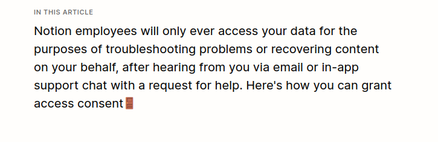
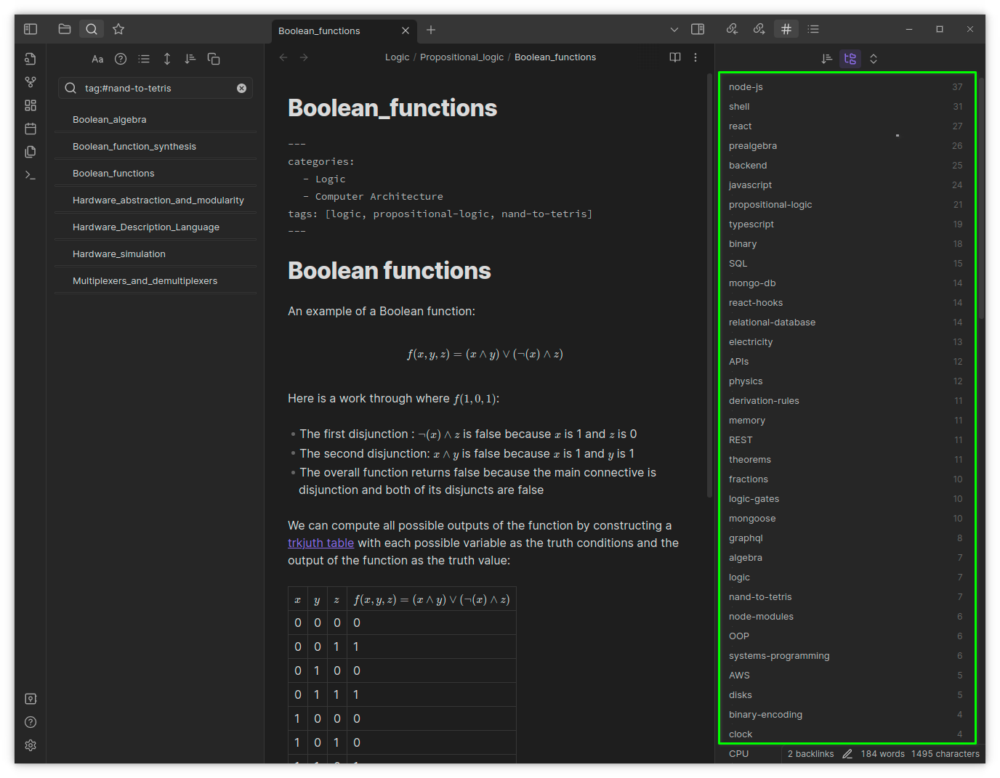
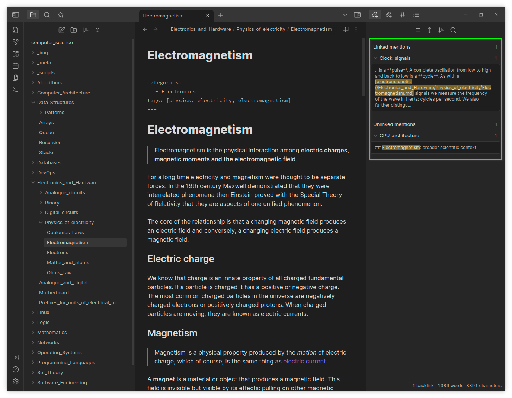

_These fragments I have shored against my ruins._

&mdash; T.S Eliot, _The Waste Land_

I'm writing this as a statement of intent, and to put my procrastinating tendencies on notice. I plan to create an extension for VS Code that will allow me to quickly retrieve, analyse and organise my Markdown-based notes.

Everything important that I learn about software engineering and computer science is written in Markdown fragments and saved to a [single public repository](https://github.com/thomasabishop/computer-science). This collated wisdom is my gift to humanity and the vast inheritance of my non-existent children.

For a while I used [Obsidian](https://obsidian.md/) as my primary note-taking tool. It allows for Markdown editing (including a Vim mode), it has a very cool knowledge-graph feature and most importantly does not own or store your data on a server or in the cloud. If the company goes bust or is hacked, your data is still yours and safe.

I moved from [Notion](https://www.notion.so) to Obsidian when I belatedly clocked that they pretty much own your data. Your notes are not available offline so if they suffer a breach or network failure, you're locked out. Also, until people complained, basically any employee could access your data. My employer blocks Notion on work machines for their cavalier practices.



<p align="center"><i>So that's fine, then</i></p>

While Obsidian is a significant improvement on Notion the following aspects bothered me:

- You are only able to cross-reference each file by a single metadatum - tags. No custom metadata.
- It does not use the default Markdown link syntax but rather a wiki-like variant. This means that if you access your notes outside of Obsidian, the links don't always work and this is especially the case when you have used relative links
- The text-editing experience is a bit clunky. Although they offer a Vim mode, the typeface remains sans-serif not monospaced, so its a disjointed experience using `+h` and `-l` to move through characters.
- The UI has far too many options and icons, a lot of which is bloat.
- You have to keep your images in the same "vault" (directory) as the Markdown that references it. But it's not possible to hide this directory or mask it from the indexer. Consequently, a link to an image (which is of course necessary to embed it in a Markdown file) counts as a hyperlink and shows up in the network graph view which serves little purpose given that it has no semantic value and is just a reference to a binary resource. You can hide these from the graph but they shouldn't be there in the first place. I imagine that this might be useful for academics and archivists but for note-taking it seems largely redundant.
- It's free software but is not open source. As a Linux user I always find this a bit troubling philosophically. But more practically, it means that you cannot offer improvements via pull-requests or fork your own customised version.

More than these individual gripes, using Obsidian meant that I had to use two pieces of software for simultaneous activity: VSCode for coding, Obsidian for writing notes about code. I really dislike context switching between apps and wasting mental energy reorientating myself to different layouts and buttons.

Now I've realised that the solution is to bring the benefits of Obsidian to VS Code via an extension.

Say what you like about Microsoft's almost papal hegemony over the software engineering ecosystem (VS Code, C#, TypeScript, GitHub, Atom, .NET Core, Windows, WSL, and now ChatGPT), VSCode is pretty good software. The fact that it is open source and has a great plugin library means I can use it for most programming languages. Again, to avoid context switching and wasted mental energy I'd rather have a passable VSCode environment rather than multiple IDEs. (Of course FOSS bores, Vimlords and Stallmanites will object, but the Vim extension combined with the telemetery-busting [AUR OSS build](https://vscodium.com/) of VSCode pretty much salves my consciouse.. Of course any open source work you do on the app means you are giving free labour to one of the world's largest corporations but let's be real: to live in this society as a worker is to be in a permanent state of vasselage.)

Many of the Obsidian selling points are already standard in VSCode: Markdown editing and rendering, version-control via Git, Vim keybindings, word and character counts etc. Plus there is an [excellent set of Markdown extensions](https://github.com/mjbvz) created by Microsoft worker Matt Bierner that enhance Markdown editing even further. My task, then, is to create an extension than enhances the existing Markdown capabilities for users that are accustomed to Obsidian. In the first instance this will be me. I will worry about extensibility and customisation once I have something I can use and am happy with.

The main features will be as follows:

- A category and tag side-view that lists your Markdown files organised by metadata you specify in YAML frontmatter. For example:

  ```yaml
  ---
  categories:
    - Programming Languages
  tags:
    - python
  ---
  ```

  This will look something like the equivalent in Obsidian:

  

- An "inlinks" and "outlinks" view that updates when you switch between open files. The latter will list documents that the current document links to. The former will list documents that link to the current document. This copies the following functionality in Obsidian.

  

- A network-graph view that maps linkages between documents, tags and categories. I have to admit this is rather splendid in Obsidian:

  

I am going to call it "Meridian" because it rhymes with "Obsidian"; the letters "M" and "D" figure promimently and this of course is the `.md` extension; plus my family live in a seaside town called Peacehaven in East Sussex which is directly on the Greenwich Meridian (we even have an underwhelming monument), so there's some personal significance.


<p align="center"><i>Temple to Poseidon. Sounion, Greece</i></p>

<br />


<p align="center"><i>Meridian Monument. Peacehaven, United Kingdom</i></p>

Development updates to follow!
