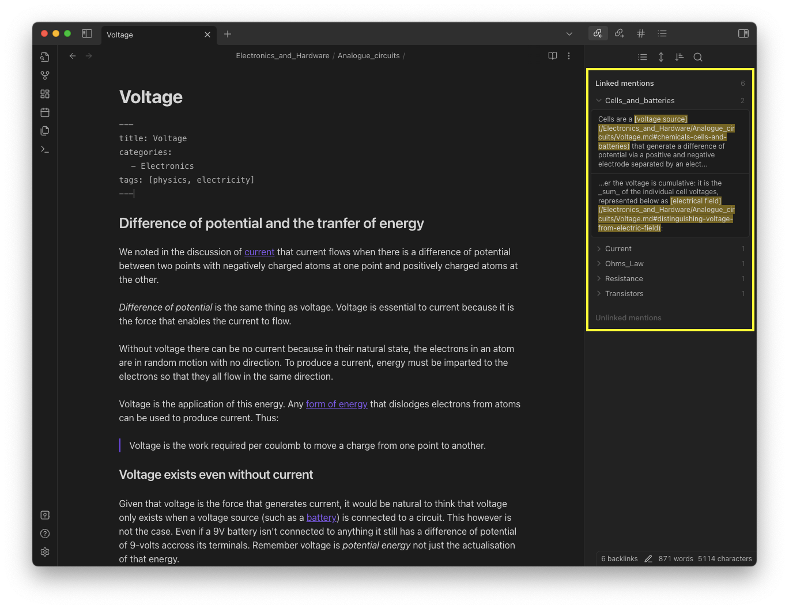

_These fragments I have shored against my ruins._

&mdash; T.S Eliot, _The Waste Land_

I plan to create an extension for VS Code that will augment its existing Markdown capabilities to better assist me in quickly retrieving, organising and analysing my study notes.

Everything important that I learn about software engineering and computer science is written in Markdown fragments and saved to a [single public repository](https://github.com/thomasabishop/computer-science). This collated wisdom is my gift to humanity and the vast inheritance of my non-existent children.

For a while I used [Obsidian](https://obsidian.md/) as my primary note-taking tool. It allows for Markdown editing (including a Vim mode), has a useful network-graph feature and importantly runs locally without storing your data on a server or in the cloud. If the company goes bust or is hacked, your data is still yours and safe.

This is the reason I moved from [Notion](https://www.notion.so) to Obsidian. In Notion, your notes are not available offline so if they suffer a breach or network failure, you're locked out. Also, until people complained and they were forced to implement locks, anyone working at Notion could access your data. My employer has blocked Notion as a result of these practices.

While Obsidian is a significant improvement on Notion the following aspects bothered me:

- You are only able to cross-reference each file by a single metadatum - tags.
- It does not use the default Markdown link syntax. This means that if you access your notes outside of Obsidian, the links don't always work, especially relative links
- The text-editing experience is a bit clunky. Although they offer a Vim mode, the typeface remains sans-serif not monospaced, so its a disjointed experience using `+h` and `-l` to move through characters.
- The UI has too many options and icons for things I don't care about.
- You have to keep your images in the same directory as your Markdown, but it's not possible to hide this directory or mask it from the indexer. Consequently, a link to an image counts as a hyperlink and shows up in the network-graph which serves little purpose given that it has no semantic value and is just a reference to a binary resource. You can manually hide these from the graph but I don't think they should be there in the first place.
- It's free software but is not open source. As such, you cannot offer improvements via pull-requests or fork your own customised version.

More than these individual problems, using Obsidian meant that I had to use two pieces of software for simultaneous activity: VSCode for coding, Obsidian for writing notes about code. I really dislike context switching and try to reduce the amount of software I use for any one task.

I've realised that the best solution for me is to bring the benefits of Obsidian to VS Code via an extension.

Say what you like about Microsoft's increasingly _papal_ hegemony over the software engineering ecosystem (VS Code, C#, TypeScript, GitHub, Atom, .NET Core, Windows, WSL, and now ChatGPT), VSCode is pretty good. The fact that it is open source and has a great plugin library means I can use it for most programming languages, without having to learn different IDEs.

Many of the Obsidian selling points are already standard or easily added via extensions Markdown editing and rendering, version-control via Git, Vim keybindings, word and character counts etc. I want to create an extension than enhances the existing Markdown capabilities for users that are accustomed to Obsidian. In the first instance this will be me. I will worry about extensibility and customisation once I have something I can use and am happy with.

The main features will be as follows:

- A category and tag side-view that lists your Markdown files organised by metadata you specify in YAML frontmatter. For example:

  ```yaml
  ---
  categories:
    - Programming Languages
  tags:
    - python
  ---
  ```

  This will look something like the equivalent in Obsidian:

  

- An "inlinks" and "outlinks" view that updates when you switch between open files. The latter will list documents that the current document links to. The former will list documents that link to the current document. This copies the following functionality in Obsidian.

  

- A network-graph view that maps linkages between documents, tags and categories.

  

I am going to call it "Meridian" because it rhymes with "Obsidian"; the letters "M" and "D" figure prominently, recalling the `.md` file extension; and my family live in a seaside town called Peacehaven in East Sussex which is directly on the Greenwich Meridian (we even have an underwhelming monument), so there's some personal significance.


