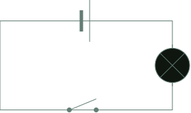
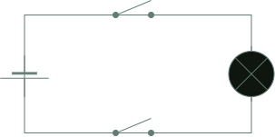
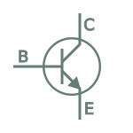

I have recently started [Nand to Tetris](https://www.nand2tetris.org/course). This course teaches the foundations of hardware and computer achitecture and is based on the textbook _The Elements of Computing Systems_ by Noam Nisan and Shimon Schocken. As the course proceeds you build a functioning general-purpose computer starting from basic logic gates that is eventually capable of running Tetris and any number of other programs. The hardware is built primarily through simulation software running on Hack, a simplified [hardware description language](https://en.wikipedia.org/wiki/Hardware_description_language) similar to Verilog and VHDL.

In this post I outline what I learned in the first unit. This broadly follows the curriculum but adds extra details I have acquired elsewhere to give the fullest account.

### Bits and functions

The workings of a classical computer can be reduced to a series of operations on the binary digits (bits) 0 and 1. A computational process can be represented as a function: data (a series of bits) goes into the function in one state and comes out in a another state. The new state is a product of the function.


The most primitive bit operations are equivalent to the truth-conditions of the logical connectives of Boolean algebra. There are multiple logical connectives but we will mostly focus on AND, OR, and NOT for simplicity.

For each Boolean connective we can use function notation and the formal conventions of propositional logic to express their operation as a function.

NOT can be represented as follows;

$$
f(x) = \lnot (x)
$$

NOT ($\lnot$) is a unary operator which means it takes one operand ($x$). We pass a single bit as the operand and the function inverts its value. We can utilise logical [truth tables]() to represent all possible inputs and outputs for the operator:

| $x$ | $f(x) = \lnot(x)$ |
| --- | ----------------- |
| 1   | 0                 |
| 0   | 1                 |

If NOT receives 0 as an input it will return 1 as the output. If it receives 1 as the input it will return 0 as the output.

AND ($\land$) and OR($\lor$) are binary operators: they receive two operands as input. This means we are passing in two bits to the function. As a bit can be one of two values (0 or 1), there are four possible configurations of the input state.

For AND this gives us:

| $x$ | $y$ | $f(x) = x \land y$ |
| --- | --- | ------------------ |
| 1   | 1   | 1                  |
| 0   | 1   | 0                  |
| 1   | 0   | 0                  |
| 0   | 0   | 0                  |

AND returns 1 if both input bits are 1, otherwise it returns 0.

OR returns 1 if one or both bits are 1, otherwise it returns 0:

| $x$ | $y$ | $f(x) = x \lor y$ |
| --- | --- | ----------------- |
| 1   | 1   | 1                 |
| 0   | 1   | 1                 |
| 1   | 0   | 1                 |
| 0   | 0   | 0                 |

### Logic gates

The logical function of each of the Boolean operators is implemented at the level of computer hardware by logic gates. Each gate is represented with one or more input pins and a single output pin through which the bits enter and exit. The pins feed into and out of a chip which executes the function.

The diagram below shows the logic gates for AND, OR, and NOT.


It is important to recognise that logic gates are an abstraction. In reality, you cannot _see_ a logic gate in a computer. If we were to look inside a chip that implements gate logic we would see an arrangement of transistors and resistors connected by wires. These components are configured to mimic the behaviour of the logical operators.

_Nand to Tetris_ starts at the level of gates and does not discuss how the individual gates are realised in electrical circuits. However, I think it is useful to understand the basics of the electrical engineering so we might begin to grasp how it is possible to go from an inert block of metal and silicon to fully functioning computer.

#### The electronic implementation of gate logic

We can start with the concept of a switch. Consider what is happening when we turn on a light using a wall switch. When the switch is off, the electrical circuit that connects the bulb to the voltage source is broken. As a result, there is no potential difference between the terminals and the current cannot reach the bulb. When the switch is on, the circuit is complete and the current flows freely to the bulb.

We can represent this with a very simple circuit:



This circuit embodies the logic of a NOT gate. We can think of the light as 1 and the absence of light as 0. When the switch is on, 1 is the output and 0 is inverted. When the switch is off, 0 is the output and 1 is inverted.

We can develop this scenario to represent the logical behaviour of an AND gate. Imagine now that this room is a bit strange and there are two switches controlling the operation of the bulb. If both switches are off the bulb will not emit light. If one of the switches is on and the other is off the bulb will not emit light. The bulb will only emit light when _both_ switches are on.

The circuit for this scenario embodies the logic of the Boolean AND connective:



Switch-controlled circuits are functionally equivalent to what actually happens inside a computer when logical conditions are expressed via gates. Electrical charge is directed along different routes depending on the value of an on/off condition. However, in modern computers the actual component that controls the flow of current is not a switch.

Whilst we could construct primitive computers with switches, the average CPU has more than a million logic gates. Controlling this number of gates with mechanical switches would be practically impossible and even if it were achieved, it would result in glacial processing times. This matters because the computational power of logic gates emerges from their behaviour at scale. Collections of gates are combined to express complex logical conditions that are a function of their individual parts. For this to be possible, the output of a collection of gates needs to be able to be fed into another collection and this is very difficult to achieve in a mechancial switch-based system.

Instead of mechanical switches, computers use transistors. Transistors are semi-conductors: components that possess an electrical conductivity between that of a conductor and an insulator. This property means they can both impede and expede the flow of electrical charge.

There are different types of transistors but we will focus on basic Bipolar Junction Transistors:



Applying a small amount of current at the base terminal (B) of a BJT allows a larger current to flow from the collector (C) to the emitter (E). Removing current at the base terminal reduces the flow from collector to emitter. This is because the the emitter and collector are composed of a semi-conductor that has a surplus of electrons (negatively charged) whereas the base has a deficiency of electrons (positively charged). This state creates a modifiable potential difference, reducing or increasing the current based on the voltage.

Thus the base terminal of a transistor is another way of implementating the gate-like behaviour we previously achieved with mechanical switches. There is an important difference however. With a switch, the circuit is actually broken when it is in the "off" state and thus there is no current flowing at all. In contrast, with a transistor, the current drops markedly in the "off" state but is not completely removed. Because a continuous circuit is an analogue system, the quantities of resistance, voltage and current are not discrete values - they will vary over a given range. Thus "off" corresponds to "low" voltage and "on" corresponds to "high" voltage. The specific stipulation will depend on the circuit design but it is typically the case that a state of 1 or "on" is within the range 2-5V whereas a state of 0 or "off" is within the range 0.0 - 0.8V.

### Boolean function synthesis

To recap, elementary computational processes can be represented as logical functions. A function consists in one or more Boolean operators processing bits. For each Boolean operator we can construct a chip that represents its truth conditions. We call these logic gates. Logic gates are built with transistors that either block or permit the flow of electric current. This makes them behave in a manner identical to mechanical switches.

Now that we know how the individual logic gates work and how they are implemented electronically, we will explore how they can be applied in combination to represent complex logical states that more closely resemble actual computer programs. This process is known as **Boolean function synthesis**.

We will construct a logic circuit that represents the truth conditions for the following state of affairs:

> The team plays on either Monday or Thursday and not at weekends

Let's call this $P$ for ease of reference.

This complex or compound expression comprises several simpler atomic expressions:

```
(x) The team plays on Monday
(y) The team plays on Thursday
(z) The team plays at weekends
```

The first step is to construct a truth table. On the left-hand side we list all the possible truth values for each individual expression. On the right-hand side, we assign an overall truth value for their combination, based on whether or not they reflect the truth conditions for $P$.

| $x$ | $y$ | $z$ | $P$ |
| --- | --- | --- | --- |
| 1   | 1   | 1   | 0   |
| 1   | 1   | 0   | 1   |
| 1   | 0   | 1   | 0   |
| 1   | 0   | 0   | 1   |
| 0   | 1   | 1   | 0   |
| 0   | 1   | 0   | 1   |
| 0   | 0   | 1   | 0   |
| 0   | 0   | 0   | 0   |

We are only interested in the cases where $P$ is true, so we can discount any lines that result in a truth value of 0 for the complex expresssion. This leaves us with:

| $x$ | $y$ | $z$ | $(x \lor y) \land \lnot z$ |
| --- | --- | --- | -------------------------- |
| 1   | 1   | 0   | 1                          |
| 1   | 0   | 0   | 1                          |
| 0   | 1   | 0   | 1                          |

Parsing each line, the truth table tells us that our complex expression ($P$) is true in the following scenarios:

- If the team plays on both Mondays and Thursdays but not at weekends
- If the team plays on Mondays but not on Thursdays and not at weekends
- If the team plays on Thursdays but not on Mondays and not at weekends

We can formalise each case:

- $(x \land y) \land \lnot z$
- $(x \land \lnot y) \land \lnot z$
- $(\lnot x \land y) \land \lnot z$

We now have three logical expressions that if constructed with logic gates would result in a partial representation of $P$. The representation would be partial because each individual expression only conveys a single aspect of the truth of $P$, not its totality. For example, if we constructed a circuit that represents $(x \land \lnot y) \land \lnot z$, this would only cover occasions where the team plays on Mondays but not on Thursdays (or the weekend). It wouldn't cover the case where the team plays on Thursdays but not Mondays (or the weekend).

So we want a circuit that captures all possible instances where $P$ returns true. There are also practical benefits to seeking a single implementation. In order to maximise our computational resources we want to use the minimum number of gates in the simplest configuration possible.

We start by concatenating each individual expression into a single disjunctive expression using logical OR:

$$
((x \land y) \land \lnot z) \lor ((x \land \lnot y) \land \lnot z) \lor ((\lnot x \land y) \land \lnot z)
$$

Next, we look for opportunities to simplify this complex expression. This is similar to simplifying equations in mathematical algebra. It is a heuristic process - there is no formal or automated procedure that will work in every case.

The first thing that stands out is that $\lnot z$ occurs in each of the individual disjunctive expressions. Therefore we can reduce the repetition by using it only once:

$$
(x \land y) \lor (x \land \lnot y) \lor (\lnot x \land y) \land \lnot z
$$

Now we need to consider how we can simplify $(x \land y) \lor (x \land \lnot y) \lor (\lnot x \land y)$.

If we look closely we can see that this expression is displaying the truth conditions for OR. The truth conditions for $x$ and $y$ are:

- true if $x$ and $y$ are true
- true if $x$ is true and $y$ is false
- true if $x$ is false and $y$ is true

This recalls our earlier definition of OR:

| $x$ | $y$ | $f(x) = x \lor y$ |
| --- | --- | ----------------- |
| 1   | 1   | 1                 |
| 0   | 1   | 1                 |
| 1   | 0   | 1                 |
| 0   | 0   | 0                 |

Thus we can reduce $(x \land y) \lor (x \land \lnot y) \lor (\lnot x \land y)$ to $x \lor y$.

The reduction is now complete, allowing us to reduce:

$$
((x \land y) \land \lnot z) \lor ((x \land \lnot y) \land \lnot z) \lor ((\lnot x \land y) \land \lnot z)
$$

to:

$$
(x \lor y) \land \lnot z
$$

// ADD DEMONSTRATION OF LOG EQUIVALENCE WITH TRUTH TABLES

#### Constructing the digital circuit

Now that we have reduced $P$ to its simplest form using the connectives AND, OR and NOT we can construct a circuit using the logic gates for these connectives to represent the overall state of affairs expresed by $P$. We will have three input bits which correspond to $x$, $y$, $z$, and a single output bit that will reflect the truth value of $P$ based on the inputs. The input bits will be fed into an arrangement of logic gates that that matches the logical connectives in $(x \lor y) \land \lnot z$.

<div style="display:flex;margin-top:1.5rem">
<iframe src="https://circuitverse.org/simulator/embed/nandtotetris-blog-post?theme=default&display_title=false&clock_time=true&fullscreen=true&zoom_in_out=true" style="border-width:; border-style: solid; border-color:;" name="myiframe" id="projectPreview" scrolling="no" frameborder="1" marginheight="0px" marginwidth="0px" height="250" width="100%" allowFullScreen></iframe>
</div>

We can confirm that the circuit implementation is an accurate representation of $P$ by toggling the input values to confirm that the output is only 1 when either $x$ or $y$ is true and $z$ is false.

#### Further simplification with NAND

Our circuit uses three different types of logic gate. This is satisfactory but it would better if we could simplify the circuit even further and use a single type of gate rather than three different gates. To do so we need to further reduce our logic and introduce another type of logic gate: NAND.

NAND stands for _not and_ and its truth conditions are the inversion of AND:

| $x$ | $y$ | $f(x) =  x \tilde\land y$ |
| --- | --- | ------------------------- |
| 1   | 1   | 0                         |
| 0   | 1   | 1                         |
| 1   | 0   | 1                         |
| 0   | 0   | 1                         |

So in essence, NAND returns 1 whenever $x$ and $y$ are not both true.

NAND is a _universal logic gate_. This means that by using NAND gates and only NAND gates, we can represent the truth function of every other logic gate (AND can be expressed with just NAND gates, as can OR and so on). It follows from this that represent every possible logical circuit using NAND gates alone.

So let's demonstrate this by rephrasing $(x \lor y) \land \lnot z$ with just NANDs.

$$
( [(x \tilde\land x) \tilde\land (y \tilde\land y)] \tilde\land (z \tilde\land z) ) \tilde\land ( [(x \tilde\land x) \tilde\land (y \tilde\land y)] \tilde\land (z \tilde\land z) )
$$

This is quite difficult to parse, so let's look at the circuit representation and derive its equivalence to $(x \lor y) \land \lnot z$:

<iframe src="https://circuitverse.org/simulator/embed/nand-simplification?theme=default&display_title=false&clock_time=true&fullscreen=true&zoom_in_out=true" style="border-width:; border-style: solid; border-color:;" name="myiframe" id="projectPreview" scrolling="no" frameborder="1" marginheight="0px" marginwidth="0px" height="250" width="100%" allowFullScreen></iframe>
</div>

You will notice that there is repeated forking pattern to most of the inputs. This occurs when the same input value is used for both input pins, equivalent to $(x \tilde\land x)$ in the equation:


When a NAND is wired to receive the same value for each input, it embodies the truth conditions for NOT: in the diagram above when $a$ is 1 the output is 0 and when $a$ is 0 the output is 1.

If we feed two of these sub-circuits into a NAND, we observe that the output is consistent with the truth conditions for OR:

<div style="display:flex;margin-top:1.5rem">
<iframe src="https://circuitverse.org/simulator/embed/or_with_nand?theme=default&display_title=false&clock_time=true&fullscreen=true&zoom_in_out=true" style="border-width:; border-style: solid; border-color:;" name="myiframe" id="projectPreview" scrolling="no" frameborder="1" marginheight="0px" marginwidth="0px" height="250" width="100%" allowFullScreen></iframe>
</div>

This is equivalent to the $(x \tilde\land x) \tilde\land (y \tilde\land y)$ section of our NAND equation which we can see is equivalent to $x \lor y$.

The final part of the NAND equation is dedicated to: $\lnot z$. This is achieved by using another forking NAND and applying it to $z$, this is then joined with the existing fragment ($(x \tilde\land x) \tilde\land (y \tilde\land y)$) via a NAND to give:

$$
( [(x \tilde\land x) \tilde\land (y \tilde\land y)] \tilde\land (z \tilde\land z) )
$$

Which is then itself forked into a NAND to give the final output.

This is probably harder to get your head around than the implementation that used three different operators.

### Hardware Description Language

Digital circuits can be designed using a Hardware Description Language (HDL) and a simulator. An HDL is a declarative programming language used to describe the behaviour and structure of digital circuits. In _Nand To Tetris_ the HDL is Hack, a simplified HDL for teaching purposes.

An HDL file uses specialised syntax to describe the function and implementation of a given chip. When it is fed into a simulator, we can test its outputs against a variety of inputs. This helps us check that the chip is working as intended but also can be used to benchmark performance metrics such as the speed of computation and energy consumption.

Below is an HDL specification file for the NAND logic gate written in Hack:

```
CHIP Nand {
    IN a,b;
    OUT out;

    PARTS:
    And(a=a,b=b,out=w);
    Not(in=w1,out=out);
}
```

The code contains two sections:

- the interface (`CHIP`, `IN`, `OUT`)
- the implementation (`PARTS`)

The interface names the chip and specifies the designators for its inputs and outputs. In the example, the interface specifies two input values (`a` and `b`) and a single output value (`out`).

The interface abstracts the actual implementation of the chip. It only tells us the inputs and output, not how the output is generated from the input. This is provided by the implementation section.

In the NAND example we invoke two other gates, AND and NOT, to implement the logic of NAND. We are simply taking the output of AND and inverting it with NOT. (For this to work in the simulator, we would have to have already defined specifications for AND and NOT, and imported them into the NAND file. )

Having defined the gate we can load it into the simulator and test its behaviour.

### Coursework

The task for the first unit was to create the set of logic gates and chips that will later be utilised in the construction of the computer. You are provided with NAND as a primitive and from this you build the other gates. Once a working gate has been constructed from NAND you are permitted to use it in the construction of subsequent gates. For example if you have made an OR gate solely out of NANDs, you may then use OR along with NAND to create XOR.

Each gate and chip is created by writing a specification for it in Hack, a Hardware Description Language that has been constructed by the course provider. An HDL is a declarative programming language used to describe the behaviour and structure of digital circuits.

Here is an example of the Hack file for NAND:

Once a gate is created, its internal implementation is encapsulated and is no longer of active concern. You can simply assume its implementation and refer to it purely on the basis of its interface.

Below I have listed the HDL files for each gate along with an interactive demonstration using [Circuitverse](https://www.circuitverse.org).

#### NOT

```
CHIP Not {
    IN in;
    OUT out;

    PARTS:
    Nand(a=in,b=in,out=out);00
}
```

<div style="display:flex;margin-top:1.5rem">

<iframe src="https://circuitverse.org/simulator/embed/n2t-not?theme=default&display_title=false&clock_time=true&fullscreen=true&zoom_in_out=true" style="border-width:; border-style: solid; border-color:;" name="myiframe" id="projectPreview" scrolling="no" frameborder="1" marginheight="0px" marginwidth="0px" height="250" width="100%" allowFullScreen></iframe>
</div>

#### AND

```
CHIP And {
    IN a, b;
    OUT out;CHIP DMux {
    IN in, sel;
    OUT a, b;

 PARTS:
    Not(in=sel,out=nsel);
    And(a=in,b=nsel,out=a);
    And(a=in,b=sel,out=b);
}
    Not(in=w1,out=out);
}
```

<div style="display:flex;margin-top:1.5rem">
<iframe src="https://circuitverse.org/simulator/embed/n2t-and?theme=default&display_title=false&clock_time=true&fullscreen=true&zoom_in_out=true" style="border-width:; border-style: solid; border-color:;" name="myiframe" id="projectPreview" scrolling="no" frameborder="1" marginheight="0px" marginwidth="0px" height="250" width="100%" allowFullScreen></iframe>
</div>

#### OR

```
CHIP Or {
    IN a, b;
    OUT out;

    PARTS:
    Nand(a=a,b=a,out=w1);
    Nand(a=b,b=b,out=w2);
    Nand(a=w1,b=w2,out=out);
}
```

<div style="display:flex;margin-top:1.5rem">
<iframe src="https://circuitverse.org/simulator/embed/n2t-or?theme=default&display_title=false&clock_time=true&fullscreen=true&zoom_in_out=true" style="border-width:; border-style: solid; border-color:;" name="myiframe" id="projectPreview" scrolling="no" frameborder="1" marginheight="0px" marginwidth="0px" height="250" width="100%" allowFullScreen></iframe>
</div And(a=in,b=sel,out=w1);
    Or(a=w1,b=sel,out=out);
    Not(in=out,out=a);>

#### XOR

```
CHIP Xor {
    IN a, b;
    OUT out;

    PARTS:
    And(a=a,b=notb,out=w1);
    Not(in=b,out=notb);
    And(a=b,b=nota,out=w2);
    Not(in=a,out=nota);
    Or(a=w1,b=w2,out=out);
}
```

<div style="display:flex;margin-top:1.5rem">
<iframe src="https://circuitverse.org/simulator/embed/n2t-xor?theme=default&display_title=false&clock_time=true&fullscreen=true&zoom_in_out=true" style="border-width:; border-style: solid; border-color:;" name="myiframe" id="projectPreview" scrolling="no" frameborder="1" marginheight="0px" marginwidth="0px" height="250" width="100%" allowFullScreen></iframe>
</div>

#### MUX (Multiplexer)

```
CHIP Mux {
    IN a, b, sel;
    OUT out;

    PARTS:
    Not(in=sel,out=w1);
    And(a=w1,b=a,out=w2);
    And(a=sel,b=b,out=w3);
    Or(a=w2,b=w3,out=out);
}
```

<div style="display:flex;margin-top:1.5rem">
<iframe src="https://circuitverse.org/simulator/embed/mux_n2t?theme=default&display_title=false&clock_time=true&fullscreen=true&zoom_in_out=true" style="border-width:; border-style: solid; border-color:;" name="myiframe" id="projectPreview" scrolling="no" frameborder="1" marginheight="0px" marginwidth="0px" height="250" width="100%" allowFullScreen></iframe>
</div>

#### DMUX (Demultiplexer)

```
CHIP DMux {
    IN in, sel;
    OUT a, b;

    PARTS:
    Not(in=sel,out=nsel);
    And(a=in,b=nsel,out=a);
    And(a=in,b=sel,out=b);
}
```

<div style="display:flex;margin-top:1.5rem">
<iframe src="https://circuitverse.org/simulator/embed/dmux_v2_n2t?theme=default&display_title=false&clock_time=true&fullscreen=true&zoom_in_out=true" style="border-width:; border-style: solid; border-color:;" name="myiframe" id="projectPreview" scrolling="no" frameborder="1" marginheight="0px" marginwidth="0px" height="250" width="100%" allowFullScreen></iframe>
</div>
