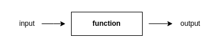
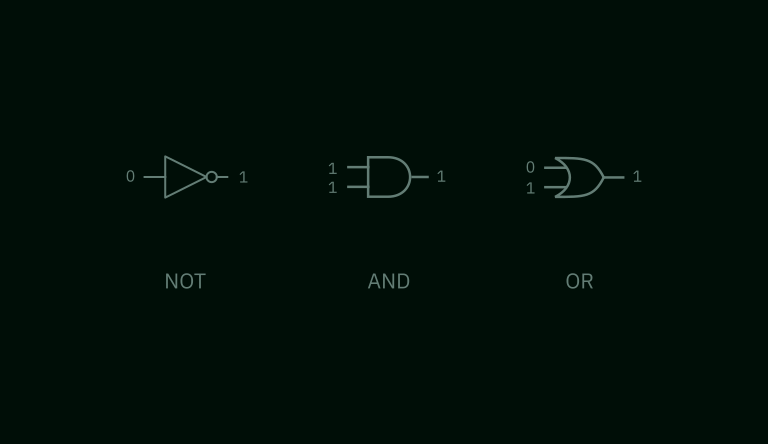
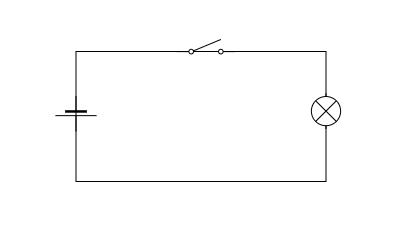
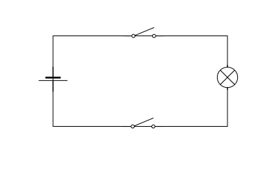
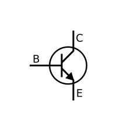
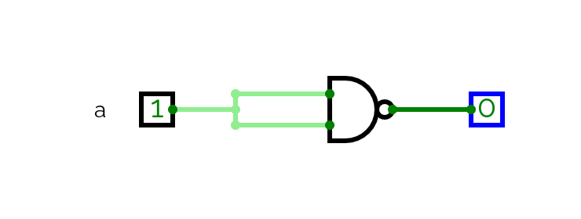
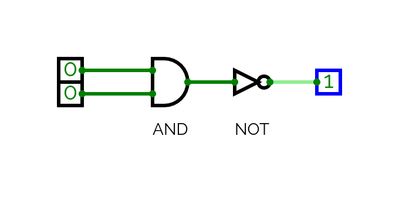
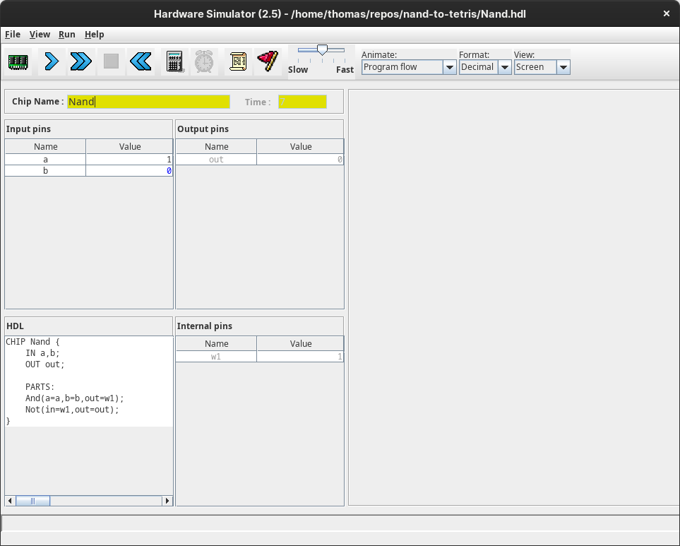

I have recently started [Nand to Tetris](https://www.nand2tetris.org/course).
This course teaches the foundations of hardware and computer achitecture and is
based on the textbook _The Elements of Computing Systems_ by Noam Nisan and
Shimon Schocken. As the course proceeds you build a functioning general-purpose
computer that is eventually capable of running Tetris and any number of other
programs. The hardware is built primarily through simulation software running on
Hack, a simplified
[hardware description language](https://en.wikipedia.org/wiki/Hardware_description_language)
similar to Verilog and VHDL.

In this post I outline what I learned in the first unit. This broadly follows
the curriculum but adds extra details I have acquired elsewhere to give the
fullest account.

## Bits and functions

The workings of a classical computer can be reduced to a series of operations on
the binary digits (bits) 0 and 1. A computational process can be represented as
a function: data (a series of bits) enters the function in one state and exits
in another state. This new state is a product of the function.



The most primitive bit operations are equivalent to the truth-conditions of the
logical connectives of Boolean algebra. In logic, the Boolean values are _true_
and _false_ but we will use 1 and 0, to represent these states as bits. There
are multiple logical connectives but we will mostly focus on AND, OR, and NOT
for simplicity.

The logic of each Boolean connective can be expressed as a function.

NOT can be represented as follows;

$$
f(x) = \lnot (x)
$$

NOT (¬) is a unary operator which means it takes one operand (_x_). We pass a
single bit as the operand and the function inverts its value. We can utilise
logical [truth tables]() to represent all possible inputs and outputs for the
operator:

| x   | f(x) = NOT(x) |
| --- | ------------- |
| 1   | 0             |
| 0   | 1             |

If NOT receives 0 as an input it will return 1 as the output. If it receives 1
as the input it will return 0 as the output.

AND ($\land$) and OR($\lor$) are binary operators: they receive two operands as
input. Therefore we pass two bits to the function. As a bit can be one of two
values (0 or 1), there are four possible inputs.

For AND this gives us:

| x   | y   | f(x) = x AND y |
| --- | --- | -------------- |
| 1   | 1   | 1              |
| 0   | 1   | 0              |
| 1   | 0   | 0              |
| 0   | 0   | 0              |

AND returns 1 if both input bits are 1, otherwise it returns 0.

OR returns 1 if one or both bits are 1, otherwise it returns 0:

| x   | y   | f(x) = x OR y |
| --- | --- | ------------- |
| 1   | 1   | 1             |
| 0   | 1   | 1             |
| 1   | 0   | 1             |
| 0   | 0   | 0             |

## Logic gates

The logical function of each of the Boolean operators is implemented at the
level of computer hardware by logic gates. Each gate is represented with one or
more input pins and a single output pin through which the bits enter and exit.
The pins feed into and out of a chip which executes the function.

The diagram below shows the logic gates for AND, OR, and NOT.



Logic gates are an abstraction. In reality, you cannot _see_ a logic gate in a
computer. If we were to look inside a chip that implements gate logic we would
see an arrangement of transistors, capacitors and resistors connected by wires.
These components are configured to mimic the behaviour of the logical operators.

_Nand to Tetris_ starts at the level of gates and does not discuss how the
individual gates are realised in electronic circuits. However, I think it is
useful to understand the basics of the electrical engineering so we might begin
to grasp how it is possible to go from an inert block of metal and silicon to
fully functioning computer.

### The electronic implementation of gate logic

We can start with the concept of a switch. Consider what is happening when we
turn on a light using a wall switch.

When the switch is off, the electrical circuit that connects the bulb to the
voltage source is broken. As a result, there is no potential difference between
the terminals and the current cannot reach the bulb. When the switch is on, the
circuit is complete and the current flows freely to the bulb.

This is represented by the following simple schematic:



This circuit embodies the logic of a NOT gate. Think of the light as 1 and the
absence of light as 0. When the switch is on, 1 is the output and 0 is inverted.
When the switch is off, 0 is the output and 1 is inverted.

This scenario can be developed to represent the logical behaviour of an AND
gate. Imagine now that this room is a bit strange and there are two switches
controlling the operation of the bulb. If both switches are off the bulb will
not emit light. If one of the switches is on and the other is off the bulb will
not emit light. The bulb will only emit light when _both_ switches are on.

The schematic for this scenario embodies the logic of the Boolean AND
connective:



Switch-controlled circuits are functionally equivalent to what actually happens
inside a computer when logical conditions are implemented via gates. Electrical
charge is directed along different routes depending on the value of an on/off
condition. However, in modern computers the actual component that controls the
flow of current is not a switch.

Whilst we could construct primitive computers with switches, the average CPU has
more than a million logic gates. Controlling this number of gates with
mechanical switches would be practically impossible and even if it were
achieved, it would result in extremely slow processing times.

This is an important point because the computational power of logic gates
emerges from their behaviour at scale. Collections of gates are combined to
express complex logical conditions that are a function of their individual
parts. For this to be possible, the output of a collection of gates needs to be
able to be fed into another collection and this it would be difficult to achieve
in a mechancial switch-based system.

Instead of mechanical switches, computers use transistors. Transistors are
semi-conductors: components that possess an electrical conductivity between that
of a conductor and an insulator. This property means they can both impede and
expede the flow of electrical charge.

There are different types of transistors but we will focus on basic Bipolar
Junction Transistors:



Applying a small amount of current at the base terminal (B) of a BJT allows a
larger current to flow from the collector (C) to the emitter (E). Removing
current at the base terminal reduces the flow from collector to emitter. This is
because the the emitter and collector are composed of a semi-conductor that has
a surplus of electrons (negatively charged) whereas the base has a deficiency of
electrons (positively charged). This state creates a modifiable potential
difference, reducing or increasing the current based on the voltage.

The base terminal of a transistor is another way of implementating the gate-like
behaviour we previously achieved with mechanical switches. However, there is an
important difference. With a switch, the circuit is actually broken when it is
in the "off" state and there is no current flowing at all. With a transistor,
the current drops in the "off" state but a voltage remains.

Because a continuous circuit is an analogue system, the quantities of
resistance, voltage and current are not discrete values, they will vary over a
given range. Thus "off" corresponds to "low" voltage and "on" corresponds to
"high" voltage. The specific stipulation will depend on the circuit design but
it is typically the case that a state of 1 or "on" is within the range 2-5V
whereas a state of 0 or "off" is within the range 0.0 - 0.8V.

## Boolean function synthesis

To recap, elementary computational processes can be represented as logical
functions. A function consists in one or more Boolean operators processing bits.
For each Boolean operator we can construct a chip that represents its truth
conditions. We call these chips logic gates. Logic gates are built with
transistors that either block or permit the flow of electric current. This makes
them behave in a manner almost identical to mechanical switches.

Now that we know how the individual logic gates work and how they are
implemented electronically, we will explore how they can be applied in
combination to represent complex logical states that more closely resemble
actual computer programs. This process is known as **Boolean function
synthesis**.

We will construct a logic circuit that represents the truth conditions for the
following state of affairs:

> The team plays on either Monday or Thursday and not at weekends

Let's call this _P_ for ease of reference.

This complex comprises several simpler atomic expressions:

<ol type="a" start="24">
  <li>The team plays on Monday</li>
  <li>The team plays on Thursday</li>
  <li>The team plays at weekends</li>
</ol>

The first step is to construct a truth table. On the left-hand side we list all
the possible truth values for each individual expression. On the right-hand
side, we assign an overall truth value for their combination, based on whether
or not they reflect the truth conditions for _P_.

| x   | y   | z   | _P_ |
| --- | --- | --- | --- |
| 1   | 1   | 1   | 0   |
| 1   | 1   | 0   | 1   |
| 1   | 0   | 1   | 0   |
| 1   | 0   | 0   | 1   |
| 0   | 1   | 1   | 0   |
| 0   | 1   | 0   | 1   |
| 0   | 0   | 1   | 0   |
| 0   | 0   | 0   | 0   |

We are only interested in the cases where _P_ is true, so we can discount any
lines that result in a truth value of 0 for the complex expresssion. This leaves
us with:

| x   | y   | z   | _P_ |
| --- | --- | --- | --- |
| 1   | 1   | 0   | 1   |
| 1   | 0   | 0   | 1   |
| 0   | 1   | 0   | 1   |

Parsing each line, the truth table tells us that our complex expression (_P_) is
true in the following scenarios:

- If the team plays on both Mondays and Thursdays but not at weekends
- If the team plays on Mondays but not on Thursdays and not at weekends
- If the team plays on Thursdays but not on Mondays and not at weekends

We can formalise each case:

- _(x AND y) AND NOT z_
- _(x AND NOT y) AND NOT z_
- _(NOT x and y) AND NOT z_

We now have three logical expressions that if constructed with logic gates would
result in a partial representation of _P_. The representation would be partial
because each individual expression only conveys a single aspect of the truth of
_P_, not its totality. For example, if we constructed a circuit that represents
_(x AND NOT y) AND NOT z_, this would only cover occasions where the team plays
on Mondays but not on Thursdays (or the weekend). It wouldn't cover the case
where the team plays on Thursdays but not Mondays (or the weekend).

We want a circuit that captures all possible instances where _P_ returns true.
There are practical benefits to seeking a single implementation. In order to
maximise our computational resources we want to use the minimum number of gates
in the simplest configuration possible.

We start by concatenating each individual expression into a single disjunctive
expression using logical OR:

$$
((x \land y) \land \lnot z) \lor ((x \land \lnot y) \land \lnot z) \lor ((\lnot x \land y) \land \lnot z)
$$

Next, we look for opportunities to simplify this complex expression. This is
similar to simplifying equations in mathematical algebra. It is a heuristic
process; there is no formal or automated procedure that will work in every case.

_NOT z_ occurs in each of the individual disjunctive expressions. Therefore we
can reduce the repetition by using it only once:

$$
(x \land y) \lor (x \land \lnot y) \lor (\lnot x \land y) \land \lnot z
$$

Now we need to consider how we can simplify the remaining expressions:

$$
(x \land y) \lor (x \land \lnot y) \lor (\lnot x \land y)
$$

If we look closely we can see that this expression is displaying the truth
conditions for OR. The truth conditions for _x_ and _y_ are:

- true if _x_ and _y_ are true
- true if _x_ is true and _y_ is false
- true if _x_ is false and _y_ is true

This recalls our earlier definition of OR:

| x   | y   | f(x) = x OR y |
| --- | --- | ------------- |
| 1   | 1   | 1             |
| 0   | 1   | 1             |
| 1   | 0   | 1             |
| 0   | 0   | 0             |

Thus we can reduce:

$$
(x \land y) \lor (x \land \lnot y) \lor (\lnot x \land y)
$$

to:

$$
x \lor y
$$

The reduction is now complete, allowing us to reduce:

$$
((x \land y) \land \lnot z) \lor ((x \land \lnot y) \land \lnot z) \lor ((\lnot x \land y) \land \lnot z)
$$

to:

$$
(x \lor y) \land \lnot z
$$

If we construct a truth table for the original expression (_P_) and its
simplification (_P'_) we see that they are true under the same logical
conditions which demonstrates their equivalence:

| x   | y   | z   | _P_ | _P'_ |
| --- | --- | --- | --- | ---- |
| 1   | 1   | 0   | 1   | 1    |
| 1   | 0   | 0   | 1   | 1    |
| 0   | 1   | 0   | 1   | 1    |

### Constructing the digital circuit

Now that we have reduced _P_ to its simplest form using the connectives AND, OR
and NOT we can construct a circuit using the logic gates for these connectives
to represent the overall state of affairs expressed by _P_.

We will have three input bits which correspond to _x_, _y_, _z_, and a single
output bit that will reflect the truth value of _P_ based on the inputs. The
input bits will be fed into an arrangement of logic gates that that matches the
logical connectives in _(x OR y) AND NOT z_.

<div style="display:flex;margin-top:1.5rem">
<iframe src="https://circuitverse.org/simulator/embed/nandtotetris-blog-post?theme=default&display_title=false&clock_time=true&fullscreen=true&zoom_in_out=true" style="border-width:; border-style: solid; border-color:;" name="myiframe" id="projectPreview" scrolling="no" frameborder="1" marginheight="0px" marginwidth="0px" height="250" width="100%" allowFullScreen></iframe>
</div>

We can confirm that the circuit implementation is an accurate representation of
_P_ by toggling the input values to confirm that the output is only 1 when
either _x_ or _y_ is true and _z_ is false.

### Further simplification with NAND

Our circuit uses three different types of logic gate. This is satisfactory but
it would better if we could simplify the circuit even further and use a single
gate rather than three. To do so we need to further reduce our logic and
introduce another type of logic gate: NAND.

NAND stands for "NOT AND" and its truth conditions are the inversion of AND:

| x   | y   | f(x) = x NAND y |
| --- | --- | --------------- |
| 1   | 1   | 0               |
| 0   | 1   | 1               |
| 1   | 0   | 1               |
| 0   | 0   | 1               |

NAND returns 1 whenever _x_ and _y_ are not both true. We will represent NAND in
our formulae with the symbol:

$$
\tilde\land
$$

NAND is a _universal logic gate_. This means that by using NAND gates and only
NAND gates, we can represent the truth function of every other logic gate (AND
can be expressed with just NAND gates, as can OR and so on). It follows that we
can create every possible logical circuit using NAND gates alone.

Let's demonstrate this by reformulating _(x OR y) AND NOT z_ with just NANDs:

$$
( [(x \tilde\land x) \tilde\land (y \tilde\land y)] \tilde\land (z \tilde\land z) ) \tilde\land ( [(x \tilde\land x) \tilde\land (y \tilde\land y)] \tilde\land (z \tilde\land z) )
$$

This is quite difficult to parse, so let's look at the circuit representation
and derive its equivalence to _(x OR y) AND NOT z_:

<iframe src="https://circuitverse.org/simulator/embed/nand-simplification?theme=default&display_title=false&clock_time=true&fullscreen=true&zoom_in_out=true" style="border-width:; border-style: solid; border-color:;" name="myiframe" id="projectPreview" scrolling="no" frameborder="1" marginheight="0px" marginwidth="0px" height="250" width="100%" allowFullScreen></iframe>
</div>

You will notice that there is repeated forking pattern to most of the inputs.
This occurs when the same input value is used for both input pins, equivalent to
_x NAND x_ in the equation:



When a NAND is wired to receive the same value for each input, it embodies the
truth conditions for NOT: in the diagram above when _a_ is 1 the output is 0 and
when _a_ is 0 the output is 1.

If we feed two of these sub-circuits into a NAND, we observe that the output is
consistent with the truth conditions for OR:

<div style="display:flex;margin-top:1.5rem">
<iframe src="https://circuitverse.org/simulator/embed/or_with_nand?theme=default&display_title=false&clock_time=true&fullscreen=true&zoom_in_out=true" style="border-width:; border-style: solid; border-color:;" name="myiframe" id="projectPreview" scrolling="no" frameborder="1" marginheight="0px" marginwidth="0px" height="250" width="100%" allowFullScreen></iframe>
</div>

This is equivalent to the _(x NAND x) NAND (y NAND y)_ section of our NAND
equation which we can see is equivalent to _x OR y_.

The final part of the NAND equation is dedicated to: _NOT z_. This is achieved
by using another forking NAND and applying it to _z_, this is then joined with
the existing fragment via a NAND to give:

$$
( [(x \tilde\land x) \tilde\land (y \tilde\land y)] \tilde\land (z \tilde\land z) )
$$

Which is then itself forked into a NAND to give the final output.

This is harder to parse than the implementation that used three different
operators but the point is just to demonstrate that such a reduction is possible
and that complex abstract states can be constructed from the concatenation of
primitive electronic components.

## Hardware Description Language

Digital circuits can be designed using a Hardware Description Language (HDL) and
simulation software. An HDL is a declarative programming language used to
describe the behaviour and structure of digital circuits. In _Nand To Tetris_
the HDL is Hack, a simplified HDL for teaching purposes.

An HDL file uses specialised syntax to describe the function and implementation
of a given chip. When it is fed into a simulator, we can test the chip's outputs
against a variety of inputs to check it is working as intended.

Below is an HDL specification file for the NAND logic gate written in Hack:

```
CHIP Nand {
    IN a,b;
    OUT out;

    PARTS:
    And(a=a,b=b,out=w);
    Not(in=w1,out=out);
}
```

The code contains two sections:

- the interface (`CHIP`, `IN`, `OUT`)
- the implementation (`PARTS`)

The interface names the chip and designates its input and output pins. In the
example, the interface specifies two input pins (`a` and `b`) and a single
output pin (`out`).

The interface abstracts the actual implementation of the chip. It only tells us
the inputs and output, not how the output is generated from the input. This is
provided by the implementation section which details the internal workings of
the chip.

The NAND implementation invokes two other gates, AND and NOT. We are simply
taking the output of AND and inverting it with NOT. The HDL specification
describes the following circuit:



Having defined the gate we can load it into the simulator and test its
behaviour.



We can change the values of the input pins and observe how this affects both the
output and the interim outputs of the implementation (ie. _w1_).

To be more efficient we can create a test file that runs through all our
expected outputs:

```
# Nand.tst

load Nand.hdl,
output-file Nand.out,
compare-to Nand.cmp,
output-list a%B3.1.3 b%B3.1.3 out%B3.1.3;

set a 0,
set b 0,
eval,
output;

set a 0,
set b 1,
eval,
output;

set a 1,
set b 0,
eval,
output;

set a 1,
set b 1,
eval,
output;
```

We feed the test file into the simulator along with the following comparison
file and it will compute whether the chip conforms to our expectations:

```
# Nand.cmp

|   a   |   b   |  out  |
|   0   |   0   |   1   |
|   0   |   1   |   1   |
|   1   |   0   |   1   |
|   1   |   1   |   1   |
```

## Coursework

The task for the first unit was to use Hack to create the set of logic gates and
chips that will later be utilised in the construction of the computer. You are
provided with NAND as a primitive and from this you build the other gates. Once
a working gate has been constructed from NAND you are permitted to use it in the
construction of subsequent gates. For example if you have made an OR gate solely
out of NANDs, you may then use OR along with NAND to create XOR.

Below I have listed the HDL files for each gate along with a simulation of the
circuit implementation.

### Gates

#### NOT

```
CHIP Not {
    IN in;
    OUT out;

    PARTS:
    Nand(a=in,b=in,out=out);
}
```

<div style="display:flex;margin-top:1.5rem">

<iframe src="https://circuitverse.org/simulator/embed/n2t-not?theme=default&display_title=false&clock_time=true&fullscreen=true&zoom_in_out=true" style="border-width:; border-style: solid; border-color:;" name="myiframe" id="projectPreview" scrolling="no" frameborder="1" marginheight="0px" marginwidth="0px" height="250" width="100%" allowFullScreen></iframe>
</div>

#### AND

```
CHIP And {
    IN a, b;
    OUT out;CHIP DMux {
    IN in, sel;
    OUT a, b;

 PARTS:
    Not(in=sel,out=nsel);
    And(a=in,b=nsel,out=a);
    And(a=in,b=sel,out=b);
}
    Not(in=w1,out=out);
}
```

<div style="display:flex;margin-top:1.5rem">
<iframe src="https://circuitverse.org/simulator/embed/n2t-and?theme=default&display_title=false&clock_time=true&fullscreen=true&zoom_in_out=true" style="border-width:; border-style: solid; border-color:;" name="myiframe" id="projectPreview" scrolling="no" frameborder="1" marginheight="0px" marginwidth="0px" height="250" width="100%" allowFullScreen></iframe>
</div>

#### OR

```
CHIP Or {
    IN a, b;
    OUT out;

    PARTS:
    Nand(a=a,b=a,out=w1);
    Nand(a=b,b=b,out=w2);
    Nand(a=w1,b=w2,out=out);
}
```

<div style="display:flex;margin-top:1.5rem">
<iframe src="https://circuitverse.org/simulator/embed/n2t-or?theme=default&display_title=false&clock_time=true&fullscreen=true&zoom_in_out=true" style="border-width:; border-style: solid; border-color:;" name="myiframe" id="projectPreview" scrolling="no" frameborder="1" marginheight="0px" marginwidth="0px" height="250" width="100%" allowFullScreen></iframe>
</div And(a=in,b=sel,out=w1);
    Or(a=w1,b=sel,out=out);
    Not(in=out,out=a);>

#### XOR

```
CHIP Xor {
    IN a, b;
    OUT out;

    PARTS:
    And(a=a,b=notb,out=w1);
    Not(in=b,out=notb);
    And(a=b,b=nota,out=w2);
    Not(in=a,out=nota);
    Or(a=w1,b=w2,out=out);
}
```

<div style="display:flex;margin-top:1.5rem">
<iframe src="https://circuitverse.org/simulator/embed/n2t-xor?theme=default&display_title=false&clock_time=true&fullscreen=true&zoom_in_out=true" style="border-width:; border-style: solid; border-color:;" name="myiframe" id="projectPreview" scrolling="no" frameborder="1" marginheight="0px" marginwidth="0px" height="250" width="100%" allowFullScreen></iframe>
</div>

### Chips

As well as the basic logic gates, the first unit introduced additional chips
that are essential for constructing a working computer. These chips represent
more complex states that the logical operators but proceed on the same
functional and modular basis: input values are processed internally to produce
output values and the implementation can utilise previously constructed logic
gates.

#### MUX (Multiplexer)

A multiplexer selects one of several input pins and forwards the selection to a
single output pin. There are three pins: two input bits (`A`, `B`) and a
selection bit (`SEL`). When `SEL` is applied the output bit is toggled between
`A` and `B`. Multiplexers are essential to the construction of large digital
circuits as they implement data selection and switching on the basis of logical
conditions.

```
CHIP Mux {
    IN a, b, sel;
    OUT out;

    PARTS:
    Not(in=sel,out=w1);
    And(a=w1,b=a,out=w2);
    And(a=sel,b=b,out=w3);
    Or(a=w2,b=w3,out=out);
}
```

<div style="display:flex;margin-top:1.5rem">
<iframe src="https://circuitverse.org/simulator/embed/mux_n2t?theme=default&display_title=false&clock_time=true&fullscreen=true&zoom_in_out=true" style="border-width:; border-style: solid; border-color:;" name="myiframe" id="projectPreview" scrolling="no" frameborder="1" marginheight="0px" marginwidth="0px" height="250" width="100%" allowFullScreen></iframe>
</div>

#### DMUX (Demultiplexer)

As the name suggests, a demultiplexer reverses the functionality of a
multiplexer. It receives a single input, and based on the `SEL` value channels
it to either an `A` or `B` output.

```
CHIP DMux {
    IN in, sel;
    OUT a, b;

    PARTS:
    Not(in=sel,out=nsel);
    And(a=in,b=nsel,out=a);
    And(a=in,b=sel,out=b);
}
```

<div style="display:flex;margin-top:1.5rem">
<iframe src="https://circuitverse.org/simulator/embed/dmux_v2_n2t?theme=default&display_title=false&clock_time=true&fullscreen=true&zoom_in_out=true" style="border-width:; border-style: solid; border-color:;" name="myiframe" id="projectPreview" scrolling="no" frameborder="1" marginheight="0px" marginwidth="0px" height="250" width="100%" allowFullScreen></iframe>
</div>

### Multi-bit chips

Multi-bit chips are variants of the chips and gates already produced. The logic
of a multi-bit AND is the same as the logic for a normal AND gate. They differ
only in the number of bits they can receive and output.

In a real computer, passing single 1s and 0s into chips would be inefficient
since very little information can be represented or encoded in a single bit.
When we build the computer we will be passing values with a bit-length of 8-bits
(a byte) as a miniumum (e.g. 10101100) and we need chips that can handle bits of
this length.

For illustration, here is the HDL implementation of an AND-16:

```
CHIP And16 {
    IN a[16], b[16];
    OUT out[16];

    PARTS:
    And(a=a[0],b=b[0],out=out[0]);
	And(a=a[1],b=b[1],out=out[1]);
	And(a=a[2],b=b[2],out=out[2]);
	And(a=a[3],b=b[3],out=out[3]);
	And(a=a[4],b=b[4],out=out[4]);
	And(a=a[5],b=b[5],out=out[5]);
	And(a=a[6],b=b[6],out=out[6]);
	And(a=a[7],b=b[7],out=out[7]);
	And(a=a[8],b=b[8],out=out[8]);
	And(a=a[9],b=b[9],out=out[9]);
	And(a=a[10],b=b[10],out=out[10]);
	And(a=a[11],b=b[11],out=out[11]);
	And(a=a[12],b=b[12],out=out[12]);
	And(a=a[13],b=b[13],out=out[13]);
	And(a=a[14],b=b[14],out=out[14]);
	And(a=a[15],b=b[15],out=out[15]);
}
```

Instead of a single-bit AND gate that takes two single-bit inputs and produces a
single-bit output, the 16-bit AND takes two 16-bit inputs and produces a single
16-bit output. Each bit of the output is determined by the AND operation which
is executed on each of the input bits.

Don't be confused by the base-10 numbers: we are still working with binary
values however we use denary digits to individuate each bit in the 16-bit
number. For example if `a = 10101111`, `a[4]` refers to the fourth bit in `a`
counting from the right-hand side (`0`).

In addition to `And16` I created multi-bit variants of OR, NOT, MUX and DMUX.

### Multi-way chips

I also produced _multi-way_ variants of some of the main gates and chips. These
versions accept more than the standard one or two input pins but execute the
same logic. For example instead of a standard 2-pin input AND gate, a 3-pin
input AND gate would take three inputs and produce a `1` output when all three
inputs are `1`.

An example of a multi-way chip that I constructed is OR-8-WAY. This chip outputs
1 when any of its 8 inputs is 1. If all inputs are 0, it outputs 0:

```
CHIP Or8Way {
    IN in[8];
    OUT out;

    PARTS:
 	Or(a=in[0],b=in[1],out=a);
	Or(a=a,b=in[2],out=b);
	Or(a=b,b=in[3],out=c);
	Or(a=c,b=in[4],out=d);
	Or(a=d,b=in[5],out=e);
	Or(a=e,b=in[6],out=f);
	Or(a=f,b=in[7],out=out);
}

```
