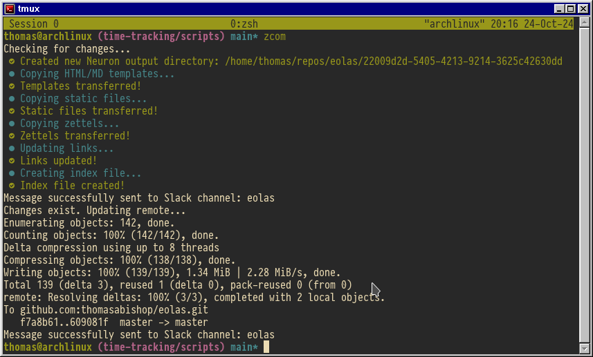
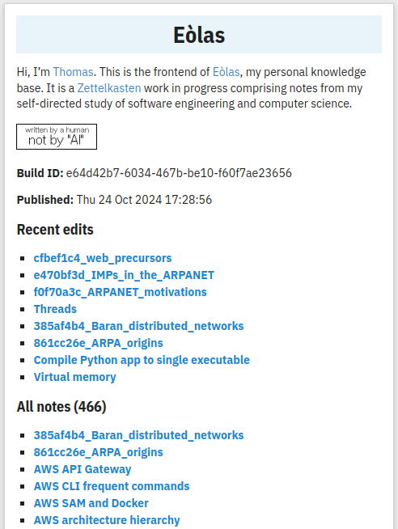

I'm now publishing [my zettelkasten](https://github.com/thomasabishop/eolas)
publicly at
[https://thomasabishop.github.io/eolas/](https://thomasabishop.github.io/eolas/).
I wanted to be able to access my notes from different devices and also have them
in a nicer format with syntax highlighting and LaTeX support.

I'm using the [Neuron](https://neuron.zettel.page/) static site generator which
is designed specifically zettelkasten-type projects. It requires that the links
and some other metadata are in a specific format. However, I wanted the
publishing process to be decoupled from my actual notes and not have to make
arbitrary changes to suit Neuron.

So I wrote a simple Python application
([neuron-zk-generator](https://github.com/thomasabishop/neuron-zk-generator))
that copies the source notes into a specific directory and applies all necessary
formatting to this copy. This generator executes locally when I push to the
remote and creates a Neuron directory which is then built (via a GitHub Action)
and deployed via GitHub pages.

<i>It's really satisfying running the generator, commit, and notification with a
    single command alias whenever I want to publish.</i>

It applies some basic CSS changes and also generates dynamic content for the
home page, displaying the build ID, publication date, a page count and the most
recently updated files along with an index:

