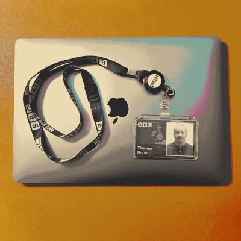

After two years and a couple of months I am leaving the BBC for ITV. I enjoyed
my time at the BBC. I was fortunate to have a really supportive and personable
manager who was great to work with and who took a real interest in my
professional development.

I worked with a variety of stakeholders on applications used internally within
the Corporation. I was able to work across the frontend and the backend in a
"full-stack" capacity, enhancing my understanding of AWS serverless, Docker,
GraphQL and other backend technologies.

In my new role I will be working with a similar tech stack also on internal
solutions, however this will be purely backend which better suits my technical
interests.

After the BBC, ITV is the second biggest broadcaster in the UK, so I think there
will be a lot of overlap. It will be interesting to see how the technical
culture differs and I am looking forward to working in a new environment on new
projects.
