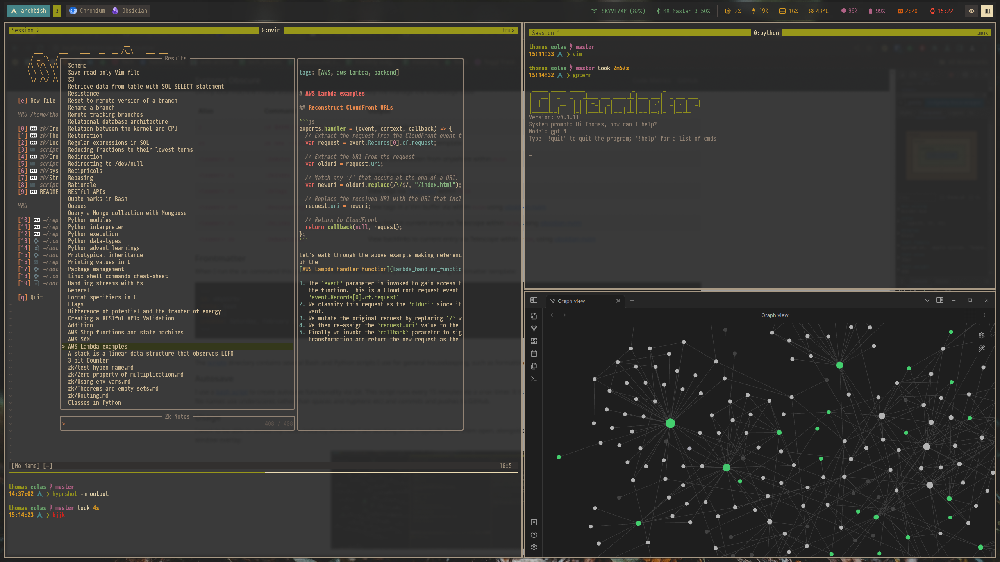
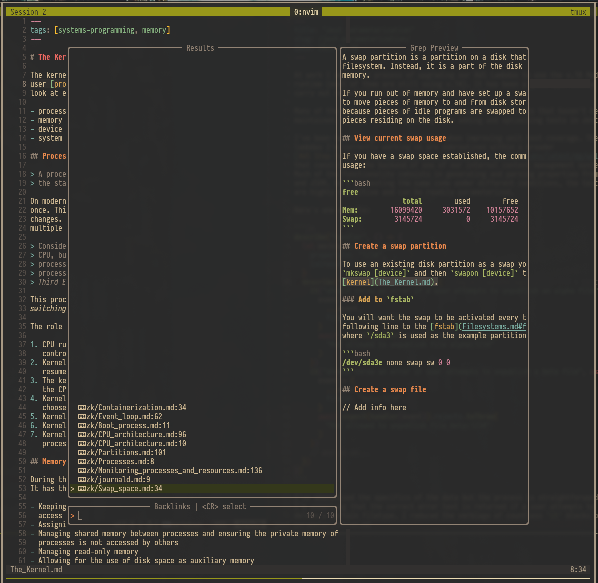

I keep my notes in a repository called [Eólas](). Eólas (_awlus_) is an Irish
word meaning knowledge or information, especially knowledge gained by experience
or practice.

I have designed it as a technical knowledge management system or "second-brain"
comprising notes from my autodidactic study of software engineering and computer
science.

It is a [Zettelkasten](https://en.wikipedia.org/wiki/Zettelkasten) work in
progress. It previously had a hierarchical structure made up of topic-based
subdirectories however I have recently converted this into a single flat
directory structure organised by tags. I'm in the process of partitioning longer
notes into smaller informational units.

I use the [zk](https://github.com/zk-org/zk) CLI package to help with indexing
and task automation alongside its [zk-nvim](https://github.com/zk-org/zk-nvim)
Neovim wrapper (my main editor). I occassionally utilise
[Obsidian](https://obsidian.md/) alongside Neovim for when I want to view my
notes as a knowledge graph or read them alongside their rich content (images,
videos etc).



<div style="text-align:center;">
<i >Viewing backlinks for a given entry.</i>
</div>

## Commands

On my local machine I have aliased several commands to help me manage the
knowledge base:

<table class="table table-bordered table-striped"> 
  <thead>
    <tr>    
     <th>Alias</th>                                                                                                             
     <th>Command</th>                                                                                                           
     <th>Output</th>                                                                                                            
     </tr>                                                                                                                          
    </thead> 
    <tbody>
        <tr>                                                                                                                          
     <td><code>z</code></td>                                                                                                    
     <td><code>cd $HOME/repos/eolas</code></td>                                                                                
     <td>Access Zettelkasten</td>                                                                                               
 </tr>                                                                                                                          
 <tr>                                                                                                                           
     <td><code>zn</code></td>                                                                                                   
     <td><code>zk new --title ...</code></td>                                                                                   
     <td>Create new entry from template</td>                                                                                    
 </tr>                                                                                                                          
 <tr>                                                                                                                           
     <td><code>&lt;leader&gt; zk</code></td>                                                                                    
     <td><code>:ZkNotes</code></td>                                                                                             
      <td>Access Zettelkasten from anywhere within <code>nvim</code></td>                                                        
  </tr>                                                                                                                          
  <tr>                                                                                                                           
      <td><code>&lt;leader&gt; zi</code></td>                                                                                    
      <td><code>:ZkIndex</code></td>                                                                                             
      <td>Index Zettelkasten within <code>nvim</code></td>                                                                       
  </tr>                                                                                                                          
  <tr>                                                                                                                           
      <td><code>&lt;leader&gt; zt</code></td>                                                                                    
      <td><code>:ZkTags</code></td>                                                                                              
      <td>View tags via <a href="https://github.com/nvim-telescope/telescope.nvim">Telescope</a> within <code>nvim</code></td>   
  </tr>                                                                                                                          
  <tr>                                                                                                                           
      <td><code>&lt;leader&gt; ztt</code></td>                                                                                   
      <td><code>:ObsidianTags</code></td>                                                                                        
      <td>View tags in a Vim buffer via within <code>nvim</code> using <a                                                        
  href="https://github.com/epwalsh/obsidian.nvim">obsidian-nvim</a></td>                                                         
  </tr>                                                                                                                          
  <tr>                                                                                                                           
      <td><code>&lt;leader&gt; zl</code></td>                                                                                    
      <td><code>:ZkLinks</code></td>                                                                                             
      <td>View links in current entry via Telescope within <code>nvim</code>, using <a                                           
  href="https://github.com/epwalsh/obsidian.nvim">obsidian-nvim</a></td>                                                         
  </tr>                                                                                                                          
  <tr>                                                                                                                           
      <td><code>&lt;leader&gt; zb</code></td>                                                                                    
      <td><code>:ZkBacklinks</code></td>                                                                                         
      <td>View backlinks to current entry via Telescope within <code>nvim</code>, using <a                                       
  href="https://github.com/epwalsh/obsidian.nvim">obsidian-nvim</a></td>                                                         
  </tr>   
        </tbody>
  </table>

## Frontmatter

When I run the `zn` command this generates a new Zettelkasten entry with the
following frontmatter template:

```yaml
---
id: o8yzcrtv
title: test
tags: []
created: Saturday, February 17, 2024 | 17:44
---
```

## Scripts

The [scripts](https://github.com/thomasabishop/eolas/tree/master/scripts)
directory contains several Bash and Python scripts I use for general
housekeeping, such as formatting image URLs, removing unused assets, and
autosaving.

## Autosave

I use a
[bash script](https://github.com/thomasabishop/eolas/blob/master/scripts/auto_save.sh)
to create autosave functionality via Git. This script runs every 15 minutes via
a `cron` timer. It tidies up the directory (removes unused images, ensures all
file names use underscores rather than spaces and hyphens etc) and commits and
pushes to GitHub.

## Usage

I want to be able to access my notes instantly whatever I am working on so I
typically have them open, alongside my knowledge graph and GPT-4 client in a
secret [Hyprland](https://hyprland.org/) window overlay (pictured above).
