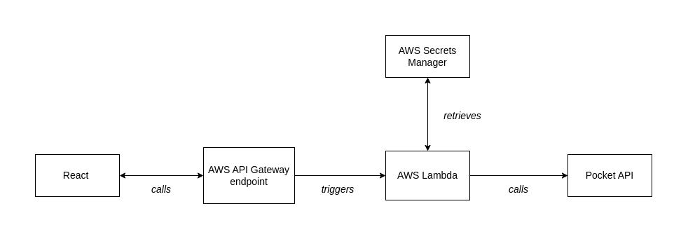
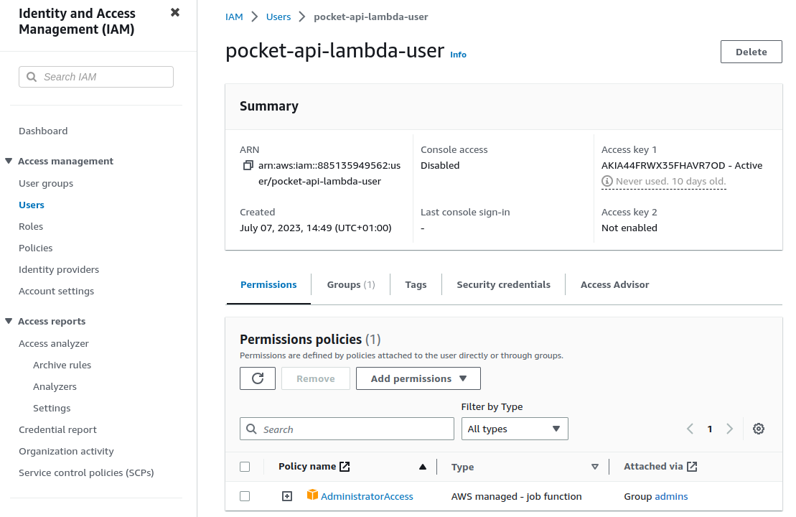
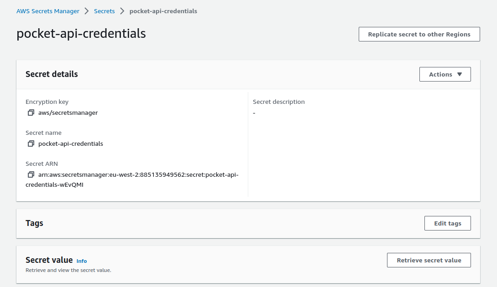
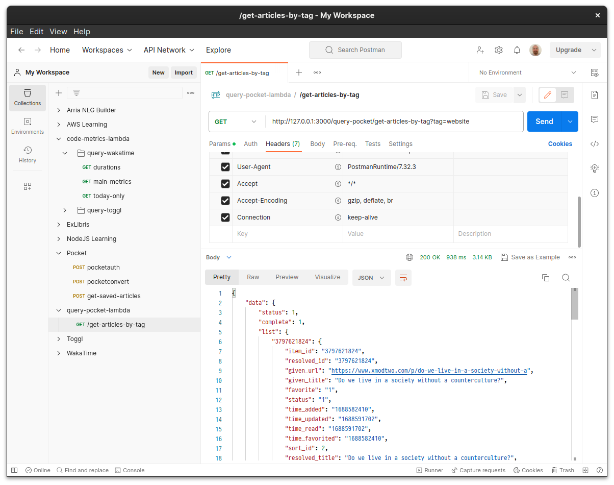
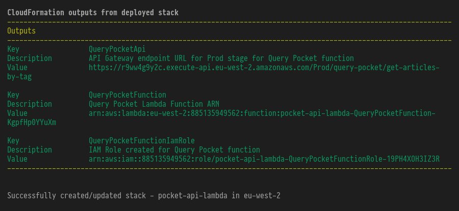
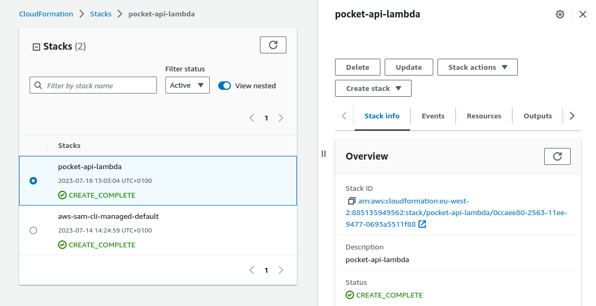
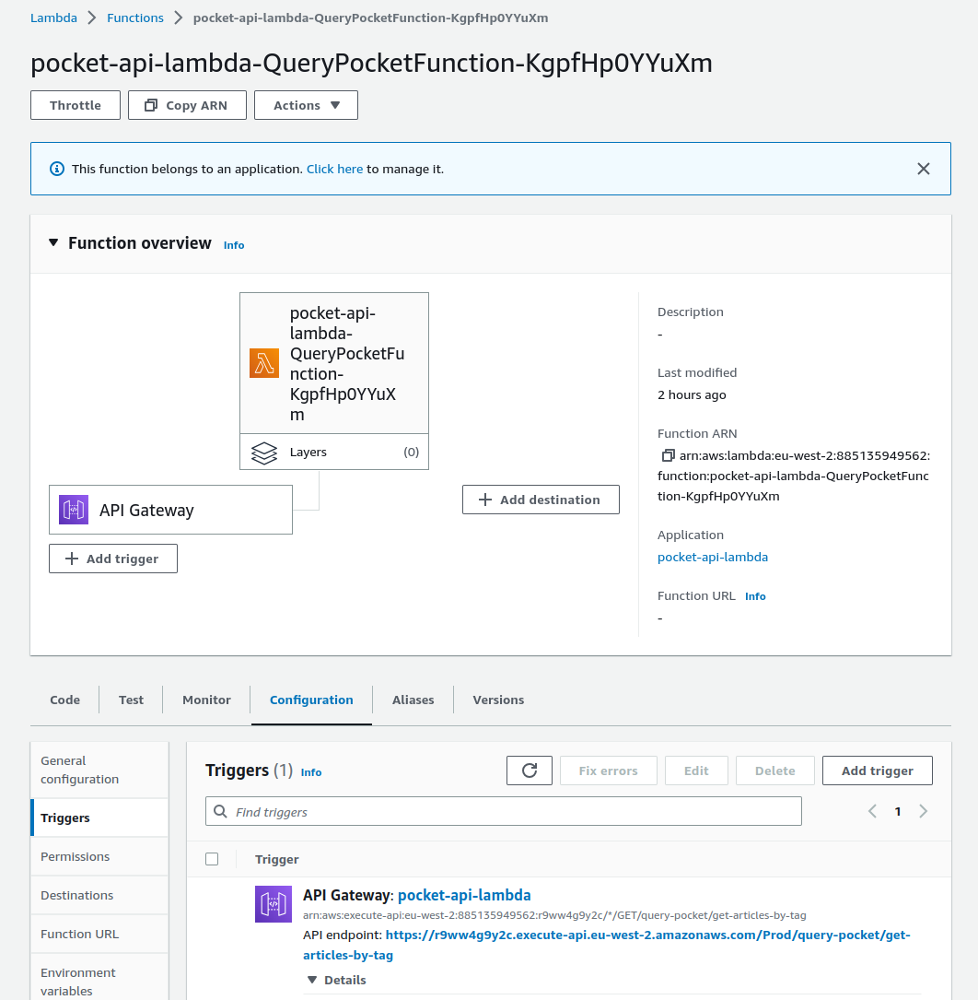
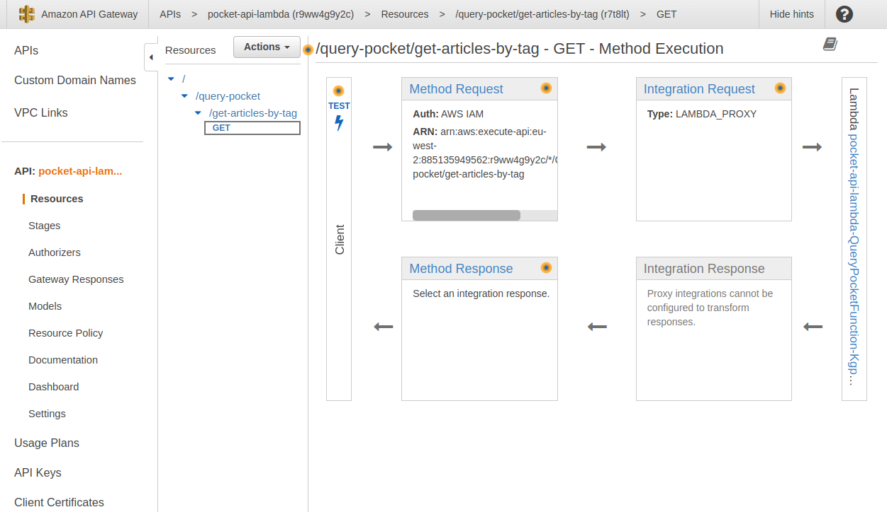

I've just added a new feature to the blog: a page that lists links to articles that I have found interesting. Here I will walk through the development process as it is a good example of setting up a simple AWS Lambda and will be useful for future reference.

## Implementation



<div style="margin-top: 1rem"></div>

I use Pocket to manage my reading list. When I save an article that I want to share to the blog I tag it with `website`. When querying the Pocket API I use this tag to distinguish articles I wish to share from my other saves. I deploy a Lambda function (written in TypeScript) that is accessible through an [AWS API Gateway](https://docs.aws.amazon.com/AWSCloudFormation/latest/UserGuide/Welcome.html) endpoint. This function simply sends a fetch request to the Pocket API and returns the response via the Gateway endpoint.

The Lambda is just a wrapper around the API request - I am not storing any data in a database. Using a Lambda means that I can access my Pocket API credentials securely on the backend and also sidestep the issue of Pocket not allowing CORS requests from a frontend.

## Backend

I will use the AWS [Single Application Model](https://aws.amazon.com/serverless/sam/) (SAM) for development. This will allow me to develop and provision the Lambda locally and then deploy my specifications as a template to AWS via the terminal. Once deployed this template will be used by AWS CloudFormation to create a manage the resources I have specified. This simplifies and programatises much of the work involved in creating and running a serverless application on AWS, since you don't have to fiddle too much with different AWS services in the AWS web console.

Following best practice I create a dedicated [Identity and Access Management](https://docs.aws.amazon.com/IAM/latest/UserGuide/introduction.html) (IAM) user for the project and will use it for the AWS services I require.

I do this via IAM in the AWS console and apply the AdministratorAccess policy to the user:



I then create an access key which will give me an Access Key ID and Secret Access Key. I add these values to a dedicated profile vie the `aws-cli`

```sh
aws configure --profile pocket-api-profile
```

This will prompt for the Access Key ID and secret key and then add the profile to `./aws/credentials`:

```
[default]
aws_access_key_id = [access_key_value_here]
aws_secret_access_key = [secret_access_key_here]

[pocket-api-profile]
aws_access_key_id = [access_key_value_here]
aws_secret_access_key = [secret_access_key_here]
```

### Create Lambda template

I use the SAM CLI to bootstrap a NodeJS Lambda written in TypeScript:

```sh
sam init --runtime nodejs16.x
```

### Update the defaults

This creates a basic _hello world_ template that I will adapt for my project. I will also change the naming conventions and file structure as I dislike the defaults.

My directory stucture is as follows:

```
.
├── pocket-api-lambda/
│   └── src/
│       └── query-pocket/
│           ├── index.ts
│           ├── package.json
│           ├── tsconfig.json
│           └── tests/
└── template.yml

```

### Create an IAM role for the Lambda function

Next I will provision for AWS to create a dedicated IAM role for my function. This is an executive role that will allow my function to access other services on my behalf. At deploy time, AWS will create the role and assign it an Amazon Resource Name (ARN). This is will uniquely identify the function's role within AWS.

Within the `Resources` object of the YAML template I add:

```yml
QueryPocketFunctionRole:
  Type: AWS::IAM::Role
  Properties:
    AssumeRolePolicyDocument:
      Version: "2012-10-17"
      Statement:
        - Effect: Allow
          Principal:
            Service:
              - lambda.amazonaws.com
          Action:
            - "sts:AssumeRole"
    Policies:
      - PolicyName: lambda-execution-policy
        PolicyDocument:
          Version: "2012-10-17"
          Statement:
            - Effect: Allow
              Action:
                - "logs:CreateLogGroup"
                - "logs:CreateLogStream"
                - "logs:PutLogEvents"
              Resource: "*"
```

This gives the function basic execution rights. I also need to add the IAM role to the `Outputs` object in the template:

```yml
QueryPocketFunctionIamRole:
  Description: "IAM Role created for Query Pocket function"
  Value: !GetAtt QueryPocketFunctionRole.Arn
```

This is necessary for AWS to create a dedicated ARN for the function when the application is deployed.

### Storing API credentials in AWS Secret Manager

In order to access the Pocket API you need to send HTTP POST requests to the endpoint with the following credentials supplied in the body:

```json
{
  "consumer_key": "[consumer_key_value_here]",
  "access_token": "[access_token_value_here]"
}
```

Rather than hard code these credentials in my Lambda code, I will follow best practice and store them in [AWS Secrets Manager](https://aws.amazon.com/secrets-manager/) which the Lambda will retrieve at runtime. This adds an extra layer of security and encrypts the credentials.

First I add the two values to Secrets Manager:



Then I add a resource permission to the existing `Policies` array for the `QueryPocketFunctionIamRole` to allow the Lambda to access the secret, specifying the ARN of the secret just created:

```yml
- PolicyName: secrets-manager-access
    PolicyDocument:
      Version: "2012-10-17"
      Statement:
        - Effect: Allow
        Action:
         - secretsmanager:GetSecretValue
        Resource: arn:aws:secretsmanager:eu-west-2:[ACCOUNT_ID]:secret:[SECRET_REF]
```

> I have put redacted private info by using square brackets: this isn't SAM syntax

### Accessing credentials

Now that the function is permitted to access the given secret. I will write a function that will retrieve the credentials from Secrets Manager, which I can invoke from the Lambda:

```typescript
const getPocketCredentials = async (): Promise<PocketCredentials> => {
  const secretsManager = new AWS.SecretsManager()
  const response = await secretsManager
    .getSecretValue({ SecretId: process.env.SECRET_ARN as string })
    .promise()
  const secretValues = JSON.parse(response.SecretString as string)

  if (secretValues) {
    return {
      accessToken: secretValues.POCKET_ACCESS_TOKEN,
      consumerKey: secretValues.POCKET_CONSUMER_KEY,
    }
  } else {
    throw new Error("Failed to return Pocket credentials")
  }
}

type PocketCredentials = {
  accessToken: string
  consumerKey: string
}
```

This function invokes the `SecretsManager` module of the `aws-sdk` to retrieve the secret and then exposes each key for destructuring within the main body of the Lambda function. In order to do so, it needs access to the ARN for the given secret which I have set as an environment variable in my `template.yml`:

```yml
...
Resources:
  QueryPocketFunction:
    ...
      Environment:
        Variables:
          SECRET_ARN:
          arn:aws:secretsmanager:eu-west-2:[MY_ACCOUNT_ID]:secret:[MY_SECRET_ARN]
```

This is great for production but when I am working locally, I don't want to keep making requests to Secrets Manager as this is unnecessary and could become costly. Instead I will utilise environment variables for the different deployment context and reserve calls to Secrets Manager for when the Lambda is executing in production. When working locally, I will source the Pocket credentials from an env file.

First I create this file at `env/local.env.json`:

```json
{
  "QueryPocketFunction": {
    "NODE_ENV": "development",
    "POCKET_CREDENTIALS": "{\"POCKET_ACCESS_TOKEN\": \"[ACCESS_TOKEN_HERE]\",\"POCKET_CONSUMER_KEY\": \"[CONSUMER_KEY_VALUE_HERE]\"}"
  }
}
```

This sets the Node runtime environment to `development` and ensures that the `POCKET_CREDENTIALS` are sourced from this file rather than Secrets Manager. I will add this file to the `.gitignore` so that it remains local. You'll notice that even though this is JSON, I pass `POCKET_CREDENTIALS` as a string rather than a nested object. This is because environment variables are a feature of the operating system's shell and most OSs treat them as simple strings rather than complex data structures.

Next I will update the `Environment` field in the `template.yml` so that it sets the Node runtime to `production` when it is deployed. I will also add an empty variable for `POCKET_CREDENTIALS` so that it can be set with the Secrets Manager values in the production context.

```yml
...
Resources:
  QueryPocketFunction:
    ...
      Environment:
        Variables:
          SECRET_ARN:
          arn:aws:secretsmanager:eu-west-2:[MY_ACCOUNT_ID]:secret:[MY_SECRET_ARN]
          NODE_ENV: production
          POCKET_CREDENTIALS: ""
```

Now I need to update the earlier `getPocketCredentials` function to distinguish between deployment environments and source the credentials from each location depending on the runtime:

```ts
const getPocketCredentials = async (): Promise<PocketCredentials> => {
  if (process.env.NODE_ENV === "production") {
    const secretsManager = new AWS.SecretsManager()
    const response = await secretsManager
      .getSecretValue({ SecretId: process.env.SECRET_ARN as string })
      .promise()
    const secretValues = JSON.parse(response.SecretString as string)

    if (secretValues) {
      return {
        accessToken: secretValues.POCKET_ACCESS_TOKEN,
        consumerKey: secretValues.POCKET_CONSUMER_KEY,
      }
    } else {
      throw new Error("Failed to return Pocket credentials")
    }
  } else {
    const localCredentials = JSON.parse(process.env.POCKET_CREDENTIALS as string)
    if (localCredentials) {
      return {
        accessToken: localCredentials.POCKET_ACCESS_TOKEN,
        consumerKey: localCredentials.POCKET_CONSUMER_KEY,
      }
    } else {
      throw new Error("Failed to return Pocket credentials")
    }
  }
}
```

Now when I run `sam build && sam local start-api` it will run the production version, sourcing the credentials from Secrets Manager. When I run the same command but specify the local environment variables, it will bypass Secrets Manager and get the credentials from the JSON file:

```sh
sam build && sam local start-api --env-vars /home/thomas/repos/lambdas/pocket-api-lambda/env/local.env.json
```

This command is a bit unwieldy to paste everytime, so I will write a Makefile that stores it:

```Makefile
.PHONY: clean build

clean:
	rm -rf .aws-sam

build:
	sam build

start-local:
	make build && sam local start-api --env-vars /home/thomas/repos/lambdas/pocket-api-lambda/env/local.env.json

```

Now I can just run `make start-local` to get the local API endpoint up and running.

### Lambda handler function

Finally I will write the actual handler function:

```ts
export const handler = async (event: APIGatewayProxyEvent): Promise<APIGatewayProxyResult> => {
  let response: APIGatewayProxyResult
  const endpoint = `https://getpocket.com/v3/get`

  try {
    const { accessToken, consumerKey } = await getPocketCredentials()
    const tag = event.queryStringParameters?.tag
    const responseHeaders = {
      "Content-Type": "application/json",
      "Access-Control-Allow-Origin": "*",
    }

    const requestBody = {
      consumer_key: consumerKey,
      access_token: accessToken,
      state: "all",
      tag: tag,
    }

    const options: RequestInit = {
      method: "POST",
      headers: {
        "Content-Type": "application/json; charset=UTF8",
      },
      body: JSON.stringify(requestBody),
    }

    const request: Response = await fetch(endpoint, options)
    const requestJson: any = await request.json()

    response = {
      statusCode: 200,
      headers: responseHeaders,
      body: JSON.stringify({
        data: requestJson,
      }),
    }
  } catch (err: unknown) {
    console.error(err)
    response = {
      statusCode: 500,
      header: responseHeaders
      body: JSON.stringify({
        message: err instanceof Error ? err.message : "some error happened",
      }),
    }
  }

  return response
}
```

I'm sending a POST request to the Pocket API endpoint. If successful, I return the data as the response, else I return an error code. You'll notice I am retrieving `queryStringParameter` from the `event` object. This means I can pass in different tags later, in case I want to retrieve different articles.

Locally, I would call the endpoint using the following URL: `http://127.0.0.1:3000/query-pocket/get-articles-by-tag?tag=website`

### The template file in full

Now the configuration is complete and the Lambda is written let's take a look at the final `template.yml`:

```yml
AWSTemplateFormatVersion: "2010-09-09"
Transform: AWS::Serverless-2016-10-31
Description: >
  pocket-api-lambda
Globals:
  Function:
    Timeout: 10
    MemorySize: 256
Resources:
  QueryPocketFunctionRole:
    Type: AWS::IAM::Role
    Properties:
      AssumeRolePolicyDocument:
        Version: "2012-10-17"
        Statement:
          - Effect: Allow
            Principal:
              Service:
                - lambda.amazonaws.com
            Action:
              - "sts:AssumeRole"
      Policies:
        - PolicyName: lambda-execution-policy
          PolicyDocument:
            Version: "2012-10-17"
            Statement:
              - Effect: Allow
                Action:
                  - "logs:CreateLogGroup"
                  - "logs:CreateLogStream"
                  - "logs:PutLogEvents"
                Resource: "*"
        - PolicyName: secrets-manager-access
          PolicyDocument:
            Version: "2012-10-17"
            Statement:
              - Effect: Allow
                Action:
                  - secretsmanager:GetSecretValue
                Resource: arn:aws:secretsmanager:eu-west-2:[ACCOUNT_ID]:secret:[SECRET_ID]
  QueryPocketFunction:
    Type: AWS::Serverless::Function
    Properties:
      CodeUri: src/query-pocket/
      Role: !GetAtt QueryPocketFunctionRole.Arn
      Handler: index.handler
      Runtime: nodejs16.x
      Architectures:
        - x86_64
      Events:
        QueryPocketApi:
          Type: Api
          Properties:
            Path: /query-pocket/get-articles-by-tag
            Method: get
      Environment:
        Variables:
          SECRET_ARN: arn:aws:secretsmanager:eu-west-2:[ACCOUNT_ID]:secret:[SECRET_ID]
          NODE_ENV: production
          POCKET_CREDENTIALS: ""
    Metadata:
      BuildMethod: esbuild
      BuildProperties:
        Minify: true
        Target: "es2020"
        Sourcemap: true
        EntryPoints:
          - index.ts
Outputs:
  QueryPocketApi:
    Description: "API Gateway endpoint URL for Prod stage for Query Pocket function"
    Value: !Sub "https://${ServerlessRestApi}.execute-api.${AWS::Region}.amazonaws.com/Prod/query-pocket/get-articles-by-tag"
  QueryPocketFunction:
    Description: "Query Pocket Lambda Function ARN"
    Value: !GetAtt QueryPocketFunction.Arn
  QueryPocketFunctionIamRole:
    Description: "IAM Role created for Query Pocket function"
    Value: !GetAtt QueryPocketFunctionRole.Arn
```

To summarise, and cover the parts of the template I have not already explained:

- I am creating provisions for three entities:

  - A Lambda function
  - An API Gateway enpoint that will trigger the function
  - An IAM role for the Lambda function

- In addition I am setting permissions so that my Lambda function can access a value stored in Secrets Manager, along with associated environment variables.

- I have a single endpoint: `/query-pocket/get-articles-by-tag`. I have given it it's own path rather than just using the root `/query-pocket` because I may add additional endpoints in the future

- My Lambda function is defined in `/query-pocket/index.ts`

Now when I start the server locally and call the endpoint from Postman I can see the data returned:



### Deploying the function

I start by validating my template to ensure that I do not introduce problems at the outset of the deployment:

```
sam validate
/home/thomas/repos/lambdas/pocket-api-lambda/template.yaml is a valid SAM Template
```

Then I run a build:

```
sam build
```

Next I package the application. CloudFront can only receive one file as an input. When we package the application we create this single file. The packaging proces will first archive all of the project artefacts into a zip file and then upload that to an [AWS S3](https://aws.amazon.com/s3/) bucket. A reference to this S3 entity is then provided to CloudFormation and used to retrieve the requisite artefacts.

```
sam package
--template-file template.yaml
--output-template-file pkg.yaml
--region eu-west-2
```

This outputs the following, confirming the creation of the zipped resources:

```
Managed S3 bucket: aws-sam-cli-managed-default-samclisourcebucket-xc8swn6xu4km
A different default S3 bucket can be set in samconfig.toml
Or by specifying --s3-bucket explicitly.
Uploading to 67c241b6f81524ee092adab3ba9998c5  50691677 / 50691677  (100.00%)

Successfully packaged artifacts and wrote output template to file pkg.yaml.
Execute the following command to deploy the packaged template
sam deploy --template-file /home/thomas/repos/lambdas/pocket-api-lambda/pkg.yaml --stack-name <YOUR STACK NAME>
```

Now that we have our packaged application, the last step is to deploy it:

```
sam deploy --guided
```

This presents me with options for the deployment defaults. The most important one is `Allow SAM CLI IAM role creation`. By affirming this, AWS will create the `QueryPocketFunctionIamRole` and generate an ARN for it.

This takes a few minutes but the CLI will keep you up to date with the deployment process. Then, if successful, it will confirm the resources it has created:



If I go to CloudFormation in the AWS I will see that the `pocket-api-lambda` stack now exists:



And a new function is added to AWS Lambda with the API Gateway endpoint as the trigger:



And in API Gateway the API has also been set up:



## Frontend

My frontend is built with the GatsbyJS library and so is React-based.

### Environment variables

Early I took to trouble to run both development and production versions of the API. When I am working locally on my site I want to be querying the local endpoint rather than the production version since this will accrue fees and also requires me to deploy after every change.

I will use an environment variable to distinguish the local and production endpoints. I do this using the [dotenv](https://www.npmjs.com/package/dotenv) Node package and create the following two files:

```sh
# .env.production
GATSBY_POCKET_AWS_LAMBDA_ENDPOINT=https://[HASH].execute-api.eu-west-2.amazonaws.com/Prod/query-pocket/get-articles-by-tag
```

```sh
# .env.development
GATSBY_POCKET_AWS_LAMBDA_ENDPOINT=http://127.0.0.1:3000/query-pocket/get-articles-by-tag
```

By prepending the variable name with `GATSBY`, Gatsby will know to inject these values at runtime. This way, and by adding my `.env` files to the `.gitignore`, I can avoid hardcoding my endpoints and can use a single reference in my React component.

When working locally I can run `NODE_ENV=development npm run start` to source the local endpoint variable and `NODE_ENV=production npm run start` to source the production endpoint variable. In the deployed production context however, `.env.production` will not be available because it is an ignored file. Thus to source the variables when `npm run build` is run remotely, it is necessary to store them as secrets that can be accessed in my CI/CD pipeline. I use a [GitHub Action](https://systemsobscure.blog/how-I-deploy-this-site/) to build my site and deploy it to AWS when I push changes, so I add the following line to my `main.file` build script:

```yml
steps:
 - name: Set environment variables
    run: |
      echo "GATSBY_POCKET_AWS_LAMBDA_ENDPOINT=${{ secrets.GATSBY_POCKET_AWS_LAMBDA_ENDPOINT }}" >> $GITHUB_ENV
      echo "GATSBY_METRICS_AWS_LAMBDA_ENDPOINT=${{ secrets.GATSBY_METRICS_AWS_LAMBDA_ENDPOINT }}" >> $GITHUB_ENV
```

### React component

Below is the React component:

```jsx
const ENDPOINT = process.env.GATSBY_POCKET_AWS_LAMBDA_ENDPOINT

const ArticleListing = ({ article }) => {
  return (
    <tr>
      <td>
        <a href={article?.resolved_url} target="_blank">
          {article?.resolved_title}
        </a>
      </td>
      <td>{formatUnixTimestamp(article?.time_added)}</td>
    </tr>
  )
}

export default function RecommendedArticlesPage() {
  const [loading, setLoading] = useState(false)
  const [data, setData] = useState({})

  useEffect(() => {
    const fetchData = async () => {
      try {
        setLoading(true)
        const response = await axios.get(`${ENDPOINT}?tag=website`)
        setData(response?.data?.data?.list)
      } catch (error) {
        console.error(error)
      } finally {
        setLoading(false)
      }
    }
    fetchData()
  }, [])

  const articles = Object.keys(data).map((key) => data[key])
  return (
    <Main>
      <PageHeader headerTitle="Recommended articles" />
      <p>
        Articles written by others that I have learned from or which present interesting viewpoints.
      </p>

      <table className="articles-table">
        <thead className={loading ? "loading" : ""}>
          <tr>
            <th>Title</th>
            <th>Date added</th>
          </tr>
        </thead>
        <tbody>
          {articles?.map((article) => (
            <ArticleListing key={article?.item_id} article={article} />
          ))}
        </tbody>
      </table>
    </Main>
  )
}
```

Here I source my environment variable from the Node runtime context and use it to query the API via the React `useEffect` hook that runs once on load. Then I loop through the data to populate the rows of an HTML table.

## Addendum: authentication

I have set up a basic AWS Gateway API with two execution contexts (local and production) that trigger a Lambda function. In closing I want to note that a considerable oversight is the lack of authentication for the remote endpoint. In its current state anyone with access to the production URL can call the API.

In this context it's not that big of a deal since the information is not sensitive or particularly interesting however if I was following best practice I would need to provide a way for AWS to authenticate requests. I did attempt this using an IAM role and an AWS Cognito user pool however I was unable to get this working despite my best efforts. This is something I will return to in a future post.
