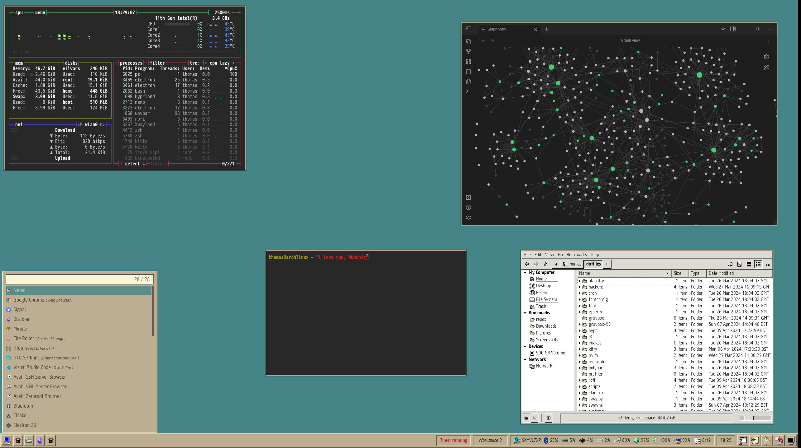
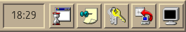
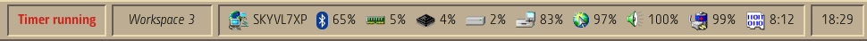
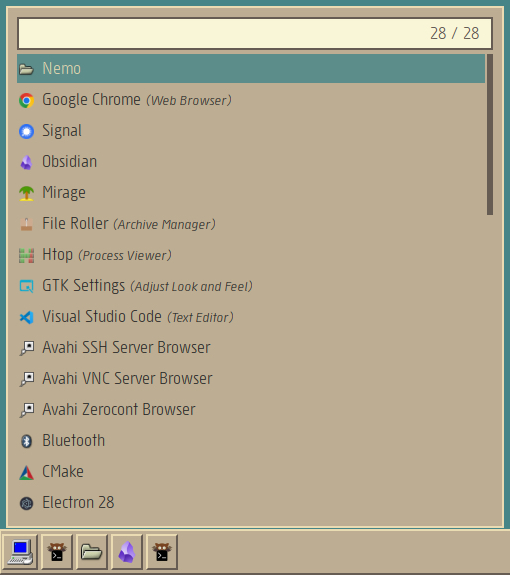

Back in April I was working on a full system rice. It was going to be called
_Gruvbox95_ and would basically apply the aesthetics of Windows95/98 to the
Hyprland window manager but with the seductive beige of the Gruvbox light theme.

Alas I was ultimately defeated by box-shadow and my own limitations but I came
across a screenshot when I was clearing out my phone.

Details of the toolbar created with <a href="https://github.com/Alexays/Waybar">Waybar</a>.

App launcher created with <a href="https://github.com/philj56/tofi">Tofi</a>.

Pixel art icon intended for the launch button.

