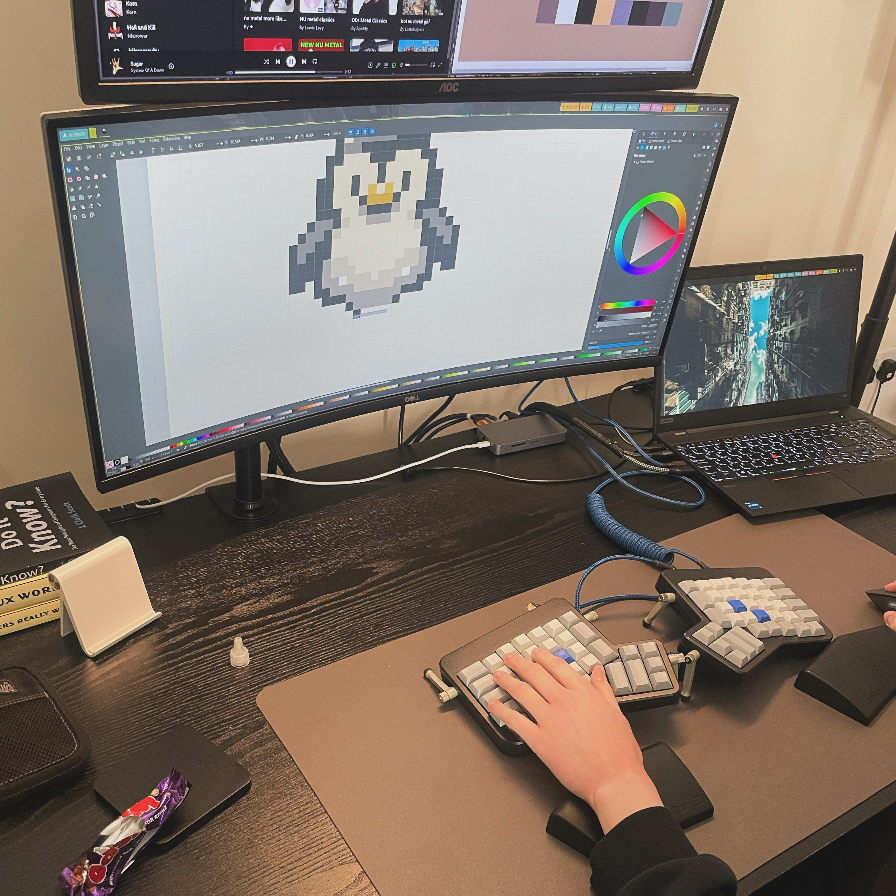

Back in April I was working on a full system rice. These were the early days of
my beige addiction when I was only looking at beige at weekends and thought I
had it under control.

It was going to be called _Gruvbox95_ and would basically apply the aesthetics
of Windows95/98 to the XFCE desktop environment but with the seductive **beige**
of the Gruvbox light theme. This would be a theme written from scratch without
any major dependencies, beyond fonts and old Windows assets.

Alas I was ultimately defeated by box-shadow and my own limitations but I came
across a screenshot when I was clearing out my phone. My only relic of those
ambitious days.

_I tried so hard and got so far. But in the end it doesn't even matter._

My glamorous assistant on
the <b>doomed project</b>, working on what would've been the launch icon:

