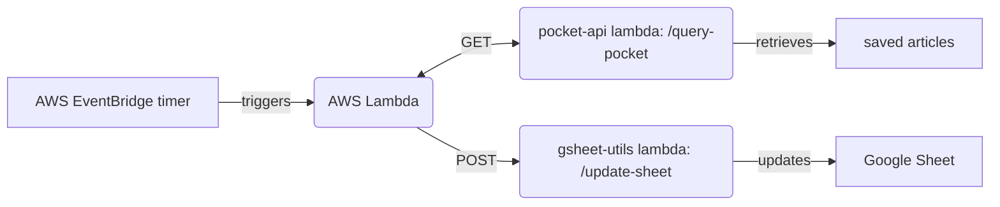

I have just set up a [new AWS Lambda](https://github.com/thomasabishop/lambdas/tree/main/save-articles) written in Python. It retrieves entries from my saved articles in Pocket, parses the key metadata and saves it to a Google Sheet.

I've done this because I find the Pocket iPhone and web app to be practically unusable. They distinguish "Saved" articles from "Archived" articles without making the distinction clear and constantly switch the status of articles between these two states making retrieval and ordering really difficult. On mobile it constantly updates and reorders the article list _as you are viewing it_ which makes using the app really disorientating. However I've used Pocket for a long time and the alternatives are worse or have bad APIs.

Now I am able to keep my interactions with Pocket minimal: I use the Pocket browser extension to save and tag articles and that's it. My pre-existing [pocket-api](https://github.com/thomasabishop/lambdas/tree/main/pocket-api) lambda is able to retrive my articles by tag. The new lambda calls this lambda to get the articles and then uses my [gsheets-utils](https://github.com/thomasabishop/lambdas/tree/main/gsheet-utils) lambda to save them to a Google Sheet. This way I can access them from anywhere without using a database. Each tag has it's own corresponding sheet that lists the articles in reverse chronological order. It executes on a cron timer once a day.

Here are my saved technical articles, for example:

I have additional sheets/tags for archived articles, general topics and articles I wish to share with my girlfriend (I simply give her read access to the worksheet.)

The architecture is summarised below:

