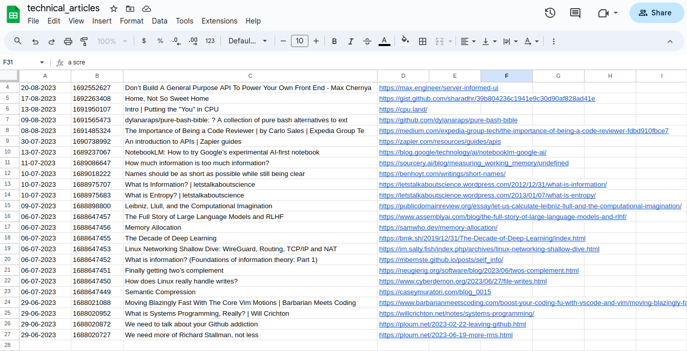

I've just finished a new
[AWS Lambda](https://github.com/thomasabishop/lambdas/tree/main/save-articles)
written in Python. It retrieves entries from my saved articles in Pocket, parses
the key metadata and saves it to a Google Sheet.

I've done this because I find the Pocket app to be really uncongenial and
confusing to use. However I've used Pocket for a long time and the alternatives
are worse or have bad APIs.

Now I keep my interactions with Pocket minimal. I use the Pocket browser
extension only to save and tag articles. My lambda function retrieves articles
by tag and saves them to a Google Sheet. This allows me to access the articles
from anywhere without using a database.

Each tag has a corresponding sheet that lists the articles in reverse
chronological order. The lambda executes on a cron timer once a day.

Here are my saved technical articles, for example:

