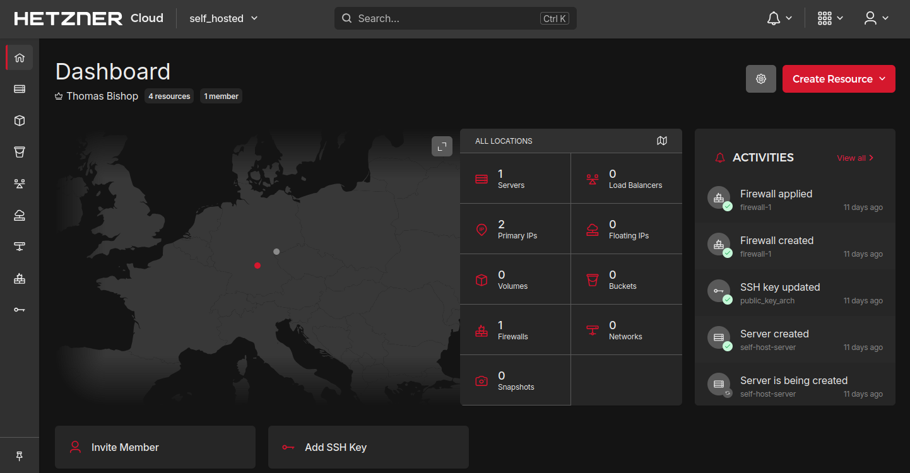
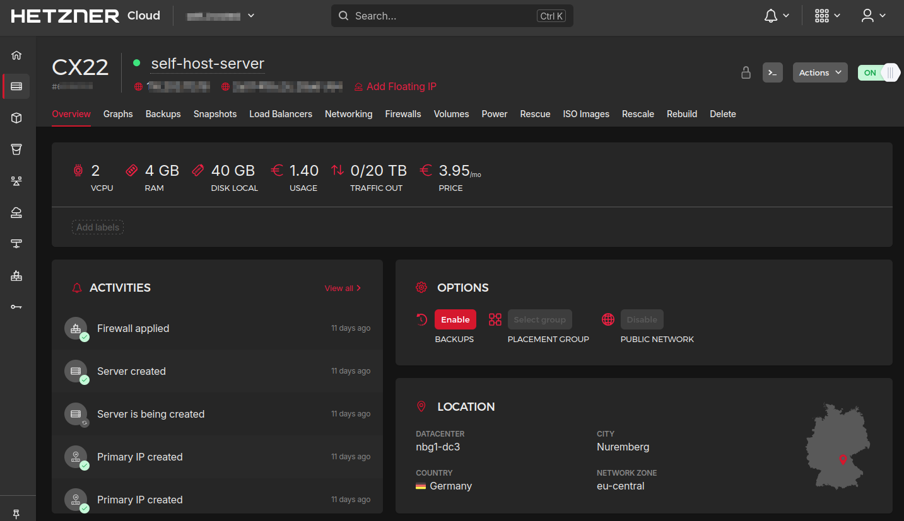

With the way the internet Internet (and the world) is going, the benefits of
self-hosting the services you rely on is becoming increasingly obvious.

I have been using AWS to run a limited set microservices on the Free Tier but
doing anything interesting with an actual server and database becomes expensive
quickly. While I hope to eventually run my own physical server, for now I have
opted to maintain a remote virtual private server. The skills I gain here will
obviously transfer to the physical context.

I intend to run a series of third-party FOSS applications on different
subdomains via Docker containers. I will also be deploying my own software as
Docker images.

This post goes over the initial setup and configuration of the server.

## Choosing a provider

Jurisdiction, location and price were the main considerations. I want the server
to be based in a country with good privacy laws but not so far away that latency
would be noticeable. I also don't want to pay that much initially given that I
am just starting out.



<div style="text-align:center">
<i>The Hetzner Cloud Console</i>
</div>

I opted for the German company, Hetzner. Being in the EU means their digital
privacy laws are better than the UK and Germany's 20th century history has
created more of a culture of resistance to surveillance than other EU states.

I chose their CX21 Cloud package which provides the following for just under €4
a month:

- 2 virtual CPUs (Intel)
- 4 GB RAM
- 40 GB SSD
- IPv4 and free IPv6

This is modest but given that it's virtual, I can scale up later as necessary.



<div style="text-align:center">
<i>My server</i>
</div>

## Creating a server

Once you've paid you get access to the Hetzner Cloud Console and you just click
"Add server" and specify the location, hostname and OS. I opted for Nuremberg as
it's nearest and decided on Debian as my Linux distro.

I set up a basic firewall using the Hetzner console, allowing incoming traffic
on ports 22 (SSH), 80 (HTTP), and 443 (HTTPS). This will apply at the Network
Layer. In a moment I'll explain how I also created a firewall at the Application
Layer, over SSH.

## Connecting

Once the server was spun up the obvious next step was to connect to it and start
configuring from the inside. To do this I needed SSH access. This was
straightforward, I just added my local machine's public key via the Hetzner and
then connected with:

```sh
ssh root@<server_ip4_address>
```

## Create non-root user

Once I had access as root the first thing I did was update my packages:

```sh
apt update
apt upgrade
```

Next I created a non-root user with `sudo` privileges. This is the account I
will use for administrating the server which is obviously safer than doing stuff
as root:

```sh
apt install sudo
add user <my_username>
usermod -aG sudo <my_username>
```

I then switched to this user:

```sh
su - <my_username>
```

I'm connecting to the server over SSH but I also want to login as `my_username`
using SSH keys instead of a password as this is less secure.

I set up the necessary SSH directory and permissions for `my_username`:

```sh
mkdir /home/<my_username>/.ssh
chown <my_username>:<my_username> /home/<my_username>/.ssh
chmod 700 /home/<my_username>/.ssh
```

Then I transferred my local machine's public key, that I added to the server via
the Hetzner Console earlier, to the known hosts for `my_username`.

```sh
cp /root/.ssh/authorized_keys /home/<my_username>/.ssh/
chown <my_username>:<my_username> /home/<my_username>/.ssh/authorized_keys
chmod 600 /home/<my_username>/.ssh
```

To confirm, I closed the connection and then connected to the server again but
this time as `my_username`:

```sh
ssh <my_username>@<server_ip4_address>
```

Having confirmed SSH login I installed two packages to make configuration
easier: `zsh` for managing my shell and `vim-tiny` for text-editing:

```sh
sudo apt install zsh
sudo apt install vim-tiny
```

## Disable root login and access

An important server-hardening routine is to prevent password logins as root.

To do this I needed to edit the root SSH config:

```sh
sudo vim /etc/sshd_config
```

Then added the following:

```
PasswordAuthentication no
```

Then restarted the SSH daemon:

```
sudo systemctl restart sshd
```

Then when I attempted `ssh root@<server_ip4_address>` I was met with "Permission
denied", as intended.

As I side note, it's actually not possible for me to login as root at all, which
is best practice. I haven't set a root password, so if I attempt to login as
root when logged in as `my_username` (with `su -`), all attempts will fail.

When I need to run processes as root, I will do this exclusively by assuming
`sudo` and to do this, I need to enter my password for `my_username`.

## Firewall

Earlier, I set up a firewall from outside of the server, using the Hetzner
Console. I'm now going to do the same thing but from within the server as
`my_username`. It will share the same rules. This means I have a firewall at the
Network Layer (Hetzner) blocking requests before they reach the server and a
firewall operating at the Application Layer for those requests that get to the
server.

This doesn't add much in terms of security, especially as the rules are
identical, but having a peripheral firewall on the Network and a firewall on the
server provides a degree of "defence in depth". It will also potentially reduce
the load on the server if blocked requests are deflected at the Network Layer
before reaching the server.

It would of course be better to block by IP, and only open the SSH port to
requests from my local network (HTTP/HTTPS is obviously public and open to all).
This isn't an option because my my broadband package doesn't include a static
IP. One way around this would be to deploy another Hetzner server and set it up
as a VPN. I would then restrict port 22 to requests from that server's IP and
connect to the VPN server first. This might be a project further down the line.

To set up the host firewall I used `ufw` (Uncomplicated Firewall):

```sh
sudo apt install ufw
```

This is a wrapper for the venerable `iptables` that makes the process simpler.

I applied the same basic rules as earlier:

```sh
sudo ufw default deny incoming
sudo ufw default allow outgoing
sudo ufw allow 22/tcp
sudo ufw allow 80/tcp
sudo ufw allow 443/tcp
sudo ufw enable
```

To confirm:

```sh
sudo ufw status

```

```
To                         Action      From
--                         ------      ----
22/tcp                     ALLOW       Anywhere
80/tcp                     ALLOW       Anywhere
443/tcp                    ALLOW       Anywhere
22/tcp (v6)                ALLOW       Anywhere (v6)
80/tcp (v6)                ALLOW       Anywhere (v6)
443/tcp (v6)               ALLOW       Anywhere (v6)

```

(This automatically applies the rules for IPv6 as well as IPv4.)

This was enough for one Sunday! In my next post I'll detail how I set up DNS and
SSL for the new server.

## Resources

In researching how to do the above, I created or drew on the following entries
in my Zettelkasten:

- [Firewalls](https://thomasabishop.github.io/eolas/Firewalls)
- [UFW firewall management](https://thomasabishop.github.io/eolas/UFW_firewall_management)
- [Disable non-root SSH access](https://thomasabishop.github.io/eolas/Disable_non-root_ssh_access)
- [IP addresses](https://thomasabishop.github.io/eolas/IP_addresses)
- [Internet fundamentals](https://thomasabishop.github.io/eolas/Internet_fundamentals)
- [The Application Layer of the Internet Protocol](https://thomasabishop.github.io/eolas/Application_Layer_of_Internet_Protocol)
