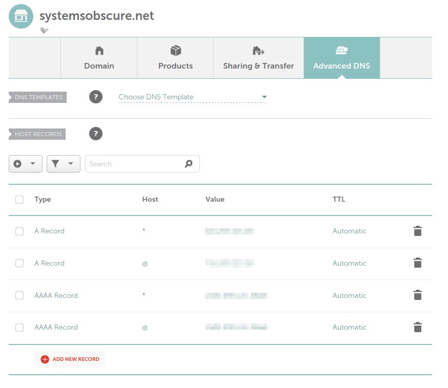
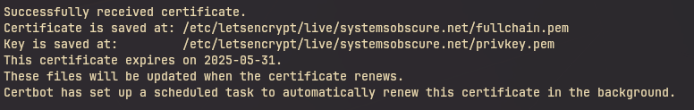

In my [previous post](./self-hosting-1-initial-setup.md) I described how I
purchased my VPS package, initialised a server and applied some basic security
safeguards. In this post I'll record how I set up DNS and the certification
necessary to enable encrypted client-server communication over HTTPS.

## DNS

As it stands, my server exists on the Internet but can only be reached via its
IPv4 address. This is sufficient to connect via SSH but eventually I want to
host HTTP services and for this, I'll need a domain name.

I purchased the domain `systemsobscure.net` from Namecheap. I'm not mad about
using a US company but it is indeed cheap and has a better record when it comes
to privacy than its main competitor, Cloudflare.

Once purchased, I needed to set up the A Records that associate my server's IP
address with the domain name:



`@` sets the root domain. `*` is a wildcard that represents all subdomains at
the root level. This means I can dedicate specific services to different
subdomains on the same server, e.g _grafana.systemsobscure.net_,
_wallabag.systemsobscure.net_ etc.

I've done this for both my IPv4 address and IPv6 addresses (pixelated).

The DNS resolution propagated very quickly and now instead of using the IP, I
can SSH with the domain name, e.g:

```sh
ssh my_username@systemsobscure.net
```

## TLS certification

Next I needed to generate a TLS certificate for the domain. Certificates provide
a mechanism for independently verifying domain ownership. This serves as a
safeguard against impersonation and man-in-the-middle attacks. (Imagine if
someone was able to impersonate the web address of your online banking provider;
they could intercept and steal your account details.)

Establishing trust through a certificate is a prerequisite for the initiation of
encrypted communication between client and server. Once the client has validated
the server's certificate, it can use the server's public cryptographic key
(supplied with the certificate) to create a shared cipher that will encrypt the
subsequent HTTP messages.

The process essentially works as follows. A client will request a resource on my
server. The server will offer its TLS certificate which contains its public key.
The client will confirm the certificate is valid and issued by a reputable
Certificate Authority. It will then use the public key to send the server an
encrypted message. This will be decrypted by the server (using its private key)
and used to create the shared key that will encrypt communication between the
two hosts.

All of this happens silently at the Transport Layer - a layer lower in the
network stack that the actual applications running over HTTPS (TLS stands for
_Transport Layer Security_). You only become aware of it when your browser
alerts you to the fact that a website has an invalid certificate or is using
unencrypted HTTP.

Thankfully, this algorithmic complexity is not the immediate concern of the
server administrator! You can use a tool called `certbot` to generate the
certificate and prove your domain ownership in a matter of minutes.

[certbot](https://certbot.eff.org/) is a free and open-source ACME client. ACME
stands for _Automatic Certificate Management Environment_. It generates the
initial certificate and automatically renews it after 90 days.

I installed `certbot`:

```sh
sudo apt install certbot
```

Then generated the certificate:

```sh
sudo certbot certonly --stanalone -d systemsobscure.net
```

This command does quite a lot. It creates a temporary web server on port 80 and
then sends a request to [Let's Encrypt](https://letsencrypt.org/) (the body
responsible for generating the certificates), asking for a "challenge" to prove
domain ownership.

Let's Encrypt will send a token to `certbot` and `certbot` will dutifully place
the token in a file that is served at a URL over port 80. Let's Encrypt will
then make an HTTP request to this URL ( e.g
`http://systemsobscure.net/.well-known/acme-challenge/the-token`) confirming
ownership and conferring the certificate.

`certbot` saves the certificate (and several associated cryptographic tokens) to
the `/etc/letsencrypt/live` directory.



As I currently don't have any services running on HTTP, the certificates won't
actually be used yet, but they are ready to go. In my next post I will finally
create my first self-hosted service which can now be served using my dedicated
domain name over HTTPS!

## Resources

In researching how to do the above, I created or expanded the following entries
in my Zettelkasten:

- [Certificates and Certificate Authorities](https://thomasabishop.github.io/eolas/Certificate_authorities)
- [Let's Encrypt](https://thomasabishop.github.io/eolas/Let's_Encrypt)
- [HTTPS](https://thomasabishop.github.io/eolas/HTTPS)
