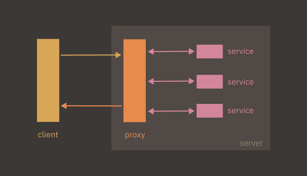
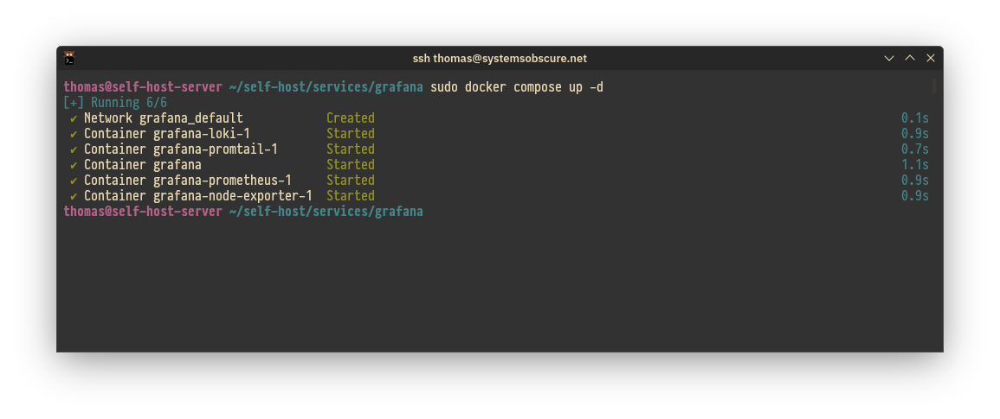
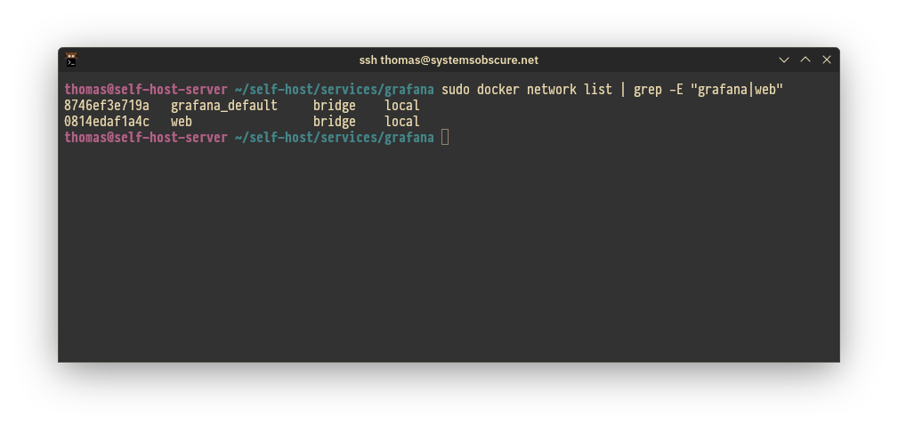
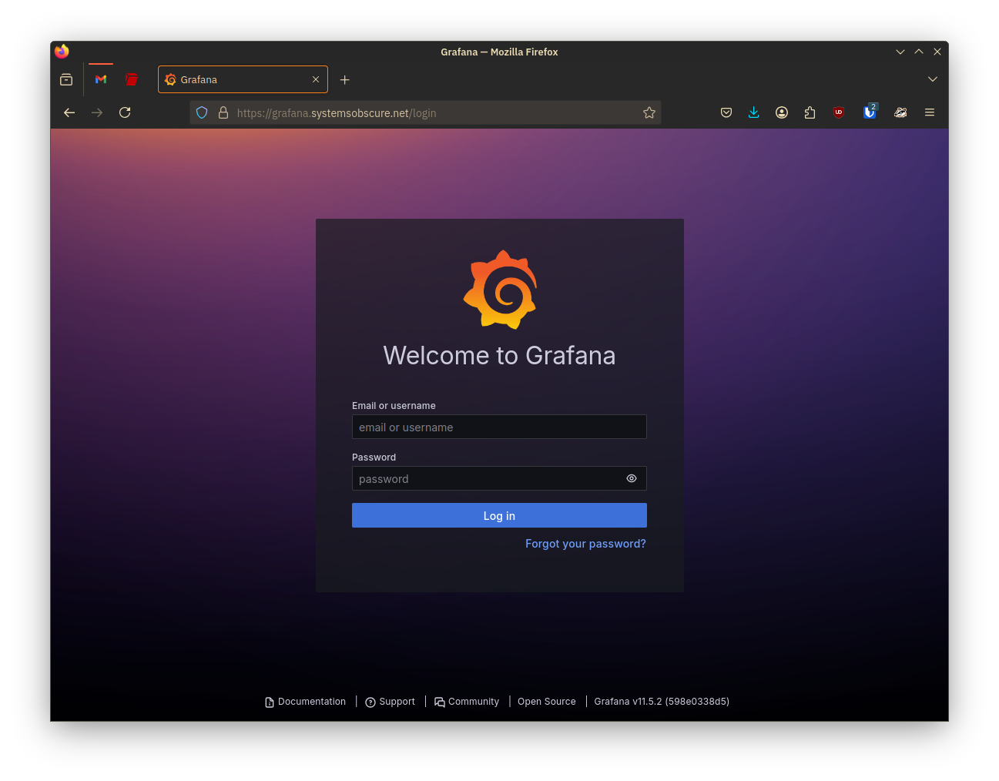
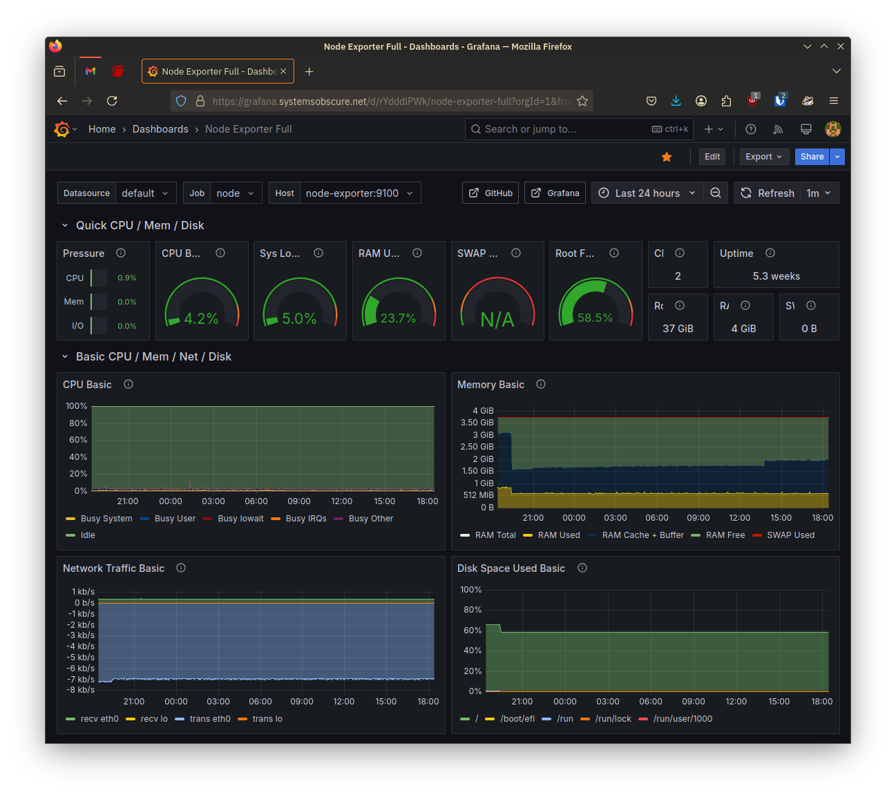
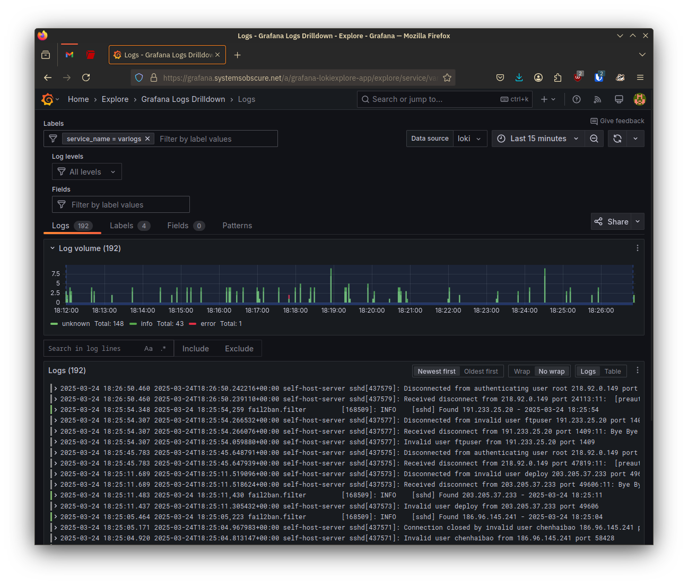

In my [previous post](https://systemsobscure.blog/self-hosting-2-dns-tls/) in
the [series](link_to_tag) I explained how I configured the DNS settings for the
server and set up its TLS certificate. I am now in a position to start hosting
services.

## Architecture



<div style="text-align:center">
<i>The basic client-server architecture I will be using with my reverse proxy.</i>
</div>

There are three core components to my self-hosting architecture:

- a public subdomain
- a reverse proxy
- software running in Docker containers

I will use this structure for the majority of my services. Let me explain each
part.

### Subdomain

This is the easiest bit to understand. A subdomain is just an address on a
larger server that groups together a set of related processes or resources. For
example, on my server, _service-a_ and _service-b_ would be accessible at the
following subdomains:

- `service-a.systemsobscure.net`
- `service-b.systemsobscure.net`

To access a given resource over the public Internet, it needs to be reachable
via a URL - subdomains provide this in a clear, hierarchical manner.

Back when I set up the
[DNS records](https://systemsobscure.blog/self-hosting-2-dns-tls/) for the
server, I created an A Record with the wildcard character (`*`). This means that
I can create multiple subdomains and have them be served off of the main
`systemsobscure` domain.

### Reverse proxy

The subdomain is the public address of the resource or service. Clients will
send HTTP requests to this address and to handle them, I need a way to map the
public subdomain to the resource on the server that the client has requested.
This is the role of the reverse proxy.

A reverse proxy serves as a buffer between the server and the incoming client
requests. It inspects the request and directs it to the port of the relevant
running process.

Reverse proxies have other uses and advantages - they can be used as load
balancers and as a security measure to block certain traffic. However my use
will be mostly administrative - directing incoming requests to the right
services.

### Docker

[Docker](https://www.docker.com/) is fairly complex but I want to go into a bit
of detail because I think it is one of the few genuinely innovative technologies
of the last couple of decades. It's remarkable how simple it is to use and how
quickly you can provision complex resources with just a few lines of
configuration.

Docker exploits a capacity native to the Linux kernel: containerisation.
Containers allow you to isolate running processes from their specific runtime
environment into self-contained virtual runtimes.

All operating system processes ultimately share the same computational
resources: memory, disk-space, processor etc. This means that any one process
can monopolise those resources at the expense of the others. For example, you
might be running software that has hit a bug and as a result it freezes and your
mouse movement slows down.

Prior to the advent of containerisation, server management mostly consisted in
balancing the competing resource needs of different processes. With containers,
you group a set of related processes into an isolated group and assign them a
specific amount of virtual memory, disk-space etc. This grouping is partitioned
from other processes on the native OS and the container is ignorant of the
specific machine it is running on. This means it is confined to its container
and cannot unduly affect other system processes. It can also be activated and
deactivated, as needed.

You can provision software just as selectively as hardware, using specific
runtimes and dependencies as required. This practically eradicates the common
issue of conflicts arising between, say, the version of Python you have on your
local machine, and the version required by a third-party software. Moreover, as
containers are _portable_ - they can, in principle, be shared between machines -
you can share software as a container and be confident that it will run on any
machine that can leverage containerisation.

This is where Docker comes in. It's a particular implementation of container
technology that is designed to simplify and standardise the creation and
exchange of containerised software.

A Docker _image_ is a blueprint for creating a specific container. For example,
you might use a MySQL image to create a database within your application. The
image contains everything necessary to run the application: binaries, libraries,
resources, and additional dependencies.

You can combine several images into a single container. In this scenario, you
might also include an OS image to manage the different components. These are
typically stripped-down versions of common Linux distributions.

Docker images are defined in a declarative file (Dockerfile) that specifies the
software to be used, the directory within the container where it should execute,
and, usually, an initialisation command.

To demonstrate, the Dockerfile below sets up a basic Python application using
the public `python:3.8` image. It transfers source files from a directory on the
local machine into to the container, installs dependencies and then starts the
application:

```
FROM python:3.8
WORKDIR /app
COPY . /app
RUN pip install -r requirements.txt
CMD ["python", "./my_script.py"]
```

Docker maintains a [public registry](https://hub.docker.com/) of images that you
can download and use via the Docker CLI.

Hopefully my intended architecture is starting to become apparent: I will run
software on my server using Docker images. Requests will arrive at a given
subdomain and the reverse proxy will channel them the port where the Docker
container is running.

That's enough background, let's get started...

## Grafana

The first service I am going to host is
[Grafana](https://en.wikipedia.org/wiki/Grafana). This is a good software to
start with because it will allow me to easily access server logs and build
dashboards that display performance and capacity metrics about the server and
the services I'm running.

I am going to host Grafana at the `grafana.systemsobscure.net` subdomain and, as
explained, I will run it as a Docker container.

### Code management

All of my services will live in a single monorepo on GitHub. This simplifies
deployment. I will configure the software in this repository on my local machine
and test it on a local server. Then, when I want to deploy , I'll simply push my
changes to the remote and pull them down to the production server over SSH.

To manage each service I will use a Docker Compose file. This is just a more
elaborate Dockerfile that you use to manage multi-container Docker applications
that require more advanced functionality than a single container can provide.
For example, when you have multiple containers, they may need access to a shared
storage device and shared network in order to communicate. You define all this
in the Docker Compose then use a single command (`docker compose up`) to start
all the processes.

The directory structure of the monorepo is as follows:

```
├── proxy
│   └── nginx
│       ├── conf.d
│       │   └── grafana.conf
│       └── docker-compose.yml
└── services
    └── grafana
        ├── docker-compose.yml
        ├── prometheus
        │   └── prometheus.yml
        ├── promtail
        │   └── promtail-config.yml
        └── README.md
```

Each service will have its own subdirectory (for example `grafana/` ) containing
a Docker Compose file that configures the software. Certain images within the
Docker Compose (eg. `prometheus`, `promtail`) may require custom configuration
in addition to the Docker Compose file - this will be handled in a dedicated
config file, e.g. `prometheus/prometheus.yml`.

### Building the Grafana Docker container

I don't want to get too bogged down in the details of how I set Grafana up, as
my objective in this pose is to demonstrate the generic architecture. However a
few parts require clarification.

Grafana itself is a sort of parent to different tracking and logging tools. It
provides an integrated interface for a wide variety of tools and you only
install the ones you wish to use.

Each of these sub-services require their own Docker image in addition to the
Grafana Docker image. I will be using the following:

- Loki
  - To display server logs
- Promtail
  - For collecting logs on the host server
- Prometheus
  - Backend service that presents the Grafana frontend with data and which can
    be queried
- Node Exporter
  - A service that can be used by Prometheus to gather hardware and OS metrics
    about the host environment

In `/services/grafana/docker-compose.yml`, I create an entry for each service
(including Grafana itself) specifying the image I want to use:

```yml
services:
  prometheus:
    image: prom/prometheus:latest

  node-exporter:
    image: prom/node-exporter:latest

  loki:
    image: grafana/loki:latest

  promtail:
    image: grafana/promtail:latest

  grafana:
    image: grafana/grafana:latest
    container_name: grafana
```

Certain containers are going to require their own Docker volumes. A Docker
volume is a form of persistent virtual storage within the container for storing
application data. This will be necessary for Prometheus, Loki, and Grafana so I
add the following to the Docker Compose:

```yml
volumes:
  prometheus_data:
  loki_data:
  grafana_data:
```

This establishes the volumes, then for each image I specify a `volumes` field
that maps the volume to the requisite directory within the container:

```yml
grafana:
  image: grafana/grafana:latestki
  container_name: grafana
  volumes:
    - grafana_data:/var/lib/grafana
```

The Grafana application will look for its data at `/var/lib/grafana` at runtime,
hence the volume is mapped to this location.

In addition to volumes, I need to provision Docker networks. I need a network
because the individual applications will need to be able to communicate with
each other and the `grafana` container - which is the parent of the other
applications - will need to communicate with processes outside of itself.
Namely, the reverse proxy that will connect client requests to the Grafana
service.

The following section of the Compose file specifies two networks for this
purpose: `default` which runs internally within the the container, and `web`
which is external to the container which `grafana` and other separate Docker
containers will be able to hook into:

```yml
networks:
  default:
  web:
    external: true
```

Then in my `grafana` declaration, I specify its membership of these networks:

```yml
grafana:
  image: grafana/grafana:latestki
  container_name: grafana
  ports:
    - "3000:3000"
  environment:
    - GF_SECURITY_ADMIN_PASSWORD=${GRAFANA_PASSWORD}
  volumes:
    - grafana_data:/var/lib/grafana
  networks:
    - default
    - web
```

You'll notice I also include an environment variable for the password. This will
be injected automatically via the presence of a `.env` file on the server
containing the password.

Additionally I specify port `3000` for Grafana to run on. This will be important
later when I connect it to the reverse proxy.

### Deploying the container

I'm now ready to pull the changes from the server and test out the container in
the live environment.

Once I've SSH'd into the server I install Docker:

```sh
sudo apt install docker-ce docker-ce-cli containerd.io docker-buildx-plugin docker-compose-plugin
```

I clone my monorepo on the server and then `cd` into the `/services/grafana`
directory and run the Docker Compose start script:

```sh
docker compose up -d
```

The containers comprising the Docker Compose start fine:



I also confirm that the two networks associated with Grafana (`web` and
`default`) are running as expected:



## nginx

So far I have succeeded in getting my `grafana` container up and running on port
3000 but I have no way yet of accessing its frontend. To do this I need to set
up and configure the reverse proxy.

I'll use [nginx](https://nginx.org/en/) for this and I'll also run this as a
Docker service, configured in the `proxy/` directory of the monorepo that I
demonstrated earlier.

As with Grafana, everything necessary is detailed in the Docker Compose:

```yml
# proxy/nginx/docker-compose.yml

services:
  nginx:
    image: nginx:latest
    ports:
      - "80:80"
      - "443:443"
    volumes:
      - ./conf.d:/etc/nginx/conf.d
      - /etc/letsencrypt:/etc/letsencrypt:ro
    restart: unless-stopped
    networks:
      - web

networks:
  web:
    external: true
```

Key points to note:

- `nginx` will have access to the shared `web` Docker network that we saw
  earlier when configuring Grafana. This will enable it to communicate with
  other Docker services.
- I pass through the actual location of my TLS certificates on the server
  (`/etc/letsencrypt`) to the nginx container, specifying that they are read
  only. This is a bit different to Grafana where we were mapping virtual Docker
  volumes to locations within the container.
- I map both the server's HTTP (`80`) and HTTPS (`443`) ports through to the
  equivalent ports in the `nginx` container.

For each Docker service that `nginx` will proxy, I need to provide a
configuration file within the `nginx/conf.d` directory. (These too are copied
into the container.)

The core process is quite simple. You specify:

- The port you want `nginx` to listen to
- The specific subdomain being requested on that port
- The location of the running server process to which you want to direct the
  incoming request

To demonstrate with the Grafana config file:

```conf
# proxy/nginx/conf.d/grafana.conf

server {
	listen 443 ssl;
	server_name grafana.systemsobscure.net;

  location / {
	proxy_pass http://grafana:3000;
  }
}
```

This is the basic idea. In fact it's a bit more complicated because we need to
enforce HTTPS and make it such that `grafana.systemsobscure.net` is only served
over HTTPS.

To do this I specify the location of my TLS certificate and set the necessary
response header:

```conf
# proxy/nginx/conf.d/grafana.conf

server {
	listen 443 ssl;
	server_name grafana.systemsobscure.net;

    ssl_certificate /etc/letsencrypt/live/systemsobscure.net/fullchain.pem;
    ssl_certificate_key /etc/letsencrypt/live/systemsobscure.net/privkey.pem;

    add_header Strict-Transport-Security "max-age=31536000; includeSubDomains" always;

    ...
}
```

This is fine so long as people always use `https://grafana.systemsobscure.net`
but of course they won't always do this, so we need to redirect any requests to
the HTTP port (80) to the HTTPS service. This is achieved with a simple 301
redirect in the same file:

```conf
server {
	listen 80;
	server_name grafana.systemsobscure.net;
	location / {
		return 301 https://$host$request_uri;
	}
}
```

Now any requests to `grafana.systemsobscure.net` will automatically be served at
`https://grafana.systemsobscure.net`.

The final step is to start the `nginx` container:

```sh
cd proxy/nginx
docker compose up -d
```

## Results

With the Grafana container running and the reverse-proxy configured we can
finally navigate to `https://grafana.systemsobscure.net` and check out the live
service!



Once I've logged in, I use a Grafana template code to create a default template
that outputs the system metrics provided by the Node Exporter service:



I can also go to Loki and look at the server connection logs and track the
activity of the `fail2ban` software I installed in the last post:



Later, when I have additional services, I'll add additional dashboards and Loki
queries so I can analyse everything that is going on.

## Resources

In researching how to do the above, I created or expanded the following entries
in my Zettelkasten:

- [Proxies](https://thomasabishop.github.io/eolas/Proxies)
- [Containerization](https://thomasabishop.github.io/eolas/Containerization)
- [Docker images](https://thomasabishop.github.io/eolas/Docker_images)
- [Creating a Docker image](https://thomasabishop.github.io/eolas/Creating_a_Docker_image)
- [Docker containers](https://thomasabishop.github.io/eolas/Docker_containers)
- [Docker storage](https://thomasabishop.github.io/eolas/Docker_storage)
- [Docker Compose and Dockerfile difference](https://thomasabishop.github.io/eolas/Docker_compose_and_Dockerfile_difference)
