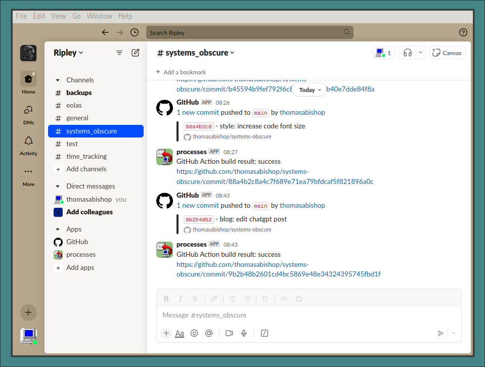

My current desktop environment is very bare-bones and consists basically of a
window manager and launcher. One difficulty of this is having to manage
notifications manually.

Triggering notifications is fine, I use
[swaync](https://github.com/ErikReider/SwayNotificationCenter). The problem is
logging them in one place so I can see at a glance what has been going on over a
given time period. There are solutions for the Wayland compositor that I use but
the list of notifications won't persist beyond the current session. They are
also quite ugly with limited options for style customisation.

When I talk about notifcations, I mainly mean alerts triggered by the automated
scripts I have running on my system: backups, auto-commits to my Zettelkasten,
time-tracking etc. I don't care about email notifications, Spotify updates etc
and suppress these.

I thought a good way to solve this would be to forgo a desktop-specific
notification center and instead use Slack. Each notification type has a
dedicated channel which I can post to via a specific webhook URL. On the
free-plan the data will persist for up to three months which is more than
sufficient for my purposes.

This solution has the added benefit that I can access my notification center
from other devices. I can also display notifications from more than one machine
and everything will be syndicated in one place. Additionally, I can leverage
Slack's extensions like the GitHub bot. Finally, using Slack's block
architecture means that I have lots of options when it comes to outputting the
notification contents.

The image below shows the notification center with the channel for this blog
displayed:



(The channel is called "Ripley" because I am an Alien fan! "processes" is the
parent app to which the different webhooks belong)

I invoke the NodeJS script below when I want to set up a notification:

```js
#!/usr/bin/env node

const process = require("process")
const { exec } = require("child_process")
const axios = require("axios")

const notificationSound =
  "mpv /home/thomas/dotfiles/gruvbox-95/sounds/st-notification.mp3"

const slackNotifier = async (channel, { message = "", block = null } = {}) => {
  try {
    const webhooks = {
      test: process.env.SLACK_WEBHOOK_TEST,
      backups: process.env.SLACK_WEBHOOK_BACKUPS,
      eolas: process.env.SLACK_WEBHOOK_EOLAS,
      systems_obscure: process.env.SLACK_WEBHOOK_SYSTEMS_OBSCURE,
      time_tracking: process.env.SLACK_WEBHOOK_TIME_TRACKING,
    }

    const webhookUrl = webhooks[channel]

    let payload

    if (message) {
      payload = { text: message, channel: channel }
    } else if (block) {
      payload = { blocks: block, channel: channel }
    } else {
      throw new Error("Either a message or a block must be provided.")
    }

    const response = await axios.post(webhookUrl, payload)

    if (response.status === 200) {
      exec(notificationSound)
      console.log(`Message successfully sent to ${channel}`)
    } else {
      console.error(
        `Slack API returned non-200 response: ${response.status}`,
        response.data
      )
    }
  } catch (error) {
    console.error(`Failed to send message to ${channel}:`, error)
  }
}

if (require.main === module) {
  const [, , channel, message] = process.argv
  slackNotifier(channel, { message }).catch(console.error)
}

module.exports = { slackNotifier }
```

An example of it being invoked (from within a script that manages my hourly
backups):

```sh
./slack-notifier/src/index.js 'backups' '💾 Error: backup drive not mounted.'

```

One drawback is that there is sometimes latency between the execution of the
script which contains the notificaton trigger and the appearance of the
notification in Slack. This is because the former happens instantly on my
machine and the latter depends on the network. I can live with this though.
