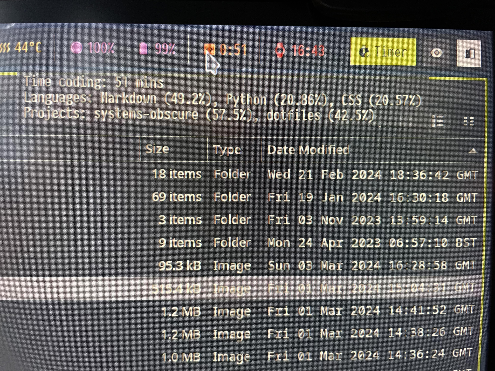

On my local machine I am currently replacing my desktop environment (Gnome) with
a tile-based window manager ([Hyprland](https://github.com/hyprwm/Hyprland)).
I'm trying to strip out the bloat and have a lightweight and highly customised
Arch workhorse.

A key component is a useful status bar that displays metrics and provides a
means of quickly executing common tasks. Previously, when I was using X, I opted
for Polybar but now that I am on Wayland I'm using
[waybar](https://github.com/Alexays/Waybar). So far, I've added two custom
modules: one for displaying code metrics and another for managing my
time-tracking.


<div style="text-align:center;">
<i >Full status bar. Click to enlarge.</i>
</div>

## Code metrics module

I use WakaTime to collate metrics on my coding activity (time coding,
programming languages, projects etc.) I already have a
[dashboard](https://systemsobscure.blog/code-metrics/) on this site that
displays some of this data but I thought it would be useful to see my stats from
the status bar as I am working.

Below is an image of the module. The permanent display outputs the coding
duration for the current day. When you hover you see a summary of the main
languages used and the main projects I've been working on.



It's a straightforward Python script that queries the WakaTime API and parses
the data and forwards it to the module:

```py
#! /usr/local/bin/python3
import requests
import os
import json
import textwrap

WAKATIME_API_KEY = os.getenv("WAKATIME_API_KEY")
WAKATIME_ENDPOINT = "https://wakatime.com/api/v1/users/current/status_bar/today"


def get_data(url):
    response = requests.get(url)
    if response.status_code == 200:
        return response.json()
    else:
        raise Exception(
            f"Failed to fetch data from API. Status code: {response.status_code}"
        )


def generate_tooltip(time, languages, projects):
    return textwrap.dedent(
        f"""\
        Time coding: {time}
        Languages: {languages}
        Projects: {projects}"""
    )


def format_metric(metrics):
    return ", ".join(
        [f'{metric["name"]} ({metric["percent"]}%)' for metric in metrics[:3]]
    )


def main():
    output = {}
    try:
        data = get_data(WAKATIME_ENDPOINT + "?api_key=" + WAKATIME_API_KEY)
        digital_time = data["data"]["grand_total"]["digital"]
        human_time = data["data"]["grand_total"]["text"]
        langs = data["data"]["languages"]
        projects = data["data"]["projects"]
        tooltip = generate_tooltip(
            human_time, format_metric(langs), format_metric(projects)
        )
        output["text"] = digital_time
        output["tooltip"] = tooltip

    except Exception as e:
        output["text"] = "Error"

    print(json.dumps(output))


if __name__ == "__main__":
    main()
```

Here's the module declaration in the Waybar config:

```
"custom/wakatime": {
    "exec": "source $HOME/dotfiles/.env && python3 $HOME/.config/waybar/resources/custom_modules/wakatime_waybar.py",
    "format": "󰅱 {}",
    "return-type": "json",
    "interval": 600
  },
```

## Time-tracking module

I've recently started using [time warrior](https://timewarrior.net/) to track my
extra-curricular coding and study. This is a command-line time-tracker so it
integrates really well with Waybar.

The module highlights green when there is an active timer. This helps to remind
me to stop the timer! When you click the current timer stops and when you
right-click it resumes. This saves me going into the terminal when I stopping
and starting an ongoing piece of work.


<div style="text-align:center;">
<i >Time warrior module in its active state.</i>
</div>

Again I've used Python for the scripting:

```py
#! /usr/local/bin/python3

import subprocess
import json


def invoke_shell(proc):
    try:
        result = subprocess.run(
            proc,
            shell=True,
            check=True,
            stdout=subprocess.PIPE,
            stderr=subprocess.PIPE,
            text=True,
        )
        return result.stdout.strip()
    except subprocess.CalledProcessError as e:
        return e.stderr.strip()


def timer_active() -> bool:
    status = invoke_shell("timew get dom.active")
    if status == "1":
        return True
    else:
        return False


def generate_tooltip():
    tooltip = invoke_shell("timew summary :week")
    return tooltip


def main():
    output = {}
    try:
        if timer_active():
            output["text"] = "󱫐 Timer"
            output["class"] = "active"
        else:
            output["text"] = "󱫦 Timer"
            output["class"] = "inactive"
    except Exception as e:
        output["text"] = "Error"

    print(json.dumps(output))


if __name__ == "__main__":
    main()
```

And here is the module declaration in the Waybar config:

```
"custom/timewarrior": {
    "exec": "python3 $HOME/.config/waybar/resources/custom_modules/time_warrior_waybar.py",
    "format": "{}",
    "on-click": "timew stop && notify-send 'Time Warrior' 'Timer stopped'",
    "on-click-right": "timew continue && notify-send 'Time Warrior' 'Timer resumed'",
    "return-type": "json",
    "interval": 5
  },
```
